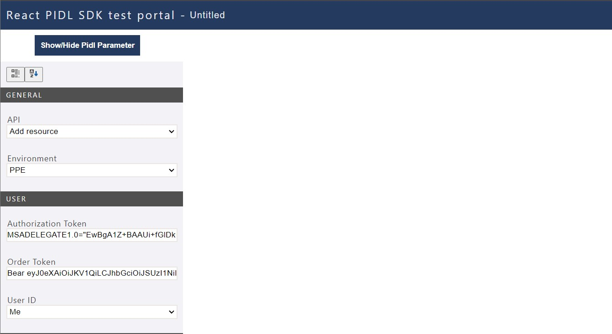
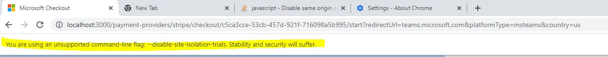

## Debugging PX
In this section, I'm going to walk you through the steps you can take to verify your setup is in a good state.

### Overview
This doc explains steps to debugging PX locally integrating with PIDLSDK Test Portal. The doc takes debuging tax form as the example.

### Target audience
Developers and PMs contributing code to PX

### Prerequisites
In addition to all of the above, please install Fiddler on your dev box from this [link](https://www.telerik.com/download/fiddler). 
You may need to provide some information like a name, email address and such. Once the installation is completed let's jump to the next step!

1. Make sure PX Service has built successfully and is running in Visual Studio:
    1. Make sure "PX Service" is selected as the project to run (if not in the dropdown list, right click the PXService project in Solution Explorer and click "Set as startup project")
    1. Run as "Web Server" (Top Option)
    1. When running the project, VS might show a popup with two options: "Modify the Web.config to enable debugging." and "Run without debugging". Make sure "Modify the Web.config file to enable debugging" option is selected and click the "OK" button
        1. **Do not commit this change to the Web.config file**  
        


### Autoresponder & Rules
Make sure Fiddler is running and AutoResponder "Enable rules" option is checked.  

In your fiddler app, navigate to the auto-responder tab to add few rules as shows below:


Fiddler's AutoResponder tab allows you to return files from your local disk instead of transmitting the request to the server.
This is based on certain regex expression for matching incoming requests URI and routes that request to a local server running on your dev box.
For instance, you can create a rule for https://www.google.com and route the response to localhost:1985/index.html on your local box.

The AutoResponder will also allow you to add `regex` expressions to catch all instances from the same request.
In the screenshot above, we tried to intercept requests coming with a particular format, in the rule editor we entered as follows:


We entered a `regex` expression to match requests that follow this format:

`REGEX:https://paymentinstruments-int.mp.microsoft.com/v6.0/users/me/TaxIdDescriptions(.*)`

That expression will intercept any requests that matches the expression and replaces it with the following local server URL, which has a hardcoded ID (all dev use same account id for dev work) and redirects to your locally running PX Service:

`http://localhost/pxservice/v7.0/bd888d21-f2a9-4f8b-92c2-129b8d4748b6/TaxIdDescriptions$1`


Once you have all of that setup, let's navigate to the sample link to examine our rules are working properly:  
(Make sure PX Service is running locally and Fiddler is running with AutoResponder rules Enabled and you have the example rule above in AutoResponder)

https://pidlsdktestportal.azurewebsites.net/PidlReact.html?init={"elementFactoryName":"officeFabric","market":"th","partner":"commercialstores","resourceType":"TaxId","taxIdType":"commercial_tax_id"}

The link above will navigate to our PIDL SDK Test Portal and will make several internal requests that matches our `regex` expression above.
Once you are on the page and it's loaded successfully, you should see something similar to the following screenshot:



We can now go back and `enable` our Fiddler Rules by checking the `Enable rules` checkbox in the Autoresponder tab also make sure you select the rule matches.
Now let's hit the `Send` button to generate a UI component based on our parameters:


### Stepping In (Debugging)
With PX Service running locally and Fiddler running with AutoResponder rules enabled and the correct rule to reroute your url to the local PX instance (see section above for example rule URLs) you can now put a break point on the controller endpoint for Tax.

Navigate to `TaxDescriptionsController` and put a breakpoint on these lines:

```csharp
        [SuppressMessage("Microsoft.Performance", "CA1822", Justification = "Needs to be an instance method for Route action selection")]
        [HttpGet]
        public List<PIDLResource> Get([FromUri]string accountId, string country, string language = null, string partner = Constants.ServiceDefaults.DefaultPartnerName, string type = null)
        {
            return PIDLResourceFactory.Instance.GetTaxIdDescriptions(country, type, language, partner);
        }
```

Run the `PXService` project and hit the generation button again on the UI side (make sure your Fiddler is running) and follow thorw with code steps. 

Loading the VAT ID component verifies the following:

1. Your fiddler installation was successful.
2. Your local server is running.
3. You are able to access the PIDL Portal and generate UI components.
4. You can now debug your code end to end PIDLSDK -> PX

### Common Issues

#### Network Certificate Errors

If browser is giving NET::ERR_CERT_AUTHORITY_INVALID, go to Fiddler and do the following steps:

1. Click Tools > Fiddler Options.
2. Click the HTTPS tab.
3. Ensure that the text says Certificates generated by CertEnroll engine.
4. Click Actions > Reset Certificates. This may take a minute.
5. Accept all prompts

#### Low security Chrome
You may need to use local test portal on low security Chrome if you're facing CORS or other network issues, to do so follow this https://stackoverflow.com/questions/24290149/creating-google-chrome-shortcut-with-disable-web-security which is basically making a chrome shortcut with these flags in the target:<br/>
$~~~~~~~~$ "C:\Program Files\Google\Chrome\Application\chrome.exe" --disable-web-security --user-data-dir="C:\tmpChromeSession"

or if chrome Version 100.0.4896.127 or above<br/>
$~~~~~~~~$ "C:\Program Files\Google\Chrome\Application\chrome.exe"  --disable-site-isolation-trials --disable-web-security --user-data-dir="D:\temp"

A new web security disabled chrome browser should open with the following message:


#### Build Errors

Resolve build error *..\SC.CSPayments.PX\Drop\Debug\PXService\bin\azure-exp-varassign.dll cannot be deleted* by stopping and re-starting IIS. 

---
For questions/clarifications, email [author/s of this doc and PX support](mailto:jiefan@microsoft.com?cc=PXSupport@microsoft.com&subject=Docs/development/devbox-setup.md).

---