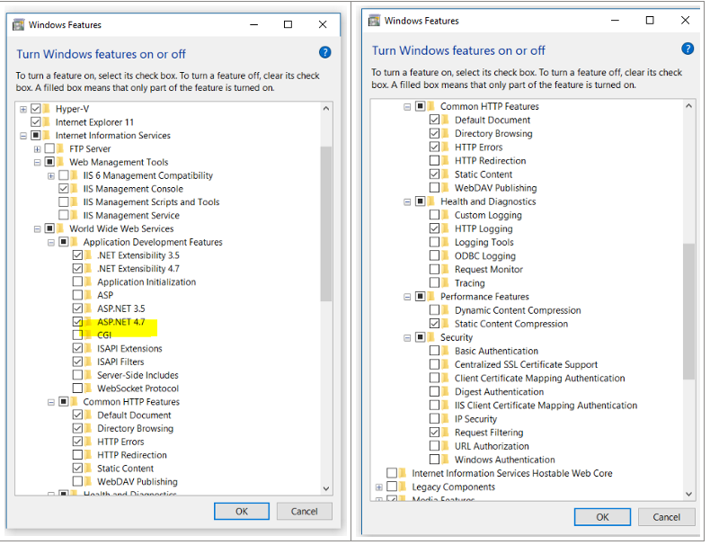

# Devbox Setup

## Target audience
Developers and PMs contributing code to PX

## Overview
This doc explains steps to setup PX service locally

## Install VS2022
>[!NOTE]
>It is recommended to use VS2022 Enterprise.
1. Download VS2022 from [here](https://visualstudio.microsoft.com/downloads/#visual-studio-enterprise-2022)
2. Check workloads
	- ASP.NET and web development
	- Azure development


## Build Repo
1. git clone [https://microsoft.visualstudio.com/DefaultCollection/Universal%20Store/_git/SC.CSPayments.PX](https://microsoft.visualstudio.com/DefaultCollection/Universal%20Store/_git/SC.CSPayments.PX)
2. Checkout master branch in a non-user folder (e.g. d:\repos\ )
3. Launch VS2022 as administrator
4. Open \Private\Payments\Payments.sln
5. Build the solution (you should see 0 errors and a bunch of warnings!) 

>[!NOTE]
>It takes some time for visual studio download NuGet. If 1st build fails and retry should work.  

If building an old repo after sometime PX/NugetPackages folder may be stale.
Delete them, restart VS and build again.  

In case of an error on VS2022: "The "StyleCopTask" task could not be loaded from the assembly  
 C:\repos\SC.CSPayments.PX\NugetPackages\StyleCop.MSBuild.4.7.53.0\build\..\tools\StyleCop.dll. 
 Could not load file or assembly 'Microsoft.Build.Utilities.v3.5, Version=3.5.0.0, Culture=neutral"
 Follow the steps:
1.  Close your Visual Studio instance.
2.  Open Visual Studio Installer.
3.  On the version of Visual Studio that you're currently using, click on More and select Modify.
4.  Select the Individual components tab.
5.  Search for .NET Framework 3.5 development tools, select it and click on Modify.
6.  Wait for the modification to finish.
7.  Open your project in Visual Studio, then do a Clean, followed by a Build.

## Host PX
1. Turn on IIS ("Add or remove programs" control panel -> "Turn windows features on or off" -> "Internet Information Services") and follow screenshots below
 
2. Install [url-rewrite module](https://www.iis.net/downloads/microsoft/url-rewrite) 
3. Get certificates from [SharePoint location](https://microsoft.sharepoint.com/:f:/r/teams/PaymentExperience/Shared%20Documents/PXINTCertificates?csf=1&web=1&e=CP2UOc) and put all the certificates into c:\repo\certificates
4. Run the following setup script in powershell **Admin Mode** (you only need to run this once for initial setup):
```
.\private\Payments\Tests\Scripts\setupLocalPX.cmd c:\repos\certificates\
```
---
If you ever need to undo setupLocalPX.cmd, then run:
```
.\private\Payments\Tests\Scripts\setupLocalPX.cmd  /uninstall
```
---

## Verify setup
1. REST GET call to http://localhost/pxservice/probe should be successful and look like this in browser:
  

In case of a 503, make sure that the repo is NOT under any user folder (e.g. C:\users\ ).  
If so, move it, run the setup uninstall command  
`.\private\Payments\Tests\Scripts\setupLocalPX.cmd  /uninstall`,  
then rerun  
`.\private\Payments\Tests\Scripts\setupLocalPX.cmd c:\repos\certificates\`  

2. All tests in CIT.PXService and CIT.PidlFactory should pass (for test setup and config see "**How to Run COTs**" section below)  
If the CIT.PXService tests are failing with  
`"Assembly Initialization method CIT.PXService.Tests.TestBase.Initialize threw exception. System.BadImageFormatException: System.BadImageFormatException: Could not load file or assembly 'Azure.Analytics.Experimentation.VariantAssignment, Version=4.0.0.0, Culture=neutral, PublicKeyToken=31bf3856ad364e35' or one of its dependencies. An attempt was made to load a program with an incorrect format.. Aborting test execution."`  
*Go to Test->Processor Architechture for AnyCPU Projects and select x64*  

3. All the COT.PXService with [TestCategory(TestCategory.OneBoxAcceptanceTest)] should pass

## How to Run COTs: 
- Set .runsettings file: 
    - Test -> Configure Run Settings -> Select Solution Wide runsettings File -> .\SC.CSPayments.PX\private\Payments\Tests\COT.PXService\RunSettings\PXService.OneBox.runsettings
    - Run test cases in COT.PXService 

## Debugging

Here is the [instruction](./devbox-debugging.md) to debug PX code 

## Common problems

- Could not load file or assembly 'Microsoft.Build.Utilities.v3.5, Version=3.5.0.0, Culture=neutral, PublicKeyToken=b03f5f7f11d50a3a' or one of its dependencies 

    Make sure ASP.NET 3.5 is installed (refer step Host PX)

- 'Microsoft.Commerce.Tracing.Sll.dll' could not be found.

    - Rebuild SllLoggingSchema.csproj
    - Rebuild PXCommon.csproj
    - Build sln 

---
For questions/clarifications, email [author/s of this doc and PX support](mailto:jiefan@microsoft.com?cc=PXSupport@microsoft.com&subject=Docs/development/devbox-setup.md).

---