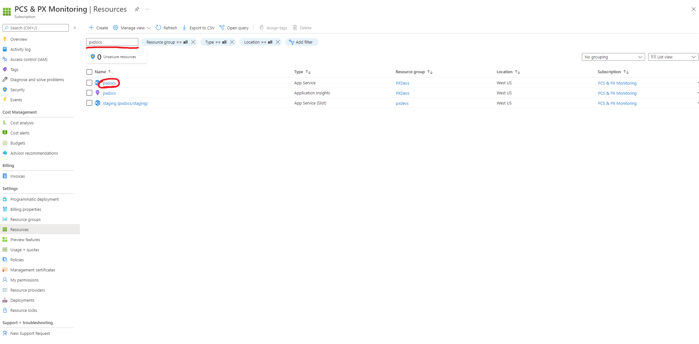
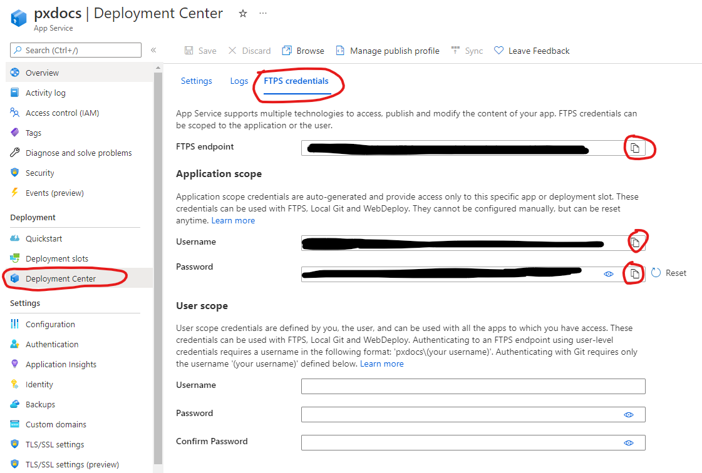
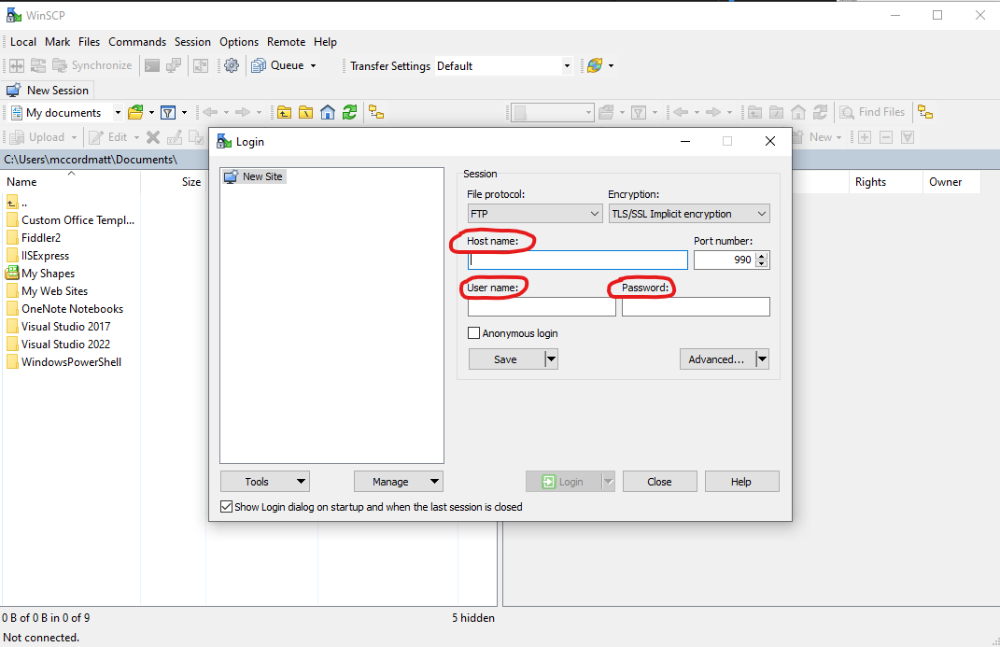
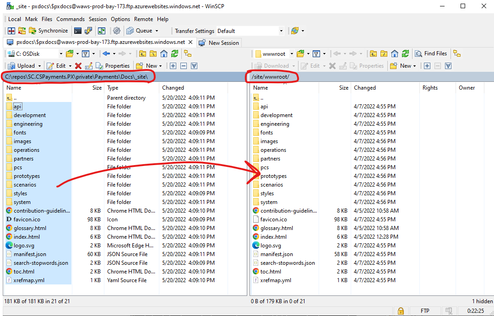

# Deploying the Documentation

## Target audience
PX Engineering team

## Overview
This document will detail the steps to deploy this documentation. Until we can setup automated deployment, we must manually deploy.

## Prerequisites
- Access to [PCS & PX Monitoring Subscription](https://ms.portal.azure.com/#@microsoft.onmicrosoft.com/resource/subscriptions/b6994420-af3c-4653-bbb1-c6b6ddf8e83b/overview)
- An FTP Client ([WinSCP](https://winscp.net/eng/downloads.php) used in "FTP Client" example screenshots)
- [Docfx](https://dotnet.github.io/docfx/tutorial/docfx_getting_started.html) installed. (Version 2.59.2.0 used at the time of making this doc)

## Deployment Steps:
### Building the Documentation
- In your terminal of choice (Git Bash used during the writing of these docs), navigate to [PX repository root]/private/Payments/Docs.
- Run `docfx build --serve`
  - This will create a new build of the docs under the `_site` folder.
  - Any issues with the build command check that your version of docfx matches the one from **Prerequisites** above, or check if in your version the command syntax has changed.
  - Other issues with docfx please check [their documentation here](https://dotnet.github.io/docfx/).
- Navigate to http://localhost:8080 (or wherever the command line tells you it is serving)
- Verify that the build worked and that your changes are there! **VERY IMPORTANT :)**

### Azure Portal
- Navigate to [PCS & PX Monitoring Subscription](https://ms.portal.azure.com/#@microsoft.onmicrosoft.com/resource/subscriptions/b6994420-af3c-4653-bbb1-c6b6ddf8e83b/overview)
- Click on **"Resources"** in the left nav.
- In the **Resources** view, search for **"pxdocs"**. You should see an item of Type **App Service** with the Name **pxdocs**.
  - **NOTE:** If you would like to deploy to staging first, you will use the App Service **"staging (pxdocs/staging)"** link instead.

- Click on the **pxdocs** link under the **Name** column.
- In the **pxdocs** App Service view click the **Deployment Center** link on the left, then click the **FTPS credentials** tab at the top:

- From this **FTPS credentials** view you can now access the **FTPS endpoint**, **Username**, and **Password** we will use in the FTP Client steps below.

### FTP Client ([WinSCP](https://winscp.net/eng/downloads.php) used in the example screenshots)
- From the previous step under Azure Portal, copy the FTPS endpoint, Username, and Password over to your FTP Client and Login
  - If there are any errors logging in, double check the endpoint, username, password copied over correctly and try again.
  - If using WinSCP, the fields will map like this: FTPS endpoint => Host name, Username => User name, Password => Password:
 
- You should now see the file structure on the FTP server. If you are at root level (/site/wwwroot/) you will see all of the documentation folders.
- From your machine copy over your new docfx build by copying all of the files and folders under the _site folder (private/Payments/Docs/_site) in to the /site/wwwroot/ folder of the FTP server:
  - The file contents of _site should map 1 to 1 over to the structure of the server's /site/wwwroot/ file contents, excluding any new additions.

- Once the copying is complete, congrats the docs have been deployed! You can checked them out at [aka.ms/pxdocs](https://aka.ms/pxdocs) or https://pxdocs.azurewebsites.net/  

---
For questions/clarifications, email [author of this doc and PX support](mailto:mccordmatt@microsoft.com?cc=PXSupport@microsoft.com&subject=Docs%20-%20development/docs-deployment.md).
---