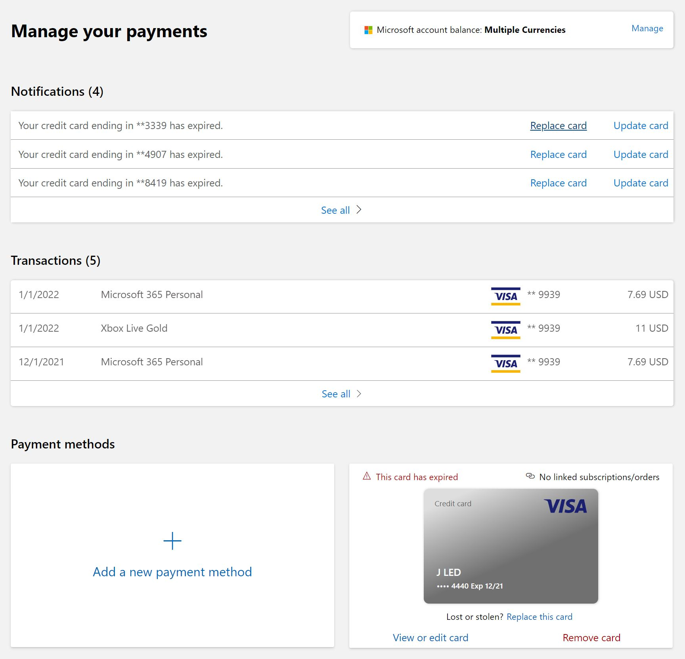

# Getting started with the manage-payments project

## Target audience
Developers and PMs contributing code to the manage-payments project.

## Overview
This documents gives an introduction of the project, concepts and source code structure.

## Introduction
The manage-payments component *(aka NorthStar, aka AMC Payment Options)*, allows customers to see their payments instruments and add, remove or replace them.

It also shows the latest transactions and notifications for payment instruments about to expire.

This is a screenshot of the homepage

The Manage Payments component can be seen in action in PROD at: http://account.microsoft.com/billing/payments/

## Source code structure
There are 3 main folders for manage-payments:  
* [**pay.pidl.sdk\components\react\manage-payments**](https://microsoft.visualstudio.com/Universal%20Store/_git/pay.pidl.sdk?path=/components/react/manage-payments): Contains the main component and also the subcomponents for the different parts of the UI like Notification List, Transaction List, PI list, Add PI panels, etc.

* [**pay.pidl.sdk\apps\northstar-app**](https://microsoft.visualstudio.com/Universal%20Store/_git/pay.pidl.sdk?path=/apps/northstar-app): Contains the test application. This application can run in localhost for dev testing and also it can get deployed to: https://mspayment-ppe-centralus.azurewebsites.net/ for pre-production testing.

Two additional folders are relevant although you may need to update them less frequently when developing for manage-payments.

* [**pay.pidl.sdk\components\react\pidl-react**](https://microsoft.visualstudio.com/Universal%20Store/_git/pay.pidl.sdk?path=/components/react/pidl-react):  
Is responsible for rendering the Add, Edit and Replace PI forms, as well as for Bitcoin Redeem form for manage-payments.

* [**pay.pidl.sdk\components\react\pidl-fluent-ui**](https://microsoft.visualstudio.com/Universal%20Store/_git/pay.pidl.sdk?path=/components/react/pidl-fluent-ui): This is an element factory that pidl-react accepts to render basic UI elements like textboxes, buttons, etc. using the standard look-and-feel defined by [Fluent UI version 8.x](https://developer.microsoft.com/en-us/fluentui#/).

## Dev box setup
For instructions to get the source code and set it up to run locally on your dev PC, read the [Manage-payments dev box setup](manage-payments-dev-setup.md) document.

## Build
To learn about building the project locally in your dev PC and how continuous integration build is setup, read the [Manage-payments build](../engineering/manage-payments-build.md) document.

## Testing
To learn about how to test the project in your dev PC and how the project is tested in the PPE environment, read the [Manage-payments testing](../engineering/manage-payments-testing.md) document.

## Release
To learn about how this project is released to our AMC partner, read [Manage-payments release](../engineering/manage-payments-release.md)
