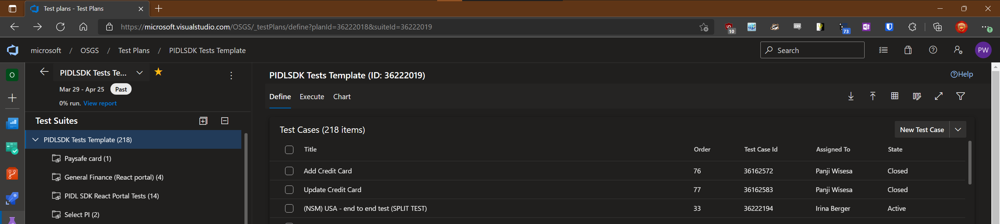
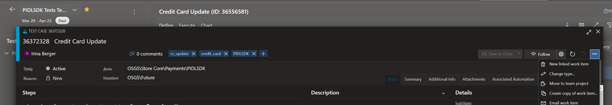
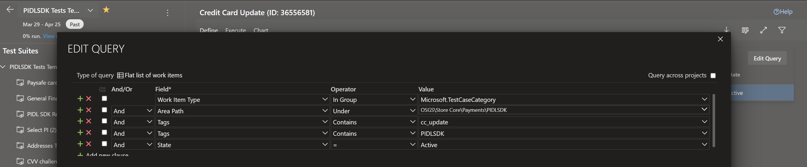
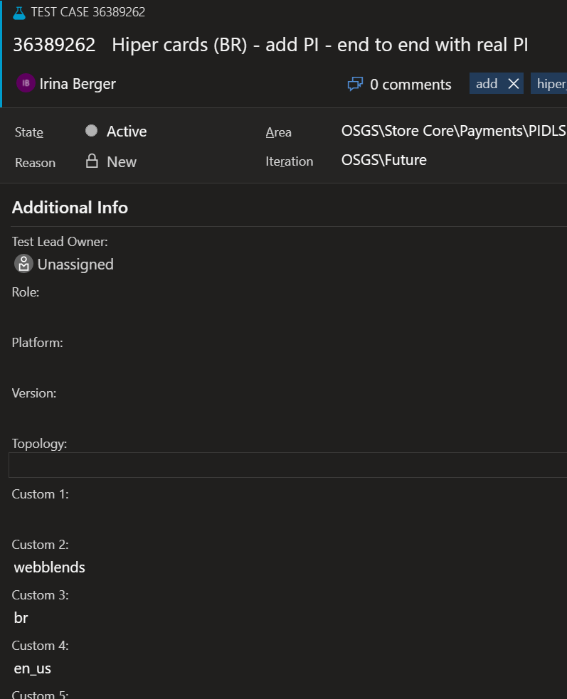
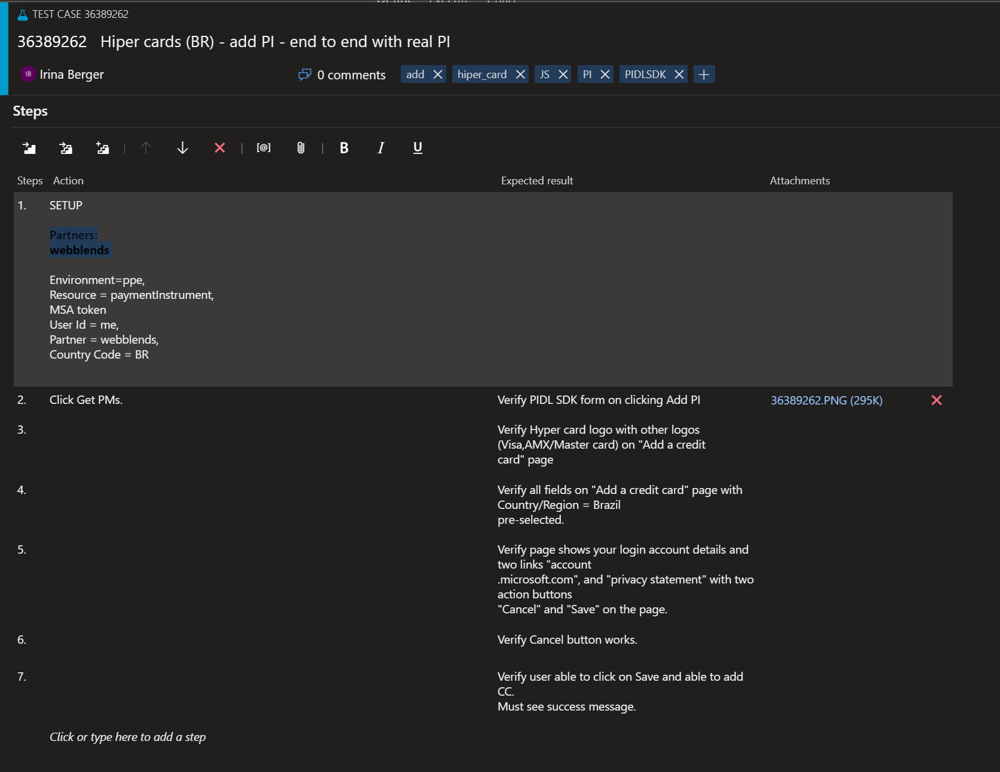
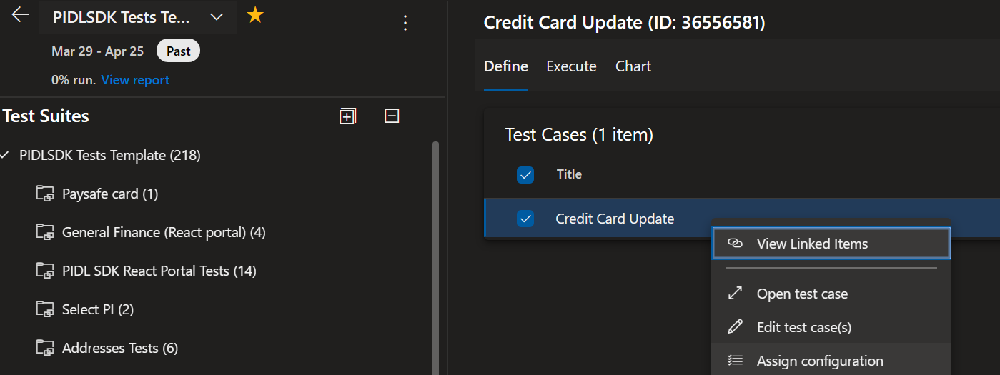
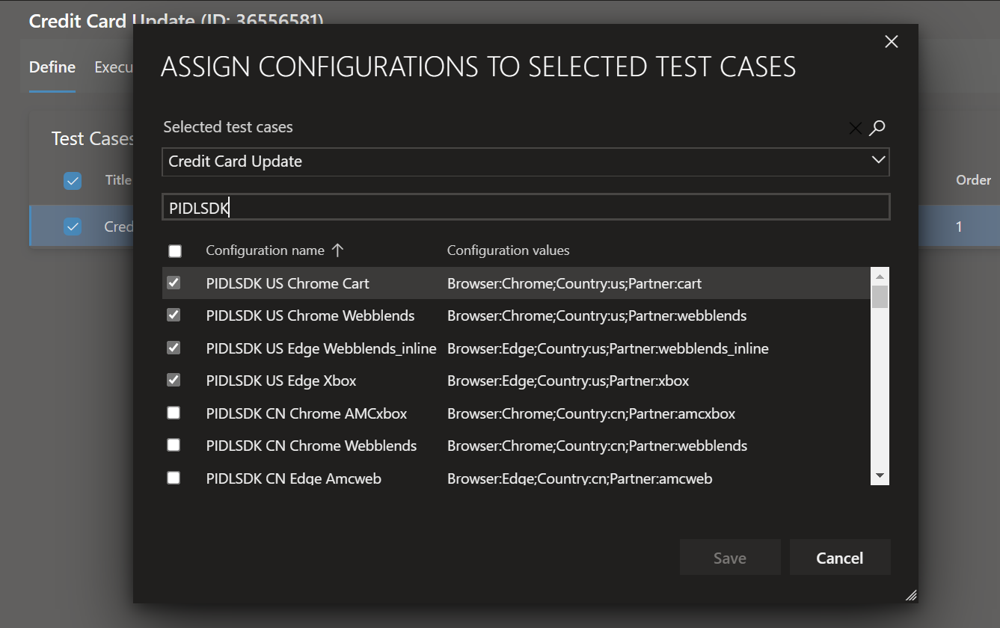
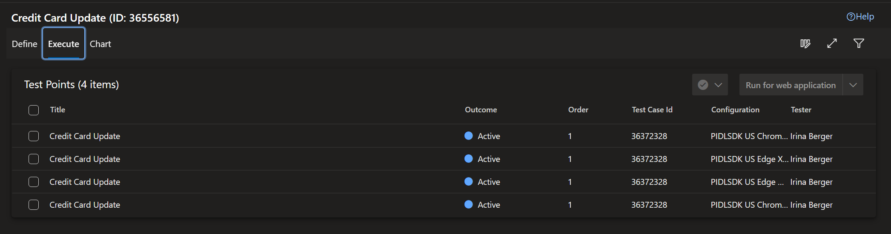

# Adding UI Tests

## Target audience
PX Engineering team
Developers and PMs contributing code to PIDLSDK or PX

## Overview
This is the instructions on how to add manual or automated UI tests whenever you make a new or changes in existing scenario.

## Prerequisites
You should have setup the pay.pidl.sdk repo by following [PIDLSDK Setup](pidlsdk-setup.md).

If you're working on adding automated UI tests then you should be able to run pay.pidl.sdk\tests\AutomationTest\AutomationTest.sln, compile it (probably requires you to NuGet restore packages beforehand), and run one of the test (look in the "Test Explorer" and try one of the CreditCardTests e.g. CreditCardAdd) successfully.

You need access to the [Template Test Plan](https://microsoft.visualstudio.com/OSGS/_testPlans/define?planId=36222018&suiteId=36222019) where you'll be adding the new tests as well.

## Adding manual tests
1. Add a completely new test case in the root:

Or duplicate an existing test case that already exist under the suite/scenario that you want to add a test to

2. For completely new tests make sure it has the right Area (OSGS\Store Core\Payments\PIDLSDK), iteration (OSGS\Future), and tags (always include PIDLSDK tag) as the suite/scenario are filled based on query like this:

3. Add additional info of partner, country, and language under Additional Info tab in custom field 2, 3, and 4 if you know what partner, country, and language you want to test this on:

4. Add the parameters to load the scenario, the steps to run, and the things to check under the steps:

Start with the major parameter and steps cause the tester will likely ask you more info on how to load the page and run the scenario. Once they are able to run the tests then you can start adding more parameters (such as different partner to check), more steps (such as partner specific steps), and more things to check (such as partner specific nuances to the rendered element (e.g. some partner has a heading some don't, etc)). <b>When a test pass is being run mark your new test with state Proposed, once the test pass is done then we can mark is as active to be part of the next test pass</b>

5. Once you made the test, check that the test are listed under the right suite/scenario and then under that suite assign configuration to the test:

Configurations specify what Country, Partner, and Browser the test should be run on:

Every checked configuration creates an execution entry so that that test will be run multiple times for each different configuration:

6. That's it, let me @pawisesa or @v-iberger know so we can help check the new entry

## Adding automated tests
1. Add your test in [the UI Automation test project in the pay.pidl.sdk](https://microsoft.visualstudio.com/Universal%20Store/_git/pay.pidl.sdk?path=/tests/AutomationTest) first. [This PR](https://microsoft.visualstudio.com/Universal%20Store/_git/pay.pidl.sdk/pullrequest/6547551) is a good example of adding a new automated UI test 

2. Do step 1 and 2 from the manual test but make sure you add automated tag and "- Automated" in the title.

3. No need to add any configuration or steps because those are determined by the code in the AutomationTest project, the test entry in the test plan is to keep track of all the tests we have and to record the result of the automated test run.

---
For questions/clarifications, email [author/s of this doc and PX support](mailto:pawisesa@microsoft.com?cc=PXSupport@microsoft.com&subject=Docs%20-%20development/pidlsdk-addingUITests.md).

---