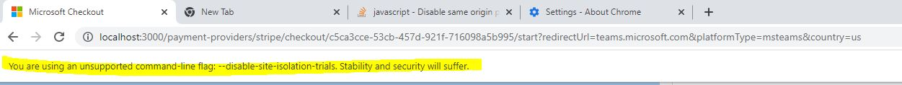

# PIDLSDK Setup

## Target audience
PX Engineering team
Developers and PMs contributing code to PIDLSDK

## Overview
This is the setup instructions for pay.pidl.sdk repo.

## Steps
1. Install git, node.js, python 2.7 (optional), and vs2022
2. Install grunt using: $~~~~$ `npm install -g grunt-cli`
3. Clone pay.pidl.sdk: git clone https://microsoft.visualstudio.com/DefaultCollection/Universal%20Store/_git/pay.pidl.sdk
4. Move into the tools\build folder: $~~~~$ `cd pay.pidl.sdk\tools\build` and then run in Powershell (close all open editors before doing so): $~~~~$ `.\setup.ps1`
>If you get an error "pay.pidl.sdk\tools\Build\setup.ps1\setup.ps1 is not digitally signed. You cannot run this script on the current system."  
 Run `Set-ExecutionPolicy -ExecutionPolicy RemoteSigned -Scope CurrentUser` in Powershell

>If setup script gives "npm ERR! 403 Forbidden. User 'npm_***' lacks permission to complete this action. You need to have 'ReadPackages", wait to receive necessary Azure DevOps permissions, do a `git pull`, and rerun `.\setup.ps1`
5. Open PidlTestPortal.sln in tests\apps\PidlTestPortal
6. Right click on the PidlTestPortal project and select "Add > New Virtual Directory…" 7 times:
   - Alias: "pidlsdk" pointing to pay.pidl.sdk\bin\sdk
   - Alias: "pidlsdkts" pointing to pay.pidl.sdk\sdk\
   - Alias: "unittests" pointing to pay.pidl.sdk\tests\unittests
   - Alias: "helpers" pointing to pay.pidl.sdk\components\resource-helpers\dist
   - Alias: "prefetcher" pointing to pay.pidl.sdk\components\prefetcher\dist
   - Alias: "1ds-analytics" pointing to pay.pidl.sdk\node_modules\\@microsoft\1ds-analytics-web-js\bundle
   - Alias: "1ds-cv" pointing to pay.pidl.sdk\node_modules\\@microsoft\1ds-cv-js\bundle
>If any of these directories are missing, rerun the setup script and make sure it executed properly. 
7. Under "Tools > NuGet Package Manager > Package Manager Settings" add the following Package Sources:
   - https://microsoft.pkgs.visualstudio.com/_packaging/Universal.Store/nuget/v3/index.json (Name = VSTS Universal.Store)
   - https://microsoft.pkgs.visualstudio.com/_packaging/cspayments.private/nuget/v3/index.json (Name = VSTS cspayments.private)
   - https://msazure.pkgs.visualstudio.com/_packaging/Official/nuget/v3/index.json (Name = MSAzure) 

## Additional info
### pay.pidl.sdk structure
After following the steps above the 2 main test portals is ready to be used:
1. PidlTestPortal is the VS based test portal that uses PIDLSDK JS, code that's in pay.pidl.sdk\sdk\, and resource helpers, code that's in pay.pidl.sdk\components\resource-helpers\, also optionally the prefetcher component, code that's in pay.pidl.sdk\components\prefetcher\. **You can use this portal by clicking the start button in VS.**
2. pidl-react-portal, located under pay.pidl.sdk\tests\apps\pidl-react-portal\ uses code under pay.pidl.sdk\sdk\ and most components under pay.pidl.sdk\components\ where each component uses (npm linked) each other:
   - Main component is pidl-react which encapsulates PIDLSDK Core under pay.pidl.sdk\sdk\
   - Element Factory components (pidl-classic, pidl-office-fabric, pidl-reactstrap) all depends on pidl-react
   - pidl-react-portal depends on pidl-react, Element Factory components, and prefetcher (optional feature) 

$~~~~~~~~$ pidl-react-portal can be started by going under pay.pidl.sdk\tests\apps\pidl-react-portal\ and running: $~~~~~~~~~~~~~~~~$ `npm run start` 

### Making changes live
For PIDLSDK JS you can make changes and have it be reflected in a running PidlTestPortal by running: $~~~~~~~~$ `npm run watch` in pay.pidl.sdk\

For PIDLSDK React you can make changes that'll be reflected under pidl-react-portal by running: $~~~~~~~~$ `npm run watch` in the components you want to make changes in (e.g. pidl-react, pidl-classic, etc). Though if you make type changes (e.g. changing interfaces defined under ElementFactory.ts in pidl-react, etc) then you'd need to run: $~~~~~~~~$ `npm run build`  in the component you make the type change in and restart the pidl-react-portal as the d.ts files are only updated during build and not watch.

### Low security Chrome
You may need to use local test portal on low security Chrome if you're facing CORS or other network issues, to do so follow this https://stackoverflow.com/questions/24290149/creating-google-chrome-shortcut-with-disable-web-security which is basically making a chrome shortcut with these flags in the target: 
$~~~~~~~~$ "C:\Program Files\Google\Chrome\Application\chrome.exe" --disable-web-security --user-data-dir="C:\tmpChromeSession"

or if chrome Version 100.0.4896.127 or above 
$~~~~~~~~$ "C:\Program Files\Google\Chrome\Application\chrome.exe"  --disable-site-isolation-trials --disable-web-security --user-data-dir="D:\temp"

A new web security disabled chrome browser should open with the following message:

### How to run test locally
pay.pidl.sdk> npm run build:test 
pay.pidl.sdk> npm run watch:test

The test result can be seen in the file below 
pay.pidl.sdk\tests\unittests\testrunner.html

---
For questions/clarifications, email [author/s of this doc and PX support](mailto:pawisesa@microsoft.com?cc=PXSupport@microsoft.com&subject=Docs%20-%20development/pidlsdk-setup.md).

---