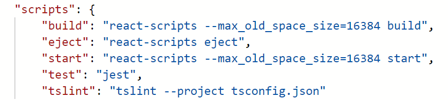
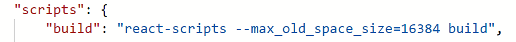

# Manage-payments build

## Target audience
PX Engineering team

## Overview
This document explains the pipelines to build and release the manage-payments component (aka NorthStar) to AMC.

## Prerequisites
* [Getting started with the manage-payments project](../development/manage-payments-getting-started.md)

## Bundlers
As explained in the [Getting started document](../development/manage-payments-getting-started.md), NorthStar is made of several projects and some of them use different bundlers.

| Project | Packager
| -- | --
| pay.pidl.sdk\apps\northstar-app | webpack (via react-scripts)
| pay.pidl.sdk\apps\northstar-amc-bundle | webpack
| pay.pidl.sdk\components\react\manage-payments | rollup
| pay.pidl.sdk\components\react\pidl-react | rollup
| pay.pidl.sdk\components\react\pidl-office-fabric | rollup
|

You can find the configuration for the bundlers on each folder with names like **rolloup.config.ts** or **webpack.config.js**

## Build commands
The **package.json** file on each folder contains *script* section with the commands available.

For example, northstar-app has the following commands:

Not all commands are used. Many of the were created by the app template and are probably not properly configure. In the list above: eject, test and tslint are not used and may fail if you attempt to run them.

The ones that we use frequently are **build** for all projects, **watch** for libraries and **start** for apps.
The pidl-react and pidl-fluent-ui do support **test**.

The way to use these commands is running **npm run {command}**

## Pipelines
Once the PR is complete it will run on several pipelines that produce different outputs. These pipelines and their purpose are listed below:

|Pipeline|Purpose|Manual or Automatic|
|--|--|--
|[Gated](https://microsoft.visualstudio.com/Universal%20Store/_build?definitionId=18407)|To build and verify PRs before being merge into master. | Automatic
|[Integration](https://microsoft.visualstudio.com/Universal%20Store/_build?definitionId=20658)|To build, verify and publish code after it has been merged into master. This is the same pipeline used for PIDL SDK and other components in the pay.pidl.sdk git repository | Automatic
|[Localization](https://microsoft.visualstudio.com/Universal%20Store/_build?definitionId=48241)|Build the localized string files into resx. | Automatic
|[Northstar](https://microsoft.visualstudio.com/Universal%20Store/_build?definitionId=46707)| Build the northstar-app and publishes it to the [MSPayments PPE site](https://mspayment-ppe-centralus.azurewebsites.net) It doesn't build the manage-payments or any other components. It uses what has been already published by the Integration pipeline.| Automatic
|[Manage-Payments bundle](https://microsoft.visualstudio.com/Universal%20Store/_build?definitionId=51626)|Publishes the bundle that is released to AMC. It doesn't build the manage-payments or any other components. It uses what has been already published by the Integration pipeline. | Manual

## Universal Store NPM repository
The **Integration** and **Manage-Payments bundle** pipelines publish packages into the [Universal Store NPM repository](https://microsoft.visualstudio.com/Universal%20Store/_artifacts/feed/Universal.Store.NPM). There you can filter by keywords like: [manage-payments](https://microsoft.visualstudio.com/Universal%20Store/_artifacts/feed/Universal.Store.NPM/Npm/@cspayments%2Fmanage-payments/versions/), [manage-payments-bundle](https://microsoft.visualstudio.com/Universal%20Store/_artifacts/feed/Universal.Store.NPM/Npm/@cspayments%2Fmanage-payments-bundle/versions/), [pidl-react](https://microsoft.visualstudio.com/Universal%20Store/_artifacts/feed/Universal.Store.NPM/Npm/@cspayments%2Fpidl-react/versions/), etc. to see the latest and previous versions that have been published.  
Once a version has been published there it can be referenced from package.json. For example: "@cspayments/manage-payments": "1.22.0-alpha.86",

## Troubleshooting
### Compiler out-of-memory error
Sometimes when running **npm run build** or *watch* you may get an out-of-memory error, this is due to the bundle being too large for the available memory. The solution is to increase the memory for the compiler by using the parameter **--max_old_space_size={amount of MB}** in the **build** and **watch** commands in package.json. For example:

