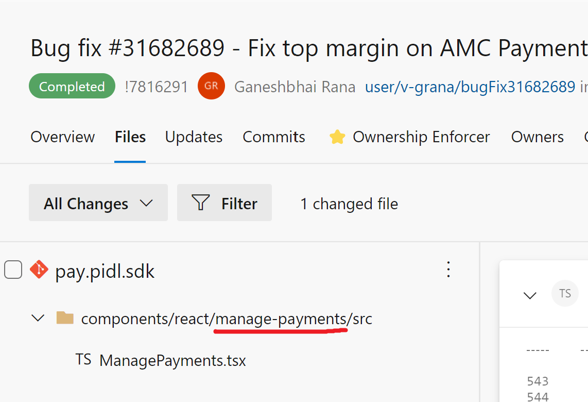
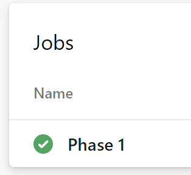
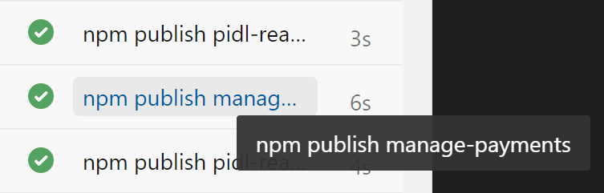
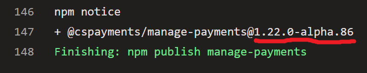
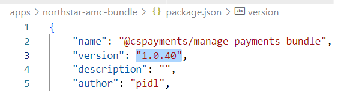

# Manage-payments release process

## Target audience
PX Engineering team

## Overview
This document explains the steps to release the manage-payments component (aka NorthStar) to AMC.

## Prerequisites
* [Getting started with the manage-payments project](../development/manage-payments-getting-started.md)

## Release cadence
Currently, we release about once a month, but is not a strict schedule; we could do it earlier or later depending on the urgency of the changes.

## Find changes since last release
1. Go to find the last PPE deployment PR in the [Completed PR List](https://microsoft.visualstudio.com/Universal%20Store/_git/pay.pidl.sdk/pullrequests?_a=completed) (Usually the PR is named: "MsPayments Build 1.0.XX Candidate"

1. Then look for all the PRs that were completed after the PPE deployment PR and find the ones that have changes under the following folders:   

        components/react/manage-payments   
        components/react/pidl-fluent-ui,   
        components/react/pidl-react

    For example, this PR changed files under the manage-payments folder, therefore is a NorthStar change
    
    
	Any PRs with changes under manage-payments is a NorthStar change for sure. If the PR has no changes under manage-payments but has changes on one or more of the other folders mentioned above, they are potential NorthStar changes, and to be sure, you need to check the bug associated with the PR and see if the bug's repro steps mention it was found while testing on:   

            account.microsoft.com,
            account.microsoft-ppe.com or
            mspayment-ppe-centralus.azurewebsites.net

1. Make a list with the bugs associated with each PR found. That will be the list of changes in the new build.

1. Share the changes list with Mohit Tayal and Jorge Ledezma to confirm these are all the changes needed for the build.

## Deploy build to PPE
1. Once the team agrees that all changes needed were checked-in, find the build that contains those changes.  
Go to the [Integration pipeline](https://microsoft.visualstudio.com/Universal%20Store/_build?definitionId=20658), this is the branch that publishes 
      manage-payments,
      pidl-fluent-ui and
      pidl-react

1. Go to the latest build and verify it contains the most recent NorthStar PR. Normally the builds will have as title the name of the last PR included in them.

1. Open the build results and click on Phase 1 under Jobs.
    

1. Click on the **npm publish manage-payments** task.
    

1. Scroll down and find the version that was published.
    

1. In your local git clone, find the *apps/northstar-app* folder, open the **package.json** file and update the manage-payments line with the version found in step 3.

1. Do the same for pidl-fluent-ui or pidl-react, but only if there were any fixes done on those projects, if not, just keep it up to date with the latest PIDL SDK released version.

1. Save package.json file with your changes.

1. Go to the *apps/northstar-app* folder run **npm install**.

1. Once npm install completes, create a PR including **package.json** and **package-lock.json**.
	
1. While waiting for the PR to get approved, run **npm start** to launch the northstar app in localhost. Look around the site, open some panels like Add PI, Replace PI, etc. and visually inspect that the home page and panels look OK.

    Once the PR is approved and complete, the [northstar pipeline](https://microsoft.visualstudio.com/Universal%20Store/_build?definitionId=46707) will produce a new build. Once that pipeline completes the [MSPayments Test Portal](https://microsoft.visualstudio.com/Universal%20Store/_release?_a=releases) release will deploy it to PPE. After PPE release has finished, the new build will be in https://mspayment-ppe-centralus.azurewebsites.net

1. Once the build has been deployed to PPE, go the https://mspayment-ppe-centralus.azurewebsites.net and do a quick visual test to make sure the build has been updated and looks good.

## Test in our PPE test portal
1. Send an <a href="
../attachments/engineering/manage-payments/NorthStar MsPayments PPE testing - 1_0_XX.msg">email</a> to the testing engineer and CC the NorthStar team.

    Feel free to add or remove instructions for test engineer as needed.

    Note the Test plan is divided into full and smoke tests. The smoke test pass is a subset of the full test pass with the intention to be a quicker way to test the most important parts of the NorthStar website. 

    Testing is usually a combination of a full test pass and smoke test passes for some particular cases (e.g. localization)

1. Once testing completes, triage any new bugs found (meet with Mohit and Jorge if needed)
At this stage we want to know if a new bug was found that is severe enough that it should block the release of this build and force us to produce a new build with the fix.
Bugs that don't meet this criteria will be fixed in a future release.

## Release to AMC
1. After testing in PPE completes and there are no blocking bugs, go to the *apps/northstar-amc-bundle* folder and update **package.json** with the same build numbers than the package.json in *apps/northstar-app*.

1. Also update the version line on the top of the file (1.0.XX).  
Go to [Universal.Store.NPM](https://microsoft.visualstudio.com/Universal%20Store/_artifacts/feed/Universal.Store.NPM) repo, filter by "manage-payments-bundle" to see the current last build number (e.g. 1.0.40), it should match to what you see in the file, if so, then just add 1 to the last digits (e.g. 1.0.40 becomes 1.0.41)

     

1. In the *apps/northstar-amc-bundle* folder run **npm install**.

1. Create a new PR including **package.json** and **package-lock.json**.

1. Once the PR is approved and completed, manually run the [Publish-ManagePayments-AMC pipeline](https://microsoft.visualstudio.com/Universal%20Store/_build?definitionId=51626)

1. Once the pipeline completes, verify the new package is available in [Universal.Store.NPM repo](https://microsoft.visualstudio.com/Universal%20Store/_artifacts/feed/Universal.Store.NPM)

1. Send an <a href="../attachments/engineering/manage-payments/Payment Options NorthStar - Release v1_0_XX.msg">email</a> to the AMC team to announce the new build and CC the NorthStar team.

## Testing on AMC PPE
1. Wait for the AMC reply to the release email you sent to them. AMC will let you know when the new build has been deployed to their AMC PPE environment and they will give you an IP Address to use for testing.

1. Add the IP address to your host file and do a quick visual check of the build.

1. Send an <a href="./attachments/engineering/manage-payments/NorthStar 1_0_XX - AMC PPE testing.msg">email</a> to the testing engineer and CC the NorthStar team.  

    Note that since the AMC team that deploys to PPE and the test engineer are in India, you can gain some time by sending the test request email ahead of time, before you receive confirmation that AMC has deployed to PPE.

1. Once testing completes, triage any new bugs found (meet with Mohit and Jorge if needed)
At this stage we want to know if a new bug was found that is severe enough that it should block the release of this build and force us to produce a new build with the fix.
Bugs that don't meet this criteria will be fixed in a future release.

## Release build to AMC PROD
1. After testing in AMC PPE completes and there are no blocking bugs, reply to the email thread with AMC to let them know that the test has completed and that no blocking bugs were found so they can proceed to deploy the build to PROD.

1. You can monitor the PROD deployment progress in the AMC pipeline. It usually takes about 2 days to complete:
[Releases - Pipelines (visualstudio.com)](https://microsoft.visualstudio.com/Universal%20Store/_release?definitionId=669&view=mine&_a=releases).   
Look for a build that contains the manage-payments version update in their package.json.
You can also ask Saumya Tripathi for an update.
