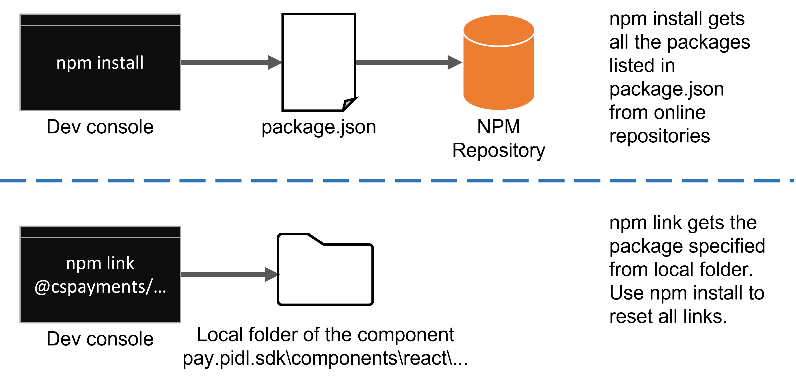
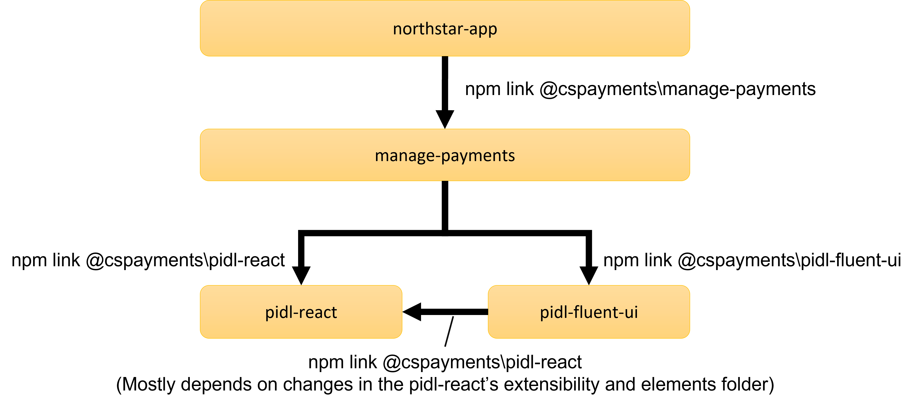

# Manage-payments testing

## Target audience
PX Engineering team

## Overview
This document explains how to test the manage-payments component in your dev PC and how the project is tested in the PPE environment.

## Prerequisites
* [Getting started with the manage-payments project](../development/manage-payments-getting-started.md)

## Testing code while is being developed
As a developer, you want to test new code while it only exists on your dev PC, before you even create a PR with it.
The NorthStar test portal can be run in localhost and that combined with npm linking will allow you to test your local build.

### NPM install vs NPM link
You are probably familiar with the node package manager, also know as NPM, and the `npm install` command to install libraries and dev tools that your project depends on.

NPM install will always get the packages from the location specified in package.json which normally are packages that exist in a remote repository (i.e. not your local build), therefore they don't have the latest changes you only have in your dev PC.

So how do you tell NPM you want some of the libraries to come from your local build? You use NPM link to replace the library downloaded from a remote repositoy by npm install, with a local folder where you built that same library.

This diagram shows the main difference between NPM install and link.

### Dependency hierarchy
When doing links, is very important to understand what depends on what, so you can run the link command in the right folder.

The following diagram shows the dependencies between the different dependencies in the NorthStar project. 

Keep in mind you don't need to link everything everytime, for instance if you have only made changes in manage-payments code and haven't made any changes to pidl-react and pidl-fluent-ui, then you only need to link northstar-app to manage-payments.

However, if multiple people are working on the same codebase and either you need their just commited changes or want to run all dependecies from the latest in master, then you will need to link those dependencies too.

Also note than running `npm install` on a given folder will reset all the links in that folder.

### Making folders linkable
Before you can use a component folder as a link, as explained above, you need to make that folder linkable by running first the command `npm link` (no parameters). 
For example, to make manage-payments linkable you first run `npm link` on the manage-payments folder.
After that you can go to the norstart-app folder, for example, and run `npm link @cspayments\manage-payments` to link to it.

Normally you only need to run `npm link` if you are creating a brand new dependency (e.g. a new element factory) or you just cloned the project from git, although running setup.ps1 (as explained in the dev setup, will run the links for you on all the known folders).

### Running northstar-app in localhost
To run the northstar-app in localhost execute `npm run start` on the nortstar-app folder.

However, if you have made any links before starting the northstar app you need to build those dependencies first from the bottom up. Normally you build pidl-react first, then pidl-fluent-ui then manage-payments and then you can start the nortstar-app.

To make this easier, you can have several command line windows open, each on a different dependency folder and running `npm run watch`. This will keep the build running automatically when you change the source code and will also automatically build them in the right sequence.

### Northstar-app settings
You can pass some settings via the query string to change the way the northstar app is initialized. 
For example to render the UI in arabic in the right-to-left reading order use: http://locahost:3000?language=ar-SA&rtl 

The following is a list of the settings available:

|Setting |Description |
--- | --- |
|**env**|Sets the environment service calls to PX, PIFD or PIMS. Example env=ppe. By default NorthStar uses PROD services|
|**market**|Sets the market. Determines what payment methods can be added and address to use by default.|
|**language**|Shows the UI localized in the language specified.|
|**rtl**|Mirrors the UI for right-to-left languages.|
|**showEvents**|Shows events on the console as info printouts. Requires env=ppe as well|
|**amcCss**|Loads the CSS that AMC would load. Useful to test CSS collision issues in localhost.|

## Testing release candidates in PPE
### Testing on the test portal (aka MSPayments PPE)
Release candidates are deployed first to the MsPayments PPE website.
MsPayments PPE is the NorthStar test portal, located at: https://mspayment-ppe-centralus.azurewebsites.net/.  

The test portal is, in fact, the same northstar-app used for dev testing, but deployed to a server rather than running in localhost.  
Also, since it's the same app, you can use the same northstar-app settings described above.

We own the [source code](https://microsoft.visualstudio.com/Universal%20Store/_git/pay.pidl.sdk?path=/apps/northstar-app) of the test portal, therefore we can add features as needed for more efficient testing or automation.

### Testing on AMC PPE
When a release candidate passes the tests done in MsPayments PPE, it gets released to the AMC team for deployment to their AMC PPE environment, located at https://account.microsoft-ppe.com/billing/payments 

The web app in AMC PPE is not the northstar-app, the source code is owed by the AMC team, not us. Therefore, there are some differences compared to testing in MSPayments PPE.   

First, the northstar app settings don't work. You cannot change the language or the market with a query string, but the AMC site has other ways to change those settings, usually as part of the UI. 
For example, from the site footer you can change the language.
Also by clicking on Profile from the header and edit your profile, you can change your account country which, effectively, changes the market.

Another difference is that the AMC site loads other components, CSS and scripts that sometimes affect our page.  
We have seen bugs introduced by these elements in the past because they are not easily detectable or even reproducible in our test portal.  

This is the reason we test again in AMC PPE. 

As explained before, first we test in our test portal to have a high level of confidence on the quality before releasing a new build to our partner, AMC, but also run another test pass in AMC PPE to make sure they will be no issues when it gets to PROD.

### Manual Test suite
For both MsPayments PPE and AMC PPE we run the manual tests listed in the [Payments NorthStar Test Suite](
https://microsoft.visualstudio.com/OSGS/_testPlans/define?planId=24794981&suiteId=25480613).   

We execute the test suite for each release candidate and keep it as a historical record.

To learn more, read [Azure Test Plans documentation](https://learn.microsoft.com/en-us/azure/devops/test/?view=azure-devops)

### Test pass types
We have two types of test-runs: **Full** and **Smoke Test**.   
A full test pass covers every feature of the app, smoke tests target only the most common features or the most common payment instruments and are a subset of the full pass.

The reason we have these types is that sometimes we require to run more than one test pass for the same release candidate.   
For example, we may do a full test pass for English and a smoke test pass for 1 or 2 localized languages. 

### Where does testing fit in the whole release process
Testing a release candidate is part of the release process.
However there are several steps that must occur before testing starts and after testing ends. So, to learn where testing fits in the release big picture, read the [Release process document](manage-payments-release.md).
