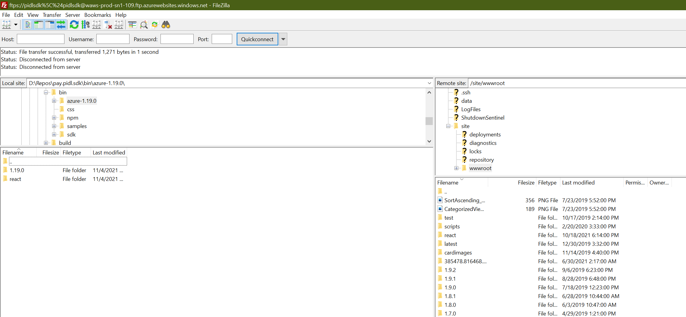
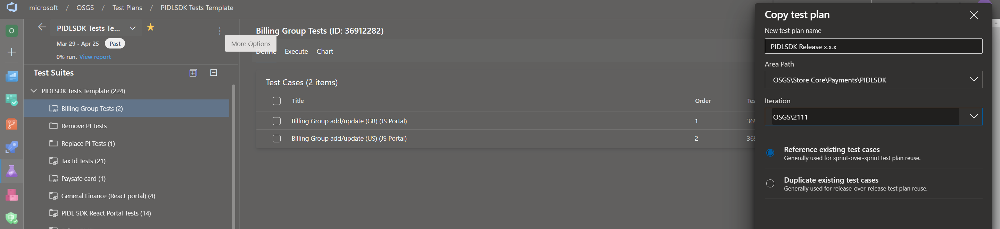
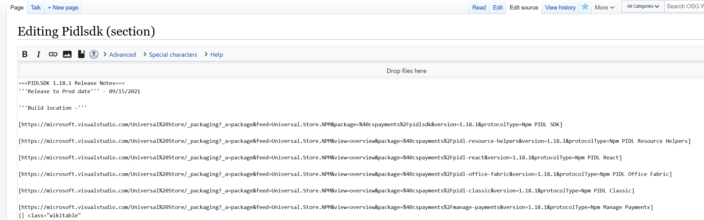
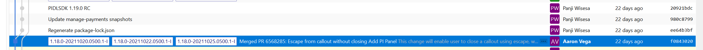
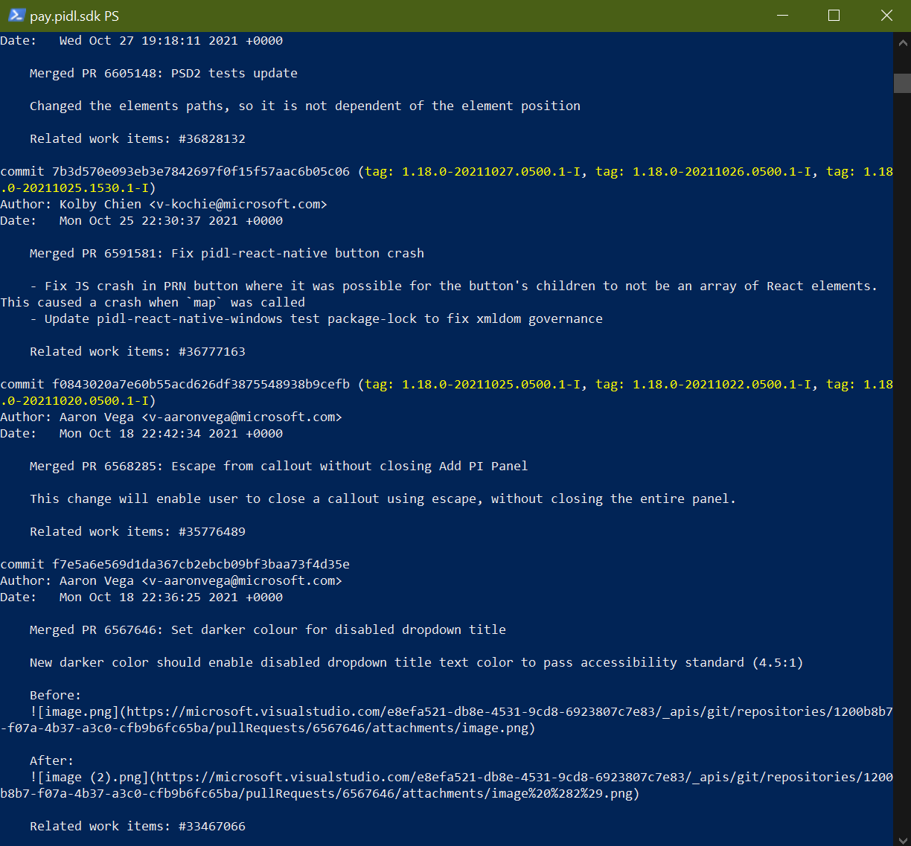
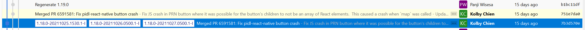

# Publishing new PIDLSDK Release

## Target audience
PX Engineering team

## Overview
This is the general steps to take when you need to release a new numbered PIDLSDK Package.

Alpha PIDLSDK packages are published automatically by the [Integration pipeline](https://microsoft.visualstudio.com/Universal%20Store/_build?definitionId=20658).

## Prerequisites
You should have setup the pay.pidl.sdk repo by following [PIDLSDK Setup](pidlsdk-setup.md).

You should also be able to run .\generator.ps1 under pay.pidl.sdk\tools\Build\ successfully.

## Steps to generate release
1. Discuss with the team on whether all the changes needed for the release are in the master branch. If you get an OK from everyone with changes that needs to be in the release then cut the build by making a branch called "release_x.x.x" (where x is the version number for the release, e.g. 1.19.0, 1.19.1, etc).
2. Move into the tools\build folder: $~~~~$ cd pay.pidl.sdk\tools\build and then run: $~~~~$ .\generator.ps1 x.x.x e.g. .\generator.ps1 1.19.0
3. Wait until the script finishes successfully and then commit all the newly generated packages into the branch, then push the branch to the remote repo and make a PR of this new branch against master (this is to bring master up to the latest version number once this process is done).
4. Deploy this release to the remote test portals by:
    - Running the [DeployVersion](https://microsoft.visualstudio.com/Universal%20Store/_build?definitionId=42170) against the newly created release branch. <b>Make sure the sdkVersion variable under Variables when running this pipeline is empty.</b>
    - Or a quicker way (or if the DeployVersion pipeline is broken) is to upload the new version manually:
        1. Connect through FTP (using FileZilla or other FTP clients) to [the pidlsdk AppService](https://ms.portal.azure.com/#@microsoft.onmicrosoft.com/resource/subscriptions/b6994420-af3c-4653-bbb1-c6b6ddf8e83b/resourceGroups/pidlsdk/providers/Microsoft.Web/sites/pidlsdk/vstscd) (look under Deployment Center > Deployment Credentials for the credentials to connect).
        2. Look under pay.pidl.sdk\bin folder and find the azure-x.x.x folder.
        3. <b>Upload the contents</b> of the azure-x.x.x folder up to /site/wwwroot on the pidlsdk AppService:

5. You should now be able to open the [JS test portal](https://pidlsdktestportal.azurewebsites.net/?mode=online&version=latest) and [React test portal](https://pidlsdktestportal.azurewebsites.net/PidlReact.html?new&version=latest) with the version in the query parameter changed to the version you just created.

If there are any changes that is not ready by the time the branch is created then those changes can be added later to the release by cherry picking the change from master into the release branch and regenerating the release (run step 2-5 again, except making the PR on step 3). <b> Just make sure that the new change is tested and any tests that maybe impacted rerun against the regenerated portals (because of this only do this cherry-pick procedure for really limited changes, else you'd have to rerun a lot of tests)</b>

## Steps to test release
1. Work with the tester to have them run a test pass based off of the [Template Test Plan](https://microsoft.visualstudio.com/OSGS/_testPlans/define?planId=36222018&suiteId=36222019). Tester should <b>copy by reference</b> the Template Test Plan and name the new copied plan something like "PIDLSDK Release x.x.x":

Make sure you set the correct Area Path and Iteration as well.
2. Running the test plan means running the automated tests in VS and marking the result in the new test plan under the Execute tab per scenario while also running the manual tests described in the test plan (and of course marking the result).
3. While they're working on the test pass coordinate with the BAG Team (the Store team, contact @vispence) on when they can flight the new JS PIDLSDK Release (they can't flight React version as of this time) for burst testing.
4. Burst testing means flighting the new package on to PROD and making sure our logs (see [PIDLSDK Dashboard](https://xpert.microsoft.com/osg/views/PidlSdkReport/054ab90f-a70d-49f8-b3e6-fdd5dcae0fd0) as an example) shows that no big issues arise from it. Coordinate with the BAG team on when they can run this test during the work hours for 15-30 minutes, if all looks well on both of our ends leave the flight on overnight and then turn it off the next day and verify the logs overnight are good (no weird fluctuations in success or failure compared to the same time range the previous week for example). As you only need to run the overnight test over one night, don't do burst tests on Friday. Also burst test can be cancelled or interrupted due to any active IcM that can come up, just keep that in mind.
5. If tester doing the test pass find any failures or regression work with them to confirm and rectify any issues (could be fixing test portals or making a fix that needs to be cherry-picked, etc).

## Steps to publish new release
1. After all the testing is done and the results are good then work with the PM on when to publish the new release.
2. When you get the go ahead run the branch against the [Publish pipeline](https://microsoft.visualstudio.com/Universal%20Store/_build?definitionId=18400).
3. Complete the PR of the branch created before <b>without deleting</b> the release_x.x.x branch as part of it.
4. Get the links to the newly published packages for the PM. You can get this easily by going to the [edit source of our previous release entry in the PIDLSDK wiki](https://www.osgwiki.com/index.php?title=Pidlsdk&action=edit&section=196) and doing replace all on the version in the query parameters of the links:

and then copying the links. <b>Do not save your changes of course.</b>
5. Get the work items in your new release since the last release for the PM. You can do this easily by looking in the git history on when the last release was cut from master:

then get the git log from current until that commit where the last release was cut from master:
 
Copy all that logs to a text editor then remove all the entries that was cherry picked into the last release or last hotfixes, for example this PR was merged to master then cherry-picked:

remove this commit from the logs you copied. 
Once you've done this filtering then copy all the logs and put it in Excel, filter for rows that start with "Related work items:" then grab only those rows, then remove the "Related work items:" prefix from those rows and filter by unique, these rows are now the work items in the release since the last one.
6. Send over the links and the rows of work items in this release since the last one and you're done.  

## Publishing hotfix releases
To release a hotfix release follow most of the steps above but:
1. Create a new branch off the release branch you want to make a hotfix version of and no need to create a PR for it. Name the branch similarly to normal releases, just change the minor versions e.g. 1.19.1, 1.19.2, etc.
2. Do the cherry-pick procedure for the changes you need in this hotfix (cherry-pick commit from master, regenerate release, deploy to remote test portals).
3. Ask the tester to run the tests for the main scenarios (e.g. Add CC, Add Paypal, List PI, etc) and the scenarios that would be impacted by the hotfix changes. No need for burst testing (but this require that you are confident and sure that the changes in the hotfix are limited and tested).
4. Follow the steps to publish as you'd normally.

---
For questions/clarifications, email [author/s of this doc and PX support](mailto:pawisesa@microsoft.com?cc=PXSupport@microsoft.com&subject=Docs%20-%20engineering/pidlsdk-publish.md).

---