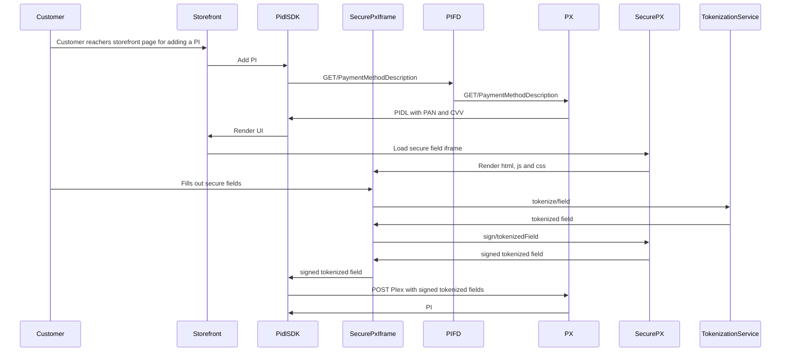

# Secure Field Isolation

## Target audience
PX Engineering team

## Progress
- [PX/PIDLSDK - Secure Field Isolation](https://microsoft.visualstudio.com/OSGS/_workitems/edit/29800284) 

## Key Objectives
- Field DOM query is not possible through the client. (Fixing the security issue.)
- Partner-PIDL contract remains the same.
- Storefront user experience remains the same.

## Architecture design


## Secure Field IFrame Messaging Contract

### Parent to Field

Message structure:
```
{
    source: 'PidlSdk', // required
    event: '', // required
    eventSource: 'cvv|pan', // [candidate], optional
    correlationId, // optional
    payload: '' // optional
};
```
|Source|Event|Description|
|----|----|----|
|PidlSdk|validateWithRegex|Request field to validate value with the given regex (or regex array).|
|PidlSdk|prepareForSubmit|Requests field to prepare for submit.|
|PidlSdk|hydrateState|Notifies secure field it should rehydrate value from storage if possible.|
|PidlSdk|clearState|Notifies field it should clear state from storage.|
|PidlSdk|applyPlaceholder|Requests field to apply the given placeholder value.|
|PidlSdk|applyCss|Requests field to apply the given css.|
|PidlSdk|enable|[CANDIDATE] Notifies field to enable input element.|
|PidlSdk|disable|[CANDIDATE] Notifies field to disable input element.|
|PidlSdk|hide|[CANDIDATE] Notifies field to hide (display: none) input element.|
|PidlSdk|show|[CANDIDATE] Notifies field to restore display property on input element.|

### Field to Parent

Message structure:
```
{
    source: 'PXSecureField', // required
    event: '', // required
    field: 'pan|cvv', // required
    correlationId, // optional
    payload: '' // optional
};
```

|Source|Field|Event|Description|
|----|----|----|----|
|PXSecureField|pan|cardTypeResolved|Notifies parent card type upon resolution.|
|PXSecureField|pan/cvv|validationCompleted|Replies to `validateWithRegex` event or might trigger automatically on value changed. Returns any validation errors found.|
|PXSecureField|pan/cvv|readyForSubmit|Replies to `prepareForSubmit` with the value to be used for submit as payload.|
|PXSecureField|pan/cvv|loaded|Notifies parent the frame has loaded successfully.|

## Design Meeting Notes
- Add event to apply watermark/placeholder.
- Whitelist possible regex values.
- Consider event names closer to existing event/api names on PIDLSDK.
- Deep dive into storage mechanism.
- Add allowed domains (both ways).
- Are messages and order guaranteed? Yes based on poc posting 10k messages in one-direction and two-direction.

## Implementation notes
Make iframe a model property
- Add label
- Add error block
- Add validation type iframe
- Validation and GetValue are async operations
- They know how to manage their messaging OR there's a global manager
	
Currently
```
export interface IIFrameElement extends ITextDisplayElement<pidlDocumentTypes.IFrameDisplayDescription> {
export class IFrameElement extends GenericTextElement<pidlDocumentTypes.IFrameDisplayDescription> implements IIFrameElement {
```

We need
```
export interface ITextBoxIFrameElement extends IPropertyElement
export class TextBoxIFrameElement extends PropertyElement implements ITextBoxIFrameElement
```

PropertyElement might need to know how to distinguish between a native text input and an iframe OR we might need:  
```
IFramePropertyElement extends ModelElement<pidlDocumentTypes.IPropertyDisplayDescription> implements IPropertyElement
```

ModelElementFactory knows when to create an iframe or iframe property

## Phase 1 (POC - 19 weeks 1 dev)

- [Original documentation](https://microsoft.sharepoint.com/teams/PaymentExperience/_layouts/15/Doc.aspx?sourcedoc=%7B171acb93-a045-434e-938d-ccefe55457ad%7D&action=edit&wd=target(PX%20Service.one%7C388e3ffe-94f9-4168-bc47-36f0dfc73a10%2FPX%5C%2FPIDLSDK%20-%20Non%20Discretionary%20-%20Secure%20Field%20Isolation%7C859f3586-4fc1-4242-85b7-56a332f96a64%2F)&share=IgGTyxoXRaBOQ5ONzO_lVFetAVuTzYY8wayvlF_mOXFb_MA)
- [Original design](https://microsoft.sharepoint.com/:u:/t/PXDevsFTE/EdfoTPyzg7xHhKZ7saxxFdMBykb6U8BkjPNOqldzFC4Eaw?e=G9ziI9)

|Area|Task|Estimate in weeks|Notes|
|----|----|----|----|
|SecurePX|Creating INT build and release pipelines |1|Consider increasing estimate for ARM templates|
|SecurePX|Create Secure PX Repository|1|Consider increasing estimate for CITs and COTs|
|SecurePX|Writing the logic / contract for post messages |4|
|SecurePX|Creating an endpoint on secure PX to do signing of the tokenized values |2|
|PX|Changes on PIDL configs to return "secure field" instead of input|1|
|PIDL|Rendering an iframe when seeing a field that needs to be tokenized PIDL SDK JS|1|
|PIDL|Implement the infrastructure to receive POST messages|2|
|PIDL|Implementing some kind of a stack to push the action that needs to be performed when there is an iframe with secure px is loaded|2|
|PIDL|Handle the POST message for PIDL resolution. Secure PX to return the context so that PIDL SDK can resolve to a PIDL|2|
|PIDL|Handle the POST message for validation errors returned by Secure PX.|2|
|SecurePX|Implement POC Partner Css |1|

Webblends us market, no pagination
Card type resolution and validation

## Phase 2 (Take  POC into prod - 26 weeks 1 dev)
|Area|Task|Estimate in weeks|
|----|----|----|
|SecurePX|Creating PPE/PROD build and release pipelines |1|
|-|Handle paging||
|PIDL|Some logic to store the signed tokenized values in a temp storage before continuing with the actions|2|
|PX|Changes on PX to verify signature of tokenized values|2|
|SecurePX|Setup INT host – AKV for TLS and a cert for signing the tokenized values |1|
|SecurePX|Setup PROD host – AKV for TLS and a cert for signing the tokenized values |1|
|SecurePX|Pushing telemetry data to Geneva |3|
|SecurePX|Do domain whitelisting of the domains that can post messages to secure px iframe |1|
|SecurePX|Perform CORS whitelisting |1|
|SecurePX|Configuration of the credit card bin ranges for per country / partner |1|
|SecurePX|Configuring alerts and dashboard monitoring on Geneva |1|
|PIDL|Rendering an iframe when seeing a field that needs to be tokenized React|1|
|SecurePX|Writing the logic to return CSS based on partner |3|
|SecurePX|Flighting and ramping up on a per partner basis |6|
|SecurePX|Load testing |2|

## Milestones
|Month|Deliverable|
|----|----|
|January|SecurePX repo and basic service|
|February|PidlSDK renders iframe for secure fields & pidlsdk/iframe contract|
|March|IFrame tokenizes values by calling Tokenization service|
|April|PidlSDK sends signed/tokenized value to PX when adding PI|
|May|TBD|

## Notes
Is PIFD going to be the gateway?
Do we need region match between PX and SecurePX?

## How to run
- Run the Secure PX service locally. No special setup required, just press F5.
- Run PX Service locally under the "user/holugo/sfi" branch
- Run the PidlTestPortal project locally
- Use fiddler to redirect int request to local environment.
- On the test portal, use webblendssecure partner and request the Add PI pidl.

## Urls
- Secure PX repo: https://microsoft.visualstudio.com/Universal%20Store/_git/SC.CSPayments.SecurePX
- Secure PX pull request build pipeline: https://microsoft.visualstudio.com/Universal%20Store/_build?definitionId=78529
- PX Service PR: https://microsoft.visualstudio.com/Universal%20Store/_git/SC.CSPayments.PX/pullrequest/7449812

---
For questions/clarifications, email [author/s of this doc and PX support](mailto:JieFan@microsoft.com?cc=PXSupport@microsoft.com&subject=Docs%20-%20engineering/local-cache.md).
---