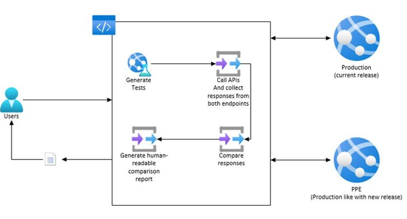

# DiffTests

## Target Audience
PX Engineering

## Overview
DiffTest is an API comparison tool built specifically for PX Service. The tool parses and compares responses against different environments, including a selfhost mode, and provides a report on all the differences it finds (additions, deletions and modification). The tool is part of the PidlTest console app located at <reporoot>\private\Payments\Tests\PidlTest.

## Architecture
DiffTest consists of 4 major pillars, 

- Test Generation. Generates API calls based on configuration files.
- Test Execution. Created and queues https request tasks and keeps track of progress.
- Response comparison. Parses responses and compares each node to detect addition, deletions and modification.
- Report Creation. Creates a CVS file with all the diffs found.



## Usage
|Parameter|Description|
|-----|------|
|/test|This is the test name to be executed. Use DiffTest.|
|/BaseEnv|(SELFHOST, LOCAL, INT, PPE, PROD) The environment to be used as baseline.|
|/TestEnv|(SELFHOST, LOCAL, INT, PPE, PROD) The environment to be tested.|
|/BaseUrl|Optional parameter, overrides the baseline url, commonly used when executing selfhost.|
|/TestUrl|Optional parameter, overrides the target url, commonly used when executing selfhost.|
|/BaseAcc|(email) (password) Optional parameter, overrides default baseline credentials.|
|/TestAcc|(email) (password) Optional parameter, overrides default target credentials.|
|/TriagedDiffFilePath|Path to file containing triagged diffs.|
|/help||
|/?||

## Example
- Compares PPE and PROD: `/test DiffTest /BaseEnv PROD /TestEnv PPE /TriagedDiffFilePath "\DiffTest\ConfigFiles\KnownDiffs\Test_PPE_AgainstBaseline_PROD.csv"`

## Running self-hosted locally
- Make sure you have git on PATH
- Caching git credential will help making the process faster. See: https://git-scm.com/docs/git-credential-cache
- Make sure you have msbuild on PATH

For VS2022, the msbuild path usually is located under %ProgramFiles%\Microsoft Visual Studio\2022\<YOUR_VS_EDITION>\MSBuild\Current\Bin where <YOUR_VS_EDITION> matches the Visual Studio edition that you have installed, i.e., Preview, Community, Professional, Enterprise.

To edit the PATH environment variable:
- Press Windows + R
- Type `rundll32 sysdm.cpl,EditEnvironmentVariables`

**If this is the first time running self-hosted difftest locally:**
- open powershell as administrator
- navigate to the repo root directory
- execute `.\LocalDiffTests.ps1 -full $true`

**If a simple difftest re-run is desired:**
- open powershell as administrator
- navigate to the repo root directory
- execute `.\LocalDiffTests.ps1`

## Triaging diffs
Before creating a pull request, make sure you run the self-hosted diff test locally.
Results will be published on `<RepoRoot>\private\Payments\Tests\PidlTest\bin\Debug\Logs`

If expected diffs are found, triage them on `<RepoRoot>\private\Payments\Tests\PidlTest\DiffTest\ConfigFiles\TriagedDiffs` using the new Triage Process, build PX service and re-run tests, errors should now be ignored.

Below are the steps to triage Diffs with New Process:
- After making the new PIDL(*.csv) changes, run the Diff Test as usual for the first time to get the differences. You can either use the PR process or run Diff Test locally for that.
- Go to the Logs folder or download from PR and verify that generated CSV file contains your changes. 
>[!NOTE]: This file will only contain new OR untriaged changes.


- In this file, triage the Diffs with your username+string. e.g. `[v-sokumawat, expected changes for bugfix-45256715]` 
>[!NOTE]: Must add the Bug/Task ID in the triage comment for tracking purposes.
- Go to PR and copy the PR ID (ignore the ! at the start of id).

 

- Rename this CSV file to the format `SELFHOST_vs_SELFHOST_PR-{PRID}`. 
  E.g., `SELFHOST_vs_SELFHOST_PR-9163089.csv` and copy it to TriagedDiffs folder.

 

- Unload & then Reload the PidlTest project (project is under Test folder) OR close & reopen the solution. 
(Optional step.  This required to see the newly added file in solution explorer in visualstudio)

 

- Check-in this file along with you PR changes.
- Build the solution and run the Diff Test again locally to verify the Diffs are triaged successfully or can use the PR Diff to test for the same.
 
 >[!NOTE]
**[Important]** Do not replace the `SELFHOST_vs_SELFHOST.csv` file in TriagedDiffs folder with your newly generated csv file from local Diff Test or PR DiffTest run.

## Sync pims INT mock data
When pims has new payment methods, we need to add those to our PIMS emulator mock [file](https://microsoft.visualstudio.com/Universal%20Store/_git/SC.CSPayments.PX?path=%2Fprivate%2FPayments%2FTests%2FEmulators%2FPIMS%2FMocks%2FPaymentMethodsByCountryAugmented.json&version=GBmaster&_a=contents).
Usually, that's done by calling pims on their int environment for each country. The following code on the PIMS accessor "GetPaymentMethods" method will create the json data.

```
                var countries = new List<string>() { "us", "jp", "cn", "fi", "cz", "gb", "de", "br", "nl", "hk", "ru", "in", "xk", "ly", "ss", "id", "ph", "tw", "th", "vn", "tr", "se" };
                var data = new Dictionary<string, List<PaymentMethod>>();

                if (additionalHeaders == null)
                {
                    additionalHeaders = new List<KeyValuePair<string, string>>();
                }

                // Could be "vNext" instead
                additionalHeaders.Add(new KeyValuePair<string, string>(GlobalConstants.HeaderValues.ExtendedFlightName, "v-next"));
                
                foreach (var c in countries)
                {
                    requestUrl = $"v4.0/paymentMethods?country={c}";

                    paymentMethods = await this.SendGetRequest<List<PaymentMethod>>(
                        requestUrl,
                        "GetPaymentMethods",
                        traceActivityId,
                        additionalHeaders);

                    data.Add(c, paymentMethods);
                }

                var json = JsonConvert.SerializeObject(data, Formatting.Indented);
```

## Re-baseline diffs after release
The [triage](https://microsoft.visualstudio.com/Universal%20Store/_git/SC.CSPayments.PX?path=/private/Payments/Tests/PidlTest/DiffTest/ConfigFiles/TriagedDiffs/SELFHOST_vs_SELFHOST.csv&version=GBmaster&_a=contents) file tends to get quite large. To keep the file with the minimum required diffs, we need to re-baseline it after each release. That is, remove all the diffs caused by the changes that were just deployed and leave only the required known diffs, should be around 400 lines.

To re baseline:
- Checkout master branch and create a feature branch off it.
- Delete all the diff rows on the triage file.
- Run the difftest tool locally with the full flag. `.\LocalDiffTests.ps1 -full $true`
- After running the difftests, all the baseline diffs will be on the log file the tool creates. Copy those diffs into the triage file and triage them.
- Build and re-run the tool locally, it should give 0 errors now.
- Merge the change into master.

## Common Issues
**Errors not related to my changes are showing up**  
Usually this is due a merge conflict resolved incorrectly. Make sure you didn't remove any triagged rows on the triage file.  
**How to correctly resolve conflicts on the triage file?**  
- Get a copy of the triage file from the master branch
- Replace the file on your branch, with the one you got from master
- Rerun the difftest tool locally, your diffs will show up no.
- Add those diffs into the triage file, append them to the end.

---
For questions/clarifications, email [author/s of this doc and PX support](mailto:holugo@microsoft.com?cc=PXSupport@microsoft.com&subject=Docs%20-%20engineering/tests/difftest.md).

---