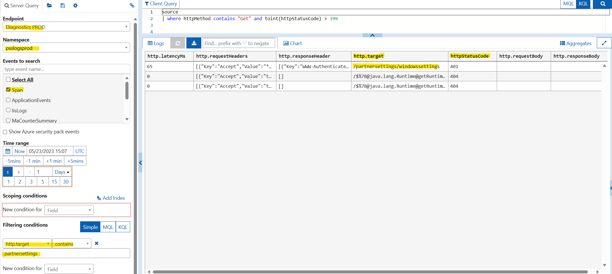
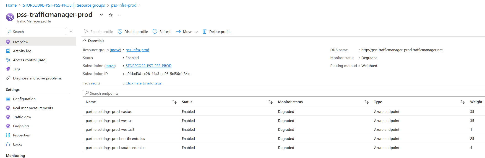

Partner Settings Service - TSG
==============================

**PSS - Subscription and Pipeline** - [PSS Subscription and Pipeline](https://microsoft-my.sharepoint.com/personal/v-saurab_microsoft_com/_layouts/OneNote.aspx?id=%2Fpersonal%2Fv-saurab_microsoft_com%2FDocuments%2FInfy_GloPay&wd=target%28PX%2FPX%20PIDL%20Extensibility.one%7CCC53D434-1372-41BA-A016-90851A8E705A%2FPSS%20Subscription%20and%20Pipeline%7CC7D1F1DB-5079-42C0-962C-7ADE6C44BA4D%2F%29)  
**PSS Repos** - [SC.CSPayments.PartnerSettings - Repos (visualstudio.com)](https://microsoft.visualstudio.com/Universal%20Store/_git/SC.CSPayments.PartnerSettings)  
**PPE Dashboard** - [pss-metrics-ppe | Jarvis (microsoftgeneva.com)](https://portal.microsoftgeneva.com/dashboard/pss-metrics-ppe)  
**Prod Dashboard** - [pss-metrics-prod | Jarvis (microsoftgeneva.com)](https://portal.microsoftgeneva.com/dashboard/pss-metrics-prod)

**JIT** - [Public - JIT Requests](https://jitaccess.security.core.windows.net/Requests)

Severity and SLA Definitions
----------------------------

*   **Sev0**: Entire platform globally offline, with no workaround, directly impacting customers or an entire channel. TTM < 60 mins.
*   **Sev1**: Multi-Region, multi-service, or major service degradation issue which severely impacts customers. TTM < 60 mins.
*   **Sev2**: Partial workflow or use case issue impacting service(s) or customer experience with errors or degraded performance. TTM < 60 mins.
*   **Sev3**: Urgent or high business impact with no SLA impact such as service/Component below SLA, not impacting major or minor customer scenario.
*   **Sev4**: Not urgent, no SLA impact such as routine maintenance.

Explanation of Impact
---------------------

The Partner Settings Service (PSS) is critical for managing partner configurations and settings. Issues in this service can lead to disruptions in partner operations, affecting their ability to manage settings and configurations effectively.

Monitor 1 - Monitor\_4xx\_Get
-----------------------------

Geneva Alert - Partner Setting Server (PSS) - Get operation has encountered Status Code 4xx Errors and has exceeded the limit.

1.  Use the following Dgrep portal link to get more detailed logs for this alert.
2.  Find partner name from http.target column from result, also extract error response from http.responsebody.
3.  Based on the error details, determine the issue.
4.  List of service errors:  
    a. SettingsNotFound  
    b. SettingTypeNotSupported  
    c. ConfigurationNotFound  
    d. ConfigurationNameNotExists  
    e. ArgumentIsNull  
    f. SettingPartnerNameNotMatching  
    g. PartnerConfigKeyIsNotValid  
    h. PartnerConfigValueIsNotValid  
    i. ConfigurationAlreadyExists



5.  Most of the Get calls are from the payment experience service PX. Below is the query to check logs:

    ```kusto
    let startTime = datetime("");
    let endTime = datetime("");
    RequestTelemetry
    | where TIMESTAMP > startTime
        and TIMESTAMP < endTime
    | where name == "Microsoft.Commerce.Tracing.Sll.PXServiceOutgoingOperation"
        and data_baseData_operationName contains "partnersettings"
    | where data_baseData_protocolStatusCode != 404 and toint(data_baseData_protocolStatusCode) > 399
    ```

Dgrep link PPE - [https://portal.microsoftgeneva.com/s/F9DE5586](https://portal.microsoftgeneva.com/s/F9DE5586)

Dgrep Prod - [https://portal.microsoftgeneva.com/s/91A2F587](https://portal.microsoftgeneva.com/s/91A2F587)

Monitor 2 - Monitor\_4xx\_AllOtherMethod
----------------------------------------

Geneva Alert - Partner Setting Server (PSS) - Post/Patch operation has encountered Status Code 4xx Errors and has exceeded the limit.

**Check logs from Dgrep: - Update the time range.**  
\[https://portal.microsoftgeneva.com/logs/dgrep?be=DGrep&offset=~1&offsetUnit=Days&UTC=false&ep=Diagnostics%20PROD&ns=psslogsprod&en=Span&conditions=\[\["http.target","contains","partnersettings"\]\]&kqlClientQuery=source%0A|%20where%20(httpMethod%20contains%20"Post"%20or%20httpMethod%20contains%20"patch")%20and%20toint(httpStatusCode)%20>%20399%0A%0A&chartEditorVisible=true&chartType=line&chartLayers=\[\["New%20Layer",""\]\]%20\](https://portal.microsoftgeneva.com/logs/dgrep?be=DGrep&offset=~1&offsetUnit=Days&UTC=false&ep=Diagnostics%20PROD&ns=psslogsprod&en=Span&conditions=\[\["http.target","contains","partnersettings"\]\]&kqlClientQuery=source%0A|%20where%20(httpMethod%20contains%20"Post"%20or%20httpMethod%20contains%20"patch")%20and%20toint(httpStatusCode)%20>%20399%0A%0A&chartEditorVisible=true&chartType=line&chartLayers=\[\["New%20Layer",""\]\]%20)

Monitor 3 - Monitor\_5xx
------------------------

Geneva alert - Partner Settings Service (PSS) has encountered Status Code 5xx Errors and has exceeded the limit.

[https://portal.microsoftgeneva.com/s/19F4FDBF](https://portal.microsoftgeneva.com/s/19F4FDBF)

Monitor 4 - Monitor-Latency
---------------------------

Partner Settings Service (PSS) latency is greater than 1000/5000ms

[https://portal.microsoftgeneva.com/s/B62D9797](https://portal.microsoftgeneva.com/s/B62D9797)

All other ICM's
---------------

1.  Check the logs for the time range.
2.  Extract the details from logs like partner/status code/error response.

If Region goes down:
--------------------

1.  Disable/Restart the region:  
    a. If you are DRI - get access using JIT. If not, get help from the SRE team.  
    b. Disable the region from ATM.  
    c. Restart the region.  
    d. Enable the region from ATM.



2.  Troubleshoot the logs from app service.

Root Cause Analysis (RCA)
-------------------------

Include a detailed RCA once the issue is resolved to prevent future occurrences.

Validation Steps
----------------

1.  Verify that the error rates have returned to normal levels.
2.  Confirm that all services are operational and no further alerts are triggered.

Point of Contact (POC)
----------------------

For escalation, contact the on-call engineer or the SRE team for immediate assistance.

Acronyms or Glossary
--------------------

*   **PSS**: Partner Settings Service
*   **DRI**: Directly Responsible Individual
*   **SRE**: Site Reliability Engineering
*   **ATM**: Azure Traffic Manager
*   **JIT**: Just-In-Time Access# Deployment Links

Airgap / Sovereign Cloud Deployments
------------------------------------

To find deployments to Sovereign Clouds (USNat, USSec, etc.) for this service, navigate to [Azure Bridge](https://bridge.azure.com/#/ReleaseStatus/Latest) and filter by the service's name.

Public Cloud Deployments
------------------------

Below are links to the EV2 rollouts in the last 14 days for the service "Payment Experience Service" (ServiceTreeID: e50abb8e-e976-4311-b12b-85156f4abc0e) service groups:

| Service Group | Classic EV2 Portal | New EV2 Portal |
|---------------|--------------------|----------------|
| Microsoft.CFS.PC.StaticResources.PROD | [Link](https://ev2portal.azure.net/#/?servicegroups=microsoft.staticresources&daterange=14&rolloutinfra=Prod) | [Link](https://ra.ev2portal.azure.net/#/Prod/e50abb8e-e976-4311-b12b-85156f4abc0e/Microsoft.CFS.PC.StaticResources.PROD?dateRange=14) |
| Microsoft.CFS.PC.SecurePX.PROD | [Link](https://ev2portal.azure.net/#/?servicegroups=securepx&daterange=14&rolloutinfra=Prod) | [Link](https://ra.ev2portal.azure.net/#/Prod/e50abb8e-e976-4311-b12b-85156f4abc0e/Microsoft.CFS.PC.SecurePX.PROD?dateRange=14) |
| Microsoft.CFS.PC.SellerMarketplace.PROD | [Link](https://ev2portal.azure.net/#/?servicegroups=microsoft.cfs.pc.sellermarketplace.prod&daterange=14&rolloutinfra=Prod) | [Link](https://ra.ev2portal.azure.net/#/Prod/e50abb8e-e976-4311-b12b-85156f4abc0e/Microsoft.CFS.PC.SellerMarketplace.PROD?dateRange=14) |
| Microsoft.CFS.PC.PSS.PROD | [Link](https://ev2portal.azure.net/#/?servicegroups=pss&daterange=14&rolloutinfra=Prod) | [Link](https://ra.ev2portal.azure.net/#/Prod/e50abb8e-e976-4311-b12b-85156f4abc0e/Microsoft.CFS.PC.PSS.PROD?dateRange=14) |
| Microsoft.CFS.PC.PX.PROD | [Link](https://ev2portal.azure.net/#/?servicegroups=PX&daterange=14&rolloutinfra=Prod) | [Link](https://ra.ev2portal.azure.net/#/Prod/e50abb8e-e976-4311-b12b-85156f4abc0e/Microsoft.CFS.PC.PX.PROD?dateRange=14) |
| Microsoft.CFS.PC.MSPayments.PROD | [Link](https://ev2portal.azure.net/#/?servicegroups=MSPayments&daterange=14&rolloutinfra=Prod) | [Link](https://ra.ev2portal.azure.net/#/Prod/e50abb8e-e976-4311-b12b-85156f4abc0e/Microsoft.CFS.PC.MSPayments.PROD?dateRange=14)