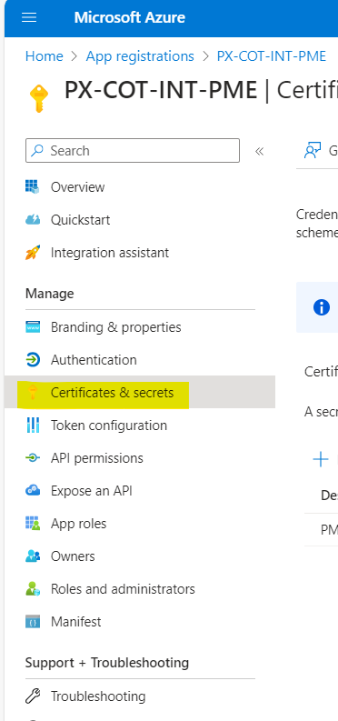

# Update COTs passwords

[Renew COTs Password](https://microsoft.sharepoint.com/teams/PaymentExperience/_layouts/OneNote.aspx?id=%2Fteams%2FPaymentExperience%2FSiteAssets%2FPayment%20Experience&wd=target%28PX%20Azurification.one%7CA7020D78-B8B0-46E6-BC1D-B0D07D02EDE6%2FRenew%20COTs%20Password%7C74CBD9D0-9494-4CDB-9E97-65E378E26B4F%2F%29onenote:https://microsoft.sharepoint.com/teams/PaymentExperience/SiteAssets/Payment%20Experience/PX%20Azurification.one#Renew%20COTs%20Password&section-id={A7020D78-B8B0-46E6-BC1D-B0D07D02EDE6}&page-id={74CBD9D0-9494-4CDB-9E97-65E378E26B4F}&object-id={B4CBA1CA-92F5-0AD1-2953-E0E315A485D5}&5B)

## Steps to create New Client Secret in **PX-COT-INT-PME**:  To create new secret you need to be owner of the App.

1. Navigate to azure portal home page https://ms.portal.azure.com/#home and search for App Registrations.

2. Open App Registrations. Under All applications, search for you App Name and Open the App.

3. Click on Certificates & Secrets. 

4. Click on New Client Secret. A new popup will open on right side. Provide necessary details. Click on Add to add the new client secret.

5. Replace AppKey with new secret generated from the previous steps in below pipeline **(csPayments.PX.PME.INT.OneBranch)**.

6. Please confirm whether the changes made will not cause the release pipeline to fail. 
7. After confirmation,  we should delete the old to be expiring secret.
