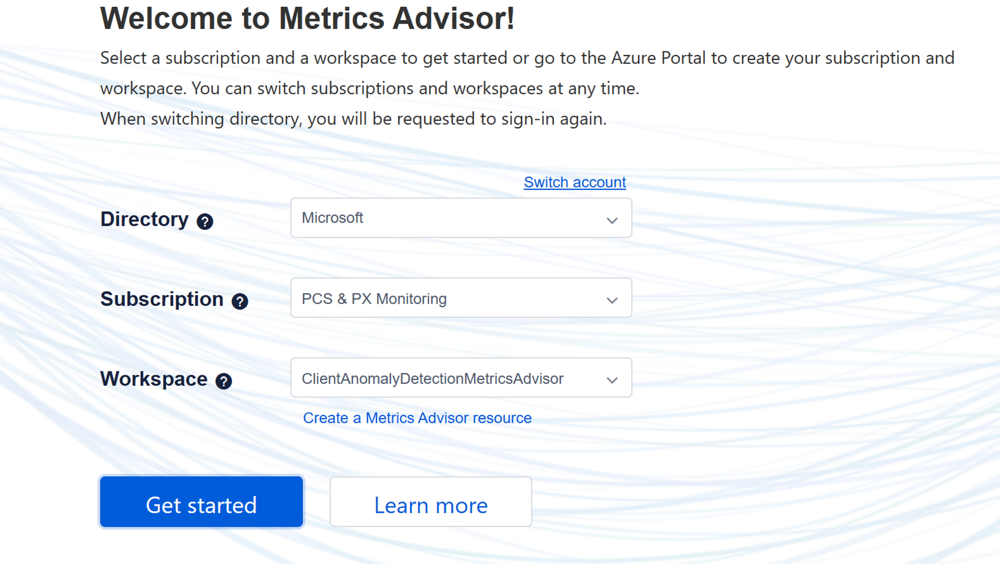

# Apay-Gpay-Latency-Sev3

Make sure you're logged into the right workspace.  This is in the "ClientAnomalyDetectionMetricsAdvisor" workspace


```

    • Sustained high latency with tokenization endpoint means an issue with Tokenization service.  Tag Kolby Chien, Arun Tilak Sivakumar in an email to highlight the issue for investigation
    • If getWalletConfig endpoint remains high, involve Kolby Chien, Jie Fan, and Bach Le for investigation
    • Spikes may occur due to the low volume currently.  If alert fires because of a single spike, 
```