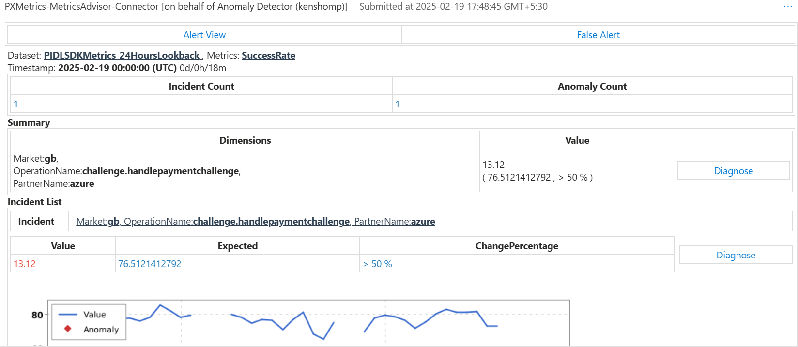

# HandlePaymentChallenge-SuccessRateDrop-Sev4

* __Background__: This TSG is for investigating the HandlePaymentChallenge-SuccessRateDrop .The issue involves a significant drop in HandlePaymentChallenge, impacting the PX service.

* __Issue__:After get an IcM generated by Metric Advisor, always start your investigation from IcM itself.Use[Incident-598204814](https://portal.microsofticm.com/imp/v5/incidents/details/598204814/summary) Details

* __Impact__: We've noticed that HandlePaymentChallenge-SuccessRateDrop due to "iFrameReturnedFailure_Failed_RejectedByProvider" error.

* __SLA Definition__: The IcM should be mitigated in 3 days and resolved in 5 days for Sev3/Sev4.

* __Severity Level Explanation__:
    * __Sev4__ - Not urgent, no SLA impact such as routing maintenance.
    * __Sev3__ - Urgent or high business impact with no SLA impact such as service/Component below SLA, not impacting major or minor customer scenario.
    * __Sev2__ - Partial workflow or use case issue impacting service(s) or customer experience with errors or degraded performance.
    * __Sev1__ - Multi-region, multi-service, or major service degradation issue severely impacting customers.
    * __Sev0__ - Entire platform globally offline, with no workaround, directly impacting customers or an entire channel.
    
* __Steps to Investigate__:
    1. Check the details that are provided by Metric Advisor Summary in the ICM as shown below.

         

    2. Run the Kusto query below, to see the errors and adjust the Timestamp as provided in Metric Advisor Alert View.

    Note:
        
    1. To run the below Kusto query, you need to have access to the PX Kusto Cluster. Kindly raise for an access here [PST Kusto Access Link](https://myaccess.microsoft.com/@microsoft.onmicrosoft.com#/access-packages/7fbe9cb6-00f3-4c98-9ed0-c9ff140f0f58)

     2. Connect to Azure VPN and open the Kusto explorer and a click on add connection with the Cluster Details - [Kusto Explorer](https://pst.kusto.windows.net)  to run the Kusto query

* __Sample Query's__
    * __Affected users query: Will provide for which error issue is happening.__

        ```
        let startTime = datetime("11-09-2023 08:00:00");
        let endTime = datetime("11-09-2023 23:59:00");
        let operationName = "";
        PidlSdkTelemetryEventsFiltered
        | where EventTime between (startTime .. endTime)
        | where PartnerName in ("amcweb") // Change partner as needed
        | where EventName == "failure"
        | where PidlResourceName startswith "challenge"
        | summarize dcount(ClientIP)
        ```
    * __Identify the error causing the drop in success rate: Will provide the error trend analysis.__
        ```
        let startTime = datetime("11-13-2023 08:00:00");
        let endTime = datetime("11-16-2023 23:59:00");
        let operationName = "";
        PidlSdkTelemetryEventsFiltered
        | where EventTime between (startTime .. endTime)
        | where PartnerName in ("amcweb")
        | where EventName == "failure"
        | where PidlResourceName startswith "challenge"
        | summarize dcount(ClientIP) by ErrorCode, bin(EventTime, 1h)
        | render timechart
        ```
* __Mitigation Steps:__
     * __Transient Issue__ :  If it’s a transient issue, the IcM will be auto mitigated after 10 mins.
     * If the issue is not auto-mitigated, then we have to check the pattern analysis. If not, Kindly contact to primary escalation point as provided below.
        * mandatoryInputParameterMissingOrNull__ / pidlDocDownloadFailed_BadRequest_InvalidRequestData
            * PIDLSDK Integration error with partner, involve on call and PIDL team (ravikmfte@microsoft.com) to contact partner

        * iFrameReturnedFailure_Failed_RejectedByProvider / pidlDocDownloadFailed_BadRequest_RejectedByProvider
            * Identify if there is a particular market causing the errors, if there is only 1 market there is potentially a card attack or a problem with a specific issuer.  Bring up these findings 

        * iFrameReturnedFailure_TimedOut_RejectedByProvider
            * Identify if there is only 1 partner throwing this error.  If there is there's likely an issue with iframe Content Security Policies blocking rendering
        
        * invalidSetup__
            * Google Pay and Apple Pay error, if we see a high rate of these that means the most recent PIDL release to partner has a bug with Gpay/Apay

* __Root Cause Analysis:__
Check if the  HandlePaymentChallenge-SuccessRateDrop  back to normal or if it is continuously dropping. Then, work with the PaymentExperience team to identify the root cause and update the Root Cause Analysis in the IcM.

* __Verification Steps:__
If the issue is auto-mitigated, then we have to check the Metric Advisor attached and confirm if the HandlePaymentChallenge-SuccessRateDrop  back to normal. If not, Kindly contact to PaymentExperience team.

* __Escalation Contact or Point-of-Contact (POC):__
Kindly contact to primary escalation point: PaymentExperience team(StoreCore-PST-PXService/pxoncall@microsoft.com).

* __Acronyms or Glossary:__

    * PX: Payment Experience
    * SLA: Service Level Agreement
    * ICM: Incident Management