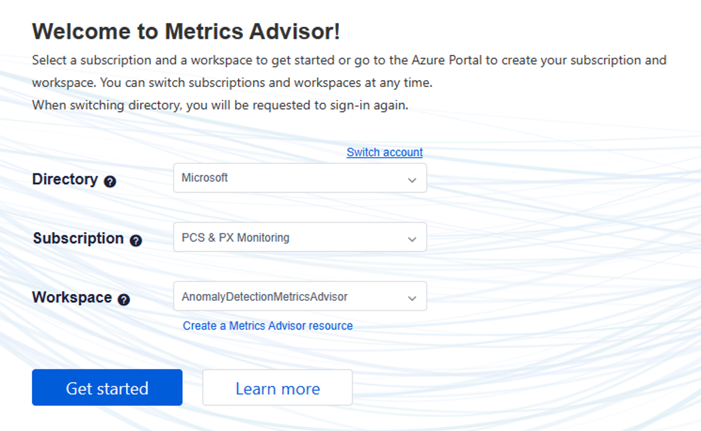
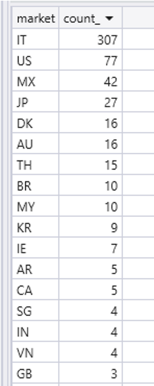

# PSD2 Authentication Success/Fail Rate 

The document below is to debug PSD2 Authentication Success/Fail Rate drop

**• PSD2 Authentication Success/Fail Rate Rises**

○ If this metrics advisor success rate alert triggers, that means we're seeing a rise In PSD2 transactions which are rejected by the bank or failing in general

▪ Metrics Advisor Entry: 
[Metrics Advisor](https://metricsadvisor.azurewebsites.net)

▪ If you need to login to metrics advisor, use the following config:

**• Pulling error information**

    ○ Error count trend query:
        ▪ This query is pulling errored/declined transactions.  Timeframe from 2 days ago to 1 minute ago, binning by 1 hour
        ▪ You should see a sin wave typically (transStatus N is typically highest), if there is an error the transaction status will have higher than normal error count
        
         PSD2PayerAuthCompleteChallengeEvents(ago(2d), ago(1m), false)
        | where transStatus in ("N", "R", "U", "")
        | summarize count() by bin(todatetime(transTime), 1h), transStatus
        | render timechart
    ○ Error information query for last hour:
            ▪ PSD2PayerAuthCompleteChallengeEvents(ago(1h), ago(1m), false)
            | where transStatus in ("N", "R", "U", "")
    ○ Authentication Rejection reasons:
            ▪ In response details, check the "cardholderinfo" field to see rejection reasons from mastercard
            ▪ RequestTelemetry
            | where TIMESTAMP > ago(1h)
            | where data_baseData_operationName == "MasterCardAuthenticateRequest"
            | extend resp = parse_json(data_ResponseDetails)
            | extend transStatus = tostring(resp.transStatus)
            | extend cardholderInfo = tostring(resp.cardholderInfo)
            | where transStatus in ("N","U","R","")
            | project TIMESTAMP, cV, data_baseData_operationName, transStatus, cardholderInfo, data_RequestDetails, data_ResponseDetails
    
**• Card Test in Italy Query**

    ○ There was a card test attack out of Italy for auth on the following dates.  This was determined by checking errors rates by market
    ○ let startTime = datetime(2023-04-04 02:30:00);
    let endTime = datetime(2023-04-04 05:30:00);
    PSD2PayerAuthAuthenticateEvents(startTime, endTime, true)
    | where transStatus == ""
    | extend resp = parse_json(ResponsePayload)
    | extend message = tostring((resp.message))
    | project market, message, ResponsePayload
    | summarize count() by market

