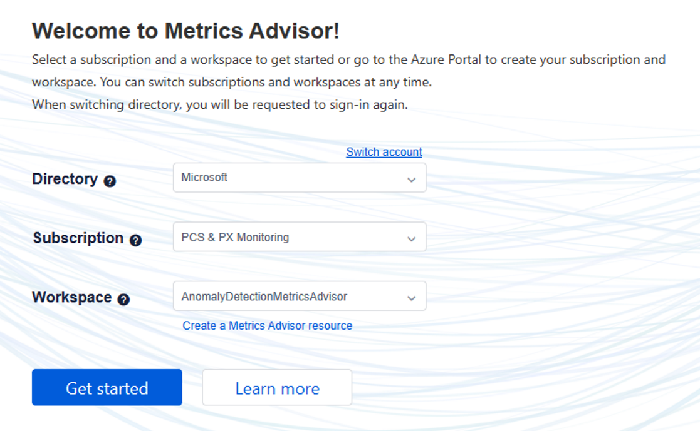

# PSD2 ChallengeCompletion Success Rate

**• TransStatus Values Meaning:**
    
○ See [6.3. Specification 2.2.0 — 3DSecure.io documentation](https://docs.3dsecure.io/3dsv2/specification_220.html#attr-ARes-transStatus)

**• PSD2ChallengeCompletion Success Rate drops**

○ If this metrics advisor success rate alert triggers, that means we're seeing a rise In PSD2 transactions which are rejected by the bank or failing in general
            
   ▪ Metrics Advisor Entry: 
[Metrics Advisor](https://metricsadvisor.azurewebsites.net/metric/c13253dc-770d-4dd7-97c8-cd131b28699d)

   ▪ If you need to login to metrics advisor, use the following config:

**• Should this be upgraded to a sev 2?**

    ○ If the error fires on the graph with "(empty)" partner, there's most likely an issue in the PSD2 ecosystem and this is a true issue and the ICM should be increased to a sev 2
    ○ If the incident only fires for a single partner (e.x. xbet), it may be caused by the following
        ▪ Low volume?
            • In metrics advisor, change the chart to show total challenge count and see if there are < 20 transactions, which may indicate a false positive due to low volume
            • If issue lasts for more than a couple hours, escalate to PX on call
        ▪ If not a low volume issue
                • Update ICM to Sev 2 and involve the PX on call
                • Determine if any of the following occurred at the time of drop
                • PX Change
                    ○ Check if dip corresponds to deployment
                • Flight change?
                • Partner Setting Service change?
                • Storefront change
                    ○ Involve on call 
            

**• Pulling error information**

     ○ Error count trend query:
            ▪ This query is pulling errored/declined transactions.  Timeframe from 2 days ago to 1 minute ago, binning by 1 hour
            ▪ You should see a rise and dip in the amount of challenges as PSD2 challenges occur more often during EU daytime hours.  Typically (transStatus N is typically highest), if there is an error the transaction status will have higher than normal error count
            PSD2PayerAuthCompleteChallengeEvents(ago(2d), ago(1m), false)
            | where transStatus in ("N", "R", "U", "")
            | summarize count() by bin(todatetime(transTime), 1h), transStatus
            | render timechart
        ○ Error information query for last hour:
            ▪ PSD2PayerAuthCompleteChallengeEvents(ago(1h), ago(1m), false)
            | where transStatus in ("N", "R", "U", "")
        ○ Authentication Rejection reasons:
            ▪ In response details, check the "cardholderinfo" field to see rejection reasons from mastercard
            ▪ RequestTelemetry
            | where TIMESTAMP > ago(1h)
            | where data_baseData_operationName == "MasterCardAuthenticateRequest"
            | extend resp = parse_json(data_ResponseDetails)
            | extend transStatus = tostring(resp.transStatus)
            | extend cardholderInfo = tostring(resp.cardholderInfo)
            | where transStatus in ("N","U","R","")
            | project TIMESTAMP, cV, data_baseData_operationName, transStatus, cardholderInfo, data_RequestDetails, data_ResponseDetails
    • I'm seeing a higher error count for a certain transaction status
        ▪ TransStatusReason Map: 6.3. Specification 2.2.0 — 3DSecure.io documentation
        ○ (empty transaction status aka transStatus == "") - Bank is rejecting our challenge request to them.  This is the most common case
            ▪ PSD2PayerAuthCompleteChallengeEvents(ago(1h), ago(1m), false)
            | where transStatus in ("")
            | summarize count() by payerAuthError, bankError
            ▪ These errors are caught by the safetynet and we still charge the card.  
            ▪Banks sometimes let the purchase go through, but there will be some charged rejected for not being authorized.  To get the affected user count, run this query here:
[PSD2 Safetynet Query](onenote:#PSD2%20Safetynet%20Query&section-id={9d4e1697-e8e8-4a70-bbc2-717d69b04a3b}&page-id={ffd9a908-775b-426b-90f1-92d41ef3e8c0}&end)
([Web view](https://microsoft.sharepoint.com/:o:/r/teams/PaymentExperience/_layouts/15/Doc.aspx?sourcedoc=%7B171acb93-a045-434e-938d-ccefe55457ad%7D&action=edit&wd=target(LiveSite%2FTSGs.one%7C9d4e1697-e8e8-4a70-bbc2-717d69b04a3b%2FPSD2%20Safetynet%20Query%7Cffd9a908-775b-426b-90f1-92d41ef3e8c0%2F)&wdorigin=703&wdpreservelink=1))

        ○ N – Transaction denied by bank
            ▪ Check the reason code for why the transaction was denied:
                • PSD2PayerAuthCompleteChallengeEvents(ago(1h), ago(1m), false)
                • | where transStatus in ("N")
                • | summarize count() by transStatusReason
        ○ R – Authentication rejected by bank, could be a technical issue caused by PSD2 issues or fraud
        ○ U – Authentication could not be performed, this means there could problem with the PSD2 flow
            ▪ Check the reason code for why the transaction was denied:
                • PSD2PayerAuthCompleteChallengeEvents(ago(1h), ago(1m), false)
                • | where transStatus in ("U")
                • | summarize count() by transStatusReason

**• How should I fix things if it's not a bank causing the problem?**

        ○ Was there a PX or PayerAuth flight that was recently enabled that matches with the drop in success rate?
            ▪ Roll back flight
        ○ Was there a PX deployment that week that included PSD2 changes?
            ▪ If there was flight around that change, revert that flight
            ▪ Roll back PX deployment or deploy hotfix fixing that issue
                • Contact Kolby Chien/Selvan Ramasamy/Anushri Marar
        ○ Is there a particular partner that is having a high error rate?
            ▪ Need to involve the on call for the problem partner

