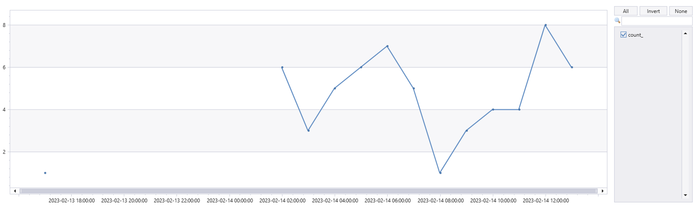
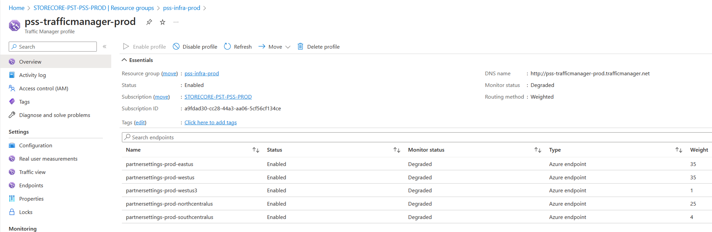

# PSS - Partner Settings Service - TSG

**PSS - Subscription and Pipeline** - [PSS Subscription and Pipeline](onenote:..\Projects\PX%20PIDL%20Extensibility.one#PSS%20Subscription%20and%20Pipeline&section-id={E3F9F531-468B-4134-B011-5EA22F2A1EDA}&page-id={C7D1F1DB-5079-42C0-962C-7ADE6C44BA4D}&end&base-path=https://microsoft.sharepoint.com/teams/PaymentExperience/SiteAssets/Payment%20Experience)

**PSS Repos** - [SC.CSPayments.PartnerSettings - Repos (visualstudio.com)](https://microsoft.visualstudio.com/Universal%20Store/_git/SC.CSPayments.PartnerSettings)

**PPE Dashboard** - [pss-metrics-ppe | Jarvis (microsoftgeneva.com)](https://portal.microsoftgeneva.com/dashboard/pss-metrics-ppe)

**Prod Dashboard** - [pss-metrics-prod | Jarvis (microsoftgeneva.com)](https://portal.microsoftgeneva.com/dashboard/pss-metrics-prod)

JIT - [Public - JIT Requests](https://jitaccess.security.core.windows.net/Requests)


**Monitor 1 -  Monitor_4xx_Get** - Geneva Alert - Partner Setting Server (PSS) - Get operation has encountered Status Code 4xx Errors and has exceeded the limit.


    1. Use the following Dgrep portal link to get more details logs for this alert
    2. Find partner name from http.target column from result, also extract error response from http.responsebody.
    3. Based on the error details find out what was the issue.
    4. List of service error 
        a. SettingsNotFound
        b. SettingTypeNotSupported
        c. ConfigurationNotFound
        d. ConfigurationNameNotExists
        e. ArgumentIsNull
        f. SettingPartnerNameNotMatching
        g. PartnerConfigKeyIsNotValid
        h. PartnerConfigValueIsNotValid
        i. ConfigurationAlreadyExists



    3. Most of the Get calls is form payment experience service PX, below is the query to check logs:

```    
let startTime = datetime("");
let endTime = datetime("");
RequestTelemetry
| where TIMESTAMP > startTime
    and TIMESTAMP < endTime
| where name == "Microsoft.Commerce.Tracing.Sll.PXServiceOutgoingOperation"
    and data_baseData_operationName contains "partnersettings"
| where data_baseData_protocolStatusCode != 404 and toint(data_baseData_protocolStatusCode) > 399
```

**Dgrep link PPE** - https://portal.microsoftgeneva.com/s/F9DE5586

**Dgrep Prod** - https://portal.microsoftgeneva.com/s/91A2F587


**Monitor 2  - Monitor_4xx_AllOtherMethod - Geneva Alert** - Partner Setting Server (PSS) - Post/Patch operation has encountered Status Code 4xx Errors and has exceeded the limit.

**Check logs from Dgrep:  - Update the time range.**

[https://portal.microsoftgeneva.com/logs/dgrep?be=DGrep&offset=~1&offsetUnit=Days&UTC=false&ep=Diagnostics%20PROD&ns=psslogsprod&en=Span&conditions=[["http.target","contains","partnersettings"]]&kqlClientQuery=source%0A|%20where%20(httpMethod%20contains%20"Post"%20or%20httpMethod%20contains%20"patch")%20and%20toint(httpStatusCode)%20>%20399%0A%0A&chartEditorVisible=true&chartType=line&chartLayers=[["New%20Layer",""]]%20](https://portal.microsoftgeneva.com/logs/dgrep?be=DGrep&offset=~1&offsetUnit=Days&UTC=false&ep=Diagnostics%20PROD&ns=psslogsprod&en=Span&conditions=[["http.target","contains","partnersettings"]]&kqlClientQuery=source%0A|%20where%20(httpMethod%20contains%20"Post"%20or%20httpMethod%20contains%20"patch")%20and%20toint(httpStatusCode)%20>%20399%0A%0A&chartEditorVisible=true&chartType=line&chartLayers=[["New%20Layer",""]]%20)

**Monitor 3  - Monitor_5xx** - Geneva alert - Partner Settings Service (PSS) has encountered Status Code 5xx Errors and has exceeded the limit.

To See Geneva logs -  https://portal.microsoftgeneva.com/s/19F4FDBF 

**OR**

Execute: [[Web](https://dataexplorer.azure.com/clusters/https%3a%2f%2fpst.kusto.windows.net/databases/Prod?query=H4sIAAAAAAAEAJVSXU%2fbQBB8j5T%2fsPKTU5l8OK2QkEBCgNQ8pETYVBUv1XJenKO%2bO3dvXQjqj%2b8lTgBHagtve7M7dzcze0U%2fG%2fKSU0WGhFf93mj0Gx6WxAT5bH6R5afzBZwAli6eFoN%2bb9dEdo0t4ueZpEAh0YbidJx%2bPJiMD9IppOnR9PBocngzSCbLAfR7aAsIg%2fj9Fj2drwtXE6NoZ7%2bgIfCCLP5ByxKiRSgtcUYi2pY%2batl2PaYtxNFcK3be3cnwzBlDrGiYM6owO8yqarj4lhH%2f0opmVjkT0MvdS1ECbyZfNlK6DnnjQc3unpS8WJSA%2bpr8S9p%2bMwgtSa5Z7zfC1eKUqzJBafyZK3bUqzaqz4QFcRc7J0Fd%2bWfQ186G6%2fbQNumgkmbFFlyrJO5ip0qFaGVWbIQie4IfOjh%2fDEwlPcJdhaUPp2v9N0nQBjiq2wT9NsFRBFtkk3W0w%2fNVTccLXBmycvEYTNNkFUXw4WXb%2fmdRZ3E%2bjccRrLm%2bMQZZPxFsFMUDuF29%2fsI7rO84%2bge26NsMNQMAAA%3d%3d)] [[Desktop](https://pst.kusto.windows.net/Prod?query=H4sIAAAAAAAEAJVSXU%2fbQBB8j5T%2fsPKTU5l8OK2QkEBCgNQ8pETYVBUv1XJenKO%2bO3dvXQjqj%2b8lTgBHagtve7M7dzcze0U%2fG%2fKSU0WGhFf93mj0Gx6WxAT5bH6R5afzBZwAli6eFoN%2bb9dEdo0t4ueZpEAh0YbidJx%2bPJiMD9IppOnR9PBocngzSCbLAfR7aAsIg%2fj9Fj2drwtXE6NoZ7%2bgIfCCLP5ByxKiRSgtcUYi2pY%2batl2PaYtxNFcK3be3cnwzBlDrGiYM6owO8yqarj4lhH%2f0opmVjkT0MvdS1ECbyZfNlK6DnnjQc3unpS8WJSA%2bpr8S9p%2bMwgtSa5Z7zfC1eKUqzJBafyZK3bUqzaqz4QFcRc7J0Fd%2bWfQ186G6%2fbQNumgkmbFFlyrJO5ip0qFaGVWbIQie4IfOjh%2fDEwlPcJdhaUPp2v9N0nQBjiq2wT9NsFRBFtkk3W0w%2fNVTccLXBmycvEYTNNkFUXw4WXb%2fmdRZ3E%2bjccRrLm%2bMQZZPxFsFMUDuF29%2fsI7rO84%2bge26NsMNQMAAA%3d%3d&web=0)] [[Web (Lens)](https://lens.msftcloudes.com/v2/#/discover/query//results?datasource=(cluster:pst.kusto.windows.net,database:Prod,type:Kusto)&query=H4sIAAAAAAAEAJVSXU%2fbQBB8j5T%2fsPKTU5l8OK2QkEBCgNQ8pETYVBUv1XJenKO%2bO3dvXQjqj%2b8lTgBHagtve7M7dzcze0U%2fG%2fKSU0WGhFf93mj0Gx6WxAT5bH6R5afzBZwAli6eFoN%2bb9dEdo0t4ueZpEAh0YbidJx%2bPJiMD9IppOnR9PBocngzSCbLAfR7aAsIg%2fj9Fj2drwtXE6NoZ7%2bgIfCCLP5ByxKiRSgtcUYi2pY%2batl2PaYtxNFcK3be3cnwzBlDrGiYM6owO8yqarj4lhH%2f0opmVjkT0MvdS1ECbyZfNlK6DnnjQc3unpS8WJSA%2bpr8S9p%2bMwgtSa5Z7zfC1eKUqzJBafyZK3bUqzaqz4QFcRc7J0Fd%2bWfQ186G6%2fbQNumgkmbFFlyrJO5ip0qFaGVWbIQie4IfOjh%2fDEwlPcJdhaUPp2v9N0nQBjiq2wT9NsFRBFtkk3W0w%2fNVTccLXBmycvEYTNNkFUXw4WXb%2fmdRZ3E%2bjccRrLm%2bMQZZPxFsFMUDuF29%2fsI7rO84%2bge26NsMNQMAAA%3d%3d&runquery=1)] [[Desktop (SAW)](https://pst.kusto.windows.net/Prod?query=H4sIAAAAAAAEAJVSXU%2fbQBB8j5T%2fsPKTU5l8OK2QkEBCgNQ8pETYVBUv1XJenKO%2bO3dvXQjqj%2b8lTgBHagtve7M7dzcze0U%2fG%2fKSU0WGhFf93mj0Gx6WxAT5bH6R5afzBZwAli6eFoN%2bb9dEdo0t4ueZpEAh0YbidJx%2bPJiMD9IppOnR9PBocngzSCbLAfR7aAsIg%2fj9Fj2drwtXE6NoZ7%2bgIfCCLP5ByxKiRSgtcUYi2pY%2batl2PaYtxNFcK3be3cnwzBlDrGiYM6owO8yqarj4lhH%2f0opmVjkT0MvdS1ECbyZfNlK6DnnjQc3unpS8WJSA%2bpr8S9p%2bMwgtSa5Z7zfC1eKUqzJBafyZK3bUqzaqz4QFcRc7J0Fd%2bWfQ186G6%2fbQNumgkmbFFlyrJO5ip0qFaGVWbIQie4IfOjh%2fDEwlPcJdhaUPp2v9N0nQBjiq2wT9NsFRBFtkk3W0w%2fNVTccLXBmycvEYTNNkFUXw4WXb%2fmdRZ3E%2bjccRrLm%2bMQZZPxFsFMUDuF29%2fsI7rO84%2bge26NsMNQMAAA%3d%3d&saw=1)]  https://pst.kusto.windows.net/Prod
```
RequestTelemetry
//| where TIMESTAMP > ago(3d)
| where around(TIMESTAMP,datetime(2024-10-23 22:37:17Z),1h)
and data_baseData_operationName startswith "PartnerSettings"
and name in ("Microsoft.Commerce.Tracing.Sll.PXServiceIncomingOperation", "Microsoft.Commerce.Tracing.Sll.PXServiceOutgoingOperation")
| project TIMESTAMP, cV, data_baseData_operationName, data_baseData_targetUri, data_baseData_protocolStatusCode, data_RequestHeader, data_RequestDetails, data_ResponseDetails, data_RequestTraceId, data_ServerTraceId, data_AccountId
| parse kind = regex flags = Ui data_baseData_targetUri with "/partnersettings/" partnerName "settingsType=PaymentExperience" *
| where data_baseData_protocolStatusCode startswith "500"
| summarize count() by partnerName, data_baseData_protocolStatusCode, data_ResponseDetails
```

**Monitor 4  - Monitor-Latency** - Partner Settings Service (PSS) latency is greater than 1000/5000ms

https://portal.microsoftgeneva.com/s/B62D9797

**All other ICM's**

    1. Check the logs for the time range
    2. Extract the details from logs like partner/status code/error response
    
**If Region goes down:**


**1. Disable/Restart the region:**

    a. If you are DRI - get access using JIT. If not get help from SRE team.
    b. Disabled the region from ATM
    c. Restart the region
    d. Enable the region from ATM



2. Troubleshoot the logs form app service.