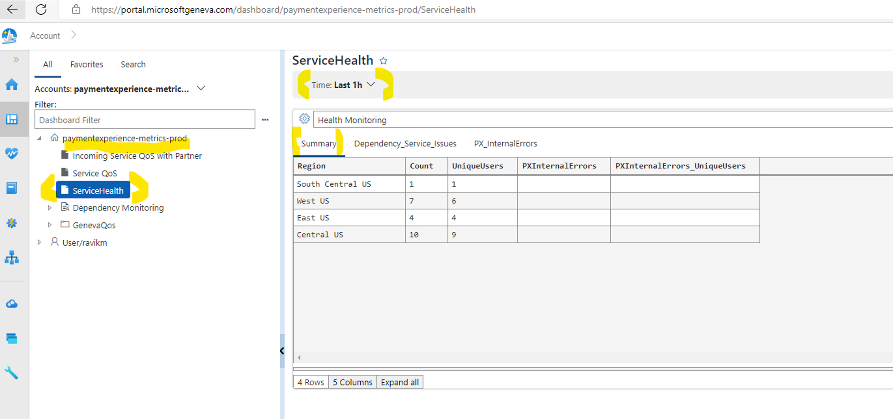
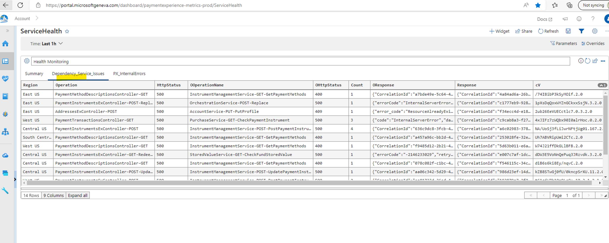
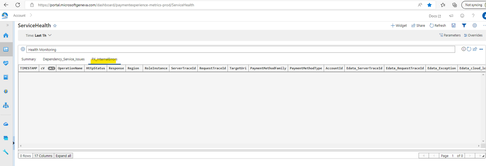

# Debugging from Geneva dashboard

1) We can use the following Geneva dashboard to see initial data about PX service health
[Service QoS | Jarvis (microsoftgeneva.com)](https://portal.microsoftgeneva.com/dashboard/paymentexperience-metrics-prod/Service%2520QoS)

2) We can use the following LensExplorer dashboard to get more details on PX service health. 
Note: This is sourced from Kusto cluster and there would be some delay in getting the recent data
[PX Reliablity Dashboard - Dashboard - Lens Explorer (msftcloudes.com)](https://lens.msftcloudes.com/#/dashboard/5dc09589-664c-4f9e-b41e-02bb73b36eab?temp=0&isSample=false&_g=(ws:e377c266-06a6-4858-9d50-4e24c8d098ed))
    
3) We can use the following dashboard to see the failures (system errors) summary.
[ServiceHealth | Jarvis (microsoftgeneva.com)](https://portal.microsoftgeneva.com/dashboard/paymentexperience-metrics-prod/ServiceHealth)
    
**In the Summary section, we can see the following details:**

        a) Region : Azure region from which the request is served
        b) Count : Total number of failures
        c) UniqueUsers : Unique users who experience the failures
        d) PXInternalErrors : Out of total failure, how many are caused by PX internal errors (no dependency service issue)
        e) PXInternalErrors_UniqueUsers : Number of unique users who experience the failures caused by PX internal errors
    
**In the 'Dependency_Service_Issues' section, we can see the following details:**

        a) Region : Azure region from which the request is served
        b) Operation : Incoming Operation Name
        c) HttpStatus : Response sent to the caller (PIFD)
        d) OOperationName : Outgoing Operation Name
        e) OHttpStatus : Outgoing call HttpStatus
        f) Count : Number of these errors for the given combination (Region, Operation, HttpStatus, OOperationName, OHttpStatus)
        g) OResponse : One of the outgoing service responses for the given combination
        h) Response : One of Incoming call's response sent back to the caller
        i) cV : One of the Incoming call's Correlation Vector (we can use this to find detailed logs)
    
**In the 'PX_InternalErrors' section, we can see the following details:**

        a) TIMESTAMP : TimeStamp of the Incoming request
        b) cV : Correlation Vector
        c) OperationName : Incoming Operation Name
        d) HttpStatus : HttpStatus code sent to the caller
        e) Response : Response details sent to the caller
        f) Region : Azure region service this request
        g) RoleInstance : Role Instance
        h) ServerTraceId : Server Trace Id (we can use this to correlate outgoing service calls)
        i) RequestTraceId : Request Trace Id (we can use this to correlate outgoing service calls0
        j) TargeUri : TargetUri for the request
        k) PaymentMethodFamily : Payment Method Family
        l) PaymentMethodType : Payment Method Type
        m) AccountId : User's Jarvis AccountId
        n) Edata_ServerTraceId : Not significant
        o) Edata_RequestTraceId : Request Trace Id (It'll be the same as 'ServeTraceId' column)
        p) Edata_Exception : It'll have the complete exception details
        q) Edata_cloud_location : It'll be same as 'Region' column

    PX_InternalErrors

        a) TIMESTAMP
        b) cV
        c) OperationName
        d) HttpStatus, Response, Region, RoleInstance, ServerTraceId, RequestTraceId, TargeUri, PaymentMethodFamily, PaymentMethodType, AccountId, Edata_ServerTraceId, Edata_RequestTraceId, Edata_Exception, Edata_cloud_location

        
4) Using the above details, analyze the impact and engage the correct team as mentioned at [livesite-sop.md - Repos (visualstudio.com)](https://microsoft.visualstudio.com/Universal%20Store/_git/SC.CSPayments.PX?path=/private/Payments/Docs/operations/livesite-sop.md&_a=preview). 

    a) If the issue is within PX service, see if the issue is limited to specific region. If so, we can either engage SRE oncall to take the impacted region offline, or get 'Traffic Manager Contributor' access to our PROD subscription using JIT and take the region offline. Our PROD Azure Traffic Manager is at [Azure Portal](https://portal.azure.com/#@mspmecloud.onmicrosoft.com/resource/subscriptions/9b6168fd-7d68-47e1-9c71-e51828aa62c0/resourceGroups/PX-Services-PROD-TM/providers/Microsoft.Network/trafficmanagerprofiles/paymentexperience-cp/overview). You need to use PME account and Yubi Key to login.

    b) If the issue is caused by any recent flight changes, see if we need to turn off those flights. Refer to [feature-flighting.md - Repos (visualstudio.com)](https://microsoft.visualstudio.com/Universal%20Store/_git/SC.CSPayments.PX?path=/private/Payments/Docs/operations/feature-flighting.md&_a=preview) for flight config management.

    c) If the issue is within PX service and not specific to a region and not specific to any flight config, engage Eng Manager Oncall (GP&C Executive Incident Manager) and see if any recent deployment needs to be rolled back.

