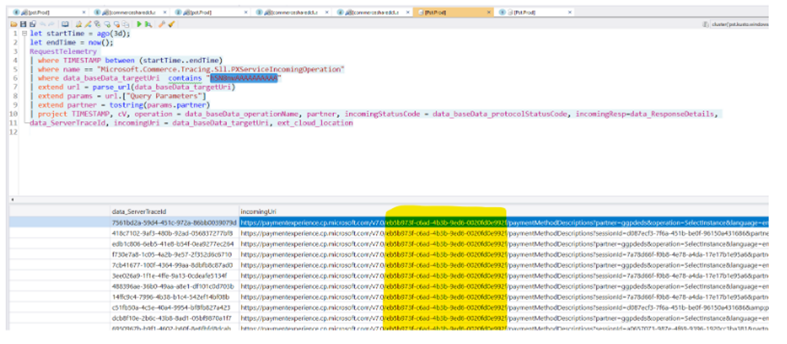

# PIDLSDK sample queries

**Title : PIDLSDK Query functions**

**Query**

GetPidlSdkFailures(ago(4h), now(), 1h)

GetPidlSdkReliabilityForAddOrUpdatePI(ago(4h), now(), 1h)

**Title : Sample PIDLSDK Query to get reliability across APIs**

Execute: [[Web](https://dataexplorer.azure.com/clusters/https%3a%2f%2fpst.kusto.windows.net/databases/Prod?query=H4sIAAAAAAAEAI1SS2%2fbMAy%2bD%2bh%2fEHSyB8%2fLBuyYw5C1QIF1C5LcA0WiU2J6BBTdzcN%2b%2fCi7gZsW6HaxRJrfQySt7zMDVfqUWdetM2wOJkOl15ScJNbo%2fNb92IGHAEzD9QNEzldv%2fqif90Cgogmglkul79BSyqnjdpVCALLQrs0QSvWZRBJHGAn0TDDG3woLRlXp3FsLOetG6c6g7wnK9ZjuUxhv5oQb4J4iiLvCkvsQDOFvUFs2xOBWqY%2bslsqWE7tqFig2n%2bEbtZ0EX0edXY2Im8nX64iz%2bRGxMtGC9%2f%2fy9vjKyRbQA9A1UaL%2fE1ImuqmZa0PyU4aaWyj4lofT4zNm0qJyGNQBY3Ubj5B5hwEa9SnUjRICjkBFQoLbL183kFMvE90JkWSmaX4%2fARnGFKfsuebGBPTDHO9GcYVdV12WTPO2BA55bw25Mt6QDuhhLx%2bP8biPKe4zBi2m9Gfv9SVtPYdbC1G2IJWNgF8M0osNeDRChDyIPknzXFVd7Mi7F12u335YLNrF%2b6dljfpY%2fwVu%2bEeEJgMAAA%3d%3d)] [[Desktop](https://pst.kusto.windows.net/Prod?query=H4sIAAAAAAAEAI1SS2%2fbMAy%2bD%2bh%2fEHSyB8%2fLBuyYw5C1QIF1C5LcA0WiU2J6BBTdzcN%2b%2fCi7gZsW6HaxRJrfQySt7zMDVfqUWdetM2wOJkOl15ScJNbo%2fNb92IGHAEzD9QNEzldv%2fqif90Cgogmglkul79BSyqnjdpVCALLQrs0QSvWZRBJHGAn0TDDG3woLRlXp3FsLOetG6c6g7wnK9ZjuUxhv5oQb4J4iiLvCkvsQDOFvUFs2xOBWqY%2bslsqWE7tqFig2n%2bEbtZ0EX0edXY2Im8nX64iz%2bRGxMtGC9%2f%2fy9vjKyRbQA9A1UaL%2fE1ImuqmZa0PyU4aaWyj4lofT4zNm0qJyGNQBY3Ubj5B5hwEa9SnUjRICjkBFQoLbL183kFMvE90JkWSmaX4%2fARnGFKfsuebGBPTDHO9GcYVdV12WTPO2BA55bw25Mt6QDuhhLx%2bP8biPKe4zBi2m9Gfv9SVtPYdbC1G2IJWNgF8M0osNeDRChDyIPknzXFVd7Mi7F12u335YLNrF%2b6dljfpY%2fwVu%2bEeEJgMAAA%3d%3d&web=0)] [[Web (Lens)](https://lens.msftcloudes.com/v2/#/discover/query//results?datasource=(cluster:pst.kusto.windows.net,database:Prod,type:Kusto)&query=H4sIAAAAAAAEAI1SS2%2fbMAy%2bD%2bh%2fEHSyB8%2fLBuyYw5C1QIF1C5LcA0WiU2J6BBTdzcN%2b%2fCi7gZsW6HaxRJrfQySt7zMDVfqUWdetM2wOJkOl15ScJNbo%2fNb92IGHAEzD9QNEzldv%2fqif90Cgogmglkul79BSyqnjdpVCALLQrs0QSvWZRBJHGAn0TDDG3woLRlXp3FsLOetG6c6g7wnK9ZjuUxhv5oQb4J4iiLvCkvsQDOFvUFs2xOBWqY%2bslsqWE7tqFig2n%2bEbtZ0EX0edXY2Im8nX64iz%2bRGxMtGC9%2f%2fy9vjKyRbQA9A1UaL%2fE1ImuqmZa0PyU4aaWyj4lofT4zNm0qJyGNQBY3Ubj5B5hwEa9SnUjRICjkBFQoLbL183kFMvE90JkWSmaX4%2fARnGFKfsuebGBPTDHO9GcYVdV12WTPO2BA55bw25Mt6QDuhhLx%2bP8biPKe4zBi2m9Gfv9SVtPYdbC1G2IJWNgF8M0osNeDRChDyIPknzXFVd7Mi7F12u335YLNrF%2b6dljfpY%2fwVu%2bEeEJgMAAA%3d%3d&runquery=1)] [[Desktop (SAW)](https://pst.kusto.windows.net/Prod?query=H4sIAAAAAAAEAI1SS2%2fbMAy%2bD%2bh%2fEHSyB8%2fLBuyYw5C1QIF1C5LcA0WiU2J6BBTdzcN%2b%2fCi7gZsW6HaxRJrfQySt7zMDVfqUWdetM2wOJkOl15ScJNbo%2fNb92IGHAEzD9QNEzldv%2fqif90Cgogmglkul79BSyqnjdpVCALLQrs0QSvWZRBJHGAn0TDDG3woLRlXp3FsLOetG6c6g7wnK9ZjuUxhv5oQb4J4iiLvCkvsQDOFvUFs2xOBWqY%2bslsqWE7tqFig2n%2bEbtZ0EX0edXY2Im8nX64iz%2bRGxMtGC9%2f%2fy9vjKyRbQA9A1UaL%2fE1ImuqmZa0PyU4aaWyj4lofT4zNm0qJyGNQBY3Ubj5B5hwEa9SnUjRICjkBFQoLbL183kFMvE90JkWSmaX4%2fARnGFKfsuebGBPTDHO9GcYVdV12WTPO2BA55bw25Mt6QDuhhLx%2bP8biPKe4zBi2m9Gfv9SVtPYdbC1G2IJWNgF8M0osNeDRChDyIPknzXFVd7Mi7F12u335YLNrF%2b6dljfpY%2fwVu%2bEeEJgMAAA%3d%3d&saw=1)] https://pst.kusto.windows.net/Prod
```
cluster("pst").database("Prod").PidlSdkTelemetryEvents
| where name == "Microsoft.Commerce.Payments.PidlSdk.PageEvent"
| where EventName in ("success", "failure", "gohome", "apiReturned")
| summarize StartedCount = countif(EventName == "apiReturned")
, SuccessCount = countif(EventName == "success")
, FailureCount = countif(EventName == "failure")
, CancelledCount = countif(EventName == "gohome")
, ServerErrorCount = countif(EventName == "failure" and EventParameters.error.type == "serverError")
by bin(IngestTime, 5m), PartnerName, PIDLResourceType, PidlSdkOperationType, ResourceFamily, ResourceType = iff(ResourceFamily in ("credit_card", "mobile_billing_non_sim"), "All", ResourceType), ResourceScenario
| extend Reliability = round((StartedCount - ServerErrorCount)*100.0/StartedCount, 2)
```

**Title : Sample NorthStar Xpert Query**

**Query**

Execute: [[Web](https://dataexplorer.azure.com/clusters/https%3a%2f%2fpst.kusto.windows.net/databases/Prod?query=H4sIAAAAAAAEAHVRwUrDQBC9F%2foPQ04phIBnrVBqwR5q2zQVRaRsN2ONbHbq7sQq%2bPHOxraxirfhzXtvZt4YZPCsHOdlhdAHtaH4rOiddztGOmiLPW5pFwc0w9caPedosEJ2H9DtfMLuGR1CPp6MFvlgMoM18g7RQnx0TtO9Va%2flWxWc%2bxBNSu3I0xOnQ6oqdBrT3Cld2k26MCad3S3QvZUax1ZTJeh0i05xSTZqzQrFarVWHq9CIWM3yEtXAmiyrErrIbq4ny4zmC9H2T3MBtlgAtejbHTZmOA7y4JQOyO3bpXzuJI6%2fse190MiZFV5UQk%2ffYjmNUooswAio%2fPR4ymXLTohM3l2ckr8LU%2f3ncZ46%2bgFNbd5JqBvE6DD1SI%2f3evYuZGhyWFKAuU%2brwUrrv2QCvwjlVlMmkxLaWUZ%2bm2%2foYeKrEhQojQ%2bkac3ePgLuvArHBetMOT%2be9AxuySEsdKG6mJlSDd7fwFZn0%2fRhQIAAA%3d%3d) [[Desktop](https://pst.kusto.windows.net/Prod?query=H4sIAAAAAAAEAHVRwUrDQBC9F%2foPQ04phIBnrVBqwR5q2zQVRaRsN2ONbHbq7sQq%2bPHOxraxirfhzXtvZt4YZPCsHOdlhdAHtaH4rOiddztGOmiLPW5pFwc0w9caPedosEJ2H9DtfMLuGR1CPp6MFvlgMoM18g7RQnx0TtO9Va%2flWxWc%2bxBNSu3I0xOnQ6oqdBrT3Cld2k26MCad3S3QvZUax1ZTJeh0i05xSTZqzQrFarVWHq9CIWM3yEtXAmiyrErrIbq4ny4zmC9H2T3MBtlgAtejbHTZmOA7y4JQOyO3bpXzuJI6%2fse190MiZFV5UQk%2ffYjmNUooswAio%2fPR4ymXLTohM3l2ckr8LU%2f3ncZ46%2bgFNbd5JqBvE6DD1SI%2f3evYuZGhyWFKAuU%2brwUrrv2QCvwjlVlMmkxLaWUZ%2bm2%2foYeKrEhQojQ%2bkac3ePgLuvArHBetMOT%2be9AxuySEsdKG6mJlSDd7fwFZn0%2fRhQIAAA%3d%3d&web=0)] [[Web (Lens)](https://lens.msftcloudes.com/v2/#/discover/query//results?datasource=(cluster:pst.kusto.windows.net,database:Prod,type:Kusto)&query=H4sIAAAAAAAEAHVRwUrDQBC9F%2foPQ04phIBnrVBqwR5q2zQVRaRsN2ONbHbq7sQq%2bPHOxraxirfhzXtvZt4YZPCsHOdlhdAHtaH4rOiddztGOmiLPW5pFwc0w9caPedosEJ2H9DtfMLuGR1CPp6MFvlgMoM18g7RQnx0TtO9Va%2flWxWc%2bxBNSu3I0xOnQ6oqdBrT3Cld2k26MCad3S3QvZUax1ZTJeh0i05xSTZqzQrFarVWHq9CIWM3yEtXAmiyrErrIbq4ny4zmC9H2T3MBtlgAtejbHTZmOA7y4JQOyO3bpXzuJI6%2fse190MiZFV5UQk%2ffYjmNUooswAio%2fPR4ymXLTohM3l2ckr8LU%2f3ncZ46%2bgFNbd5JqBvE6DD1SI%2f3evYuZGhyWFKAuU%2brwUrrv2QCvwjlVlMmkxLaWUZ%2bm2%2foYeKrEhQojQ%2bkac3ePgLuvArHBetMOT%2be9AxuySEsdKG6mJlSDd7fwFZn0%2fRhQIAAA%3d%3d&runquery=1)] [[Desktop (SAW)](https://pst.kusto.windows.net/Prod?query=H4sIAAAAAAAEAHVRwUrDQBC9F%2foPQ04phIBnrVBqwR5q2zQVRaRsN2ONbHbq7sQq%2bPHOxraxirfhzXtvZt4YZPCsHOdlhdAHtaH4rOiddztGOmiLPW5pFwc0w9caPedosEJ2H9DtfMLuGR1CPp6MFvlgMoM18g7RQnx0TtO9Va%2flWxWc%2bxBNSu3I0xOnQ6oqdBrT3Cld2k26MCad3S3QvZUax1ZTJeh0i05xSTZqzQrFarVWHq9CIWM3yEtXAmiyrErrIbq4ny4zmC9H2T3MBtlgAtejbHTZmOA7y4JQOyO3bpXzuJI6%2fse190MiZFV5UQk%2ffYjmNUooswAio%2fPR4ymXLTohM3l2ckr8LU%2f3ncZ46%2bgFNbd5JqBvE6DD1SI%2f3evYuZGhyWFKAuU%2brwUrrv2QCvwjlVlMmkxLaWUZ%2bm2%2foYeKrEhQojQ%2bkac3ePgLuvArHBetMOT%2be9AxuySEsdKG6mJlSDd7fwFZn0%2fRhQIAAA%3d%3d&saw=1)] https://pst.kusto.windows.net/Prod
```
let startTime = ago(1d);
let endTime = now();
RequestTelemetry 
| where TIMESTAMP between (startTime..endTime)
| where name == "Microsoft.Commerce.Tracing.Sll.PXServiceIncomingOperation"
| where data_baseData_targetUri  contains "<YOUR QUERY PARAM HERE>"
| extend url = parse_url(data_baseData_targetUri)
| extend params = url.["Query Parameters"]
| extend partner = tostring(params.partner)
| project TIMESTAMP, cV, operation = data_baseData_operationName, partner, incomingStatusCode = data_baseData_protocolStatusCode, incomingResp=data_ResponseDetails, 
data_ServerTraceId, incomingUri = data_baseData_targetUri, ext_cloud_location
```

**Notes**

**Example URL:** https://paymentinstruments.mp.microsoft.com/v6.0/users/me/paymentMethodDescriptions?sessionId=d087ecf3-7f6a-451b-be0f-96150a431686&partner=ggpdeds&operation=Add&language=en-US&family=credit_card&country=au&billableaccountid=hSN8nwAAAAAAAAAA
1. Open Kusto Explorer
2. Run the following query against Pst > Prod database (adjusting start and end time as necessary), replacing <YOUR QUERY PARAM HERE> with a unique query parameter value you want to search for (cV, data_ServerTraceId, billableaccountid, etc):


For example, if you want to search for the billableaccountid then replace <YOUR QUERY PARAM HERE> with hSN8nwAAAAAAAAAA 


3. Find the incomingUri in the Kusto search results to locate the account id in the url after the version number. For example: https://paymentexperience.cp.microsoft.com/v7.0/`{ACCOUNT ID IS HERE}`/paymentMethodDescriptions?partner=ggpdeds&operation=SelectInstance&language=en-US&country=AU&billableaccountid=hSN8nwAAAAAAAAAA&allowedPaymentMethods=%5B%22credit_card%22%2C%22direct_debit%22%5D


