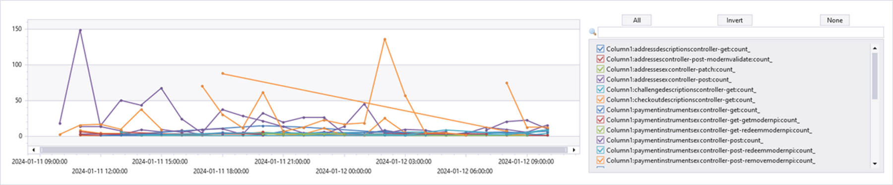

# PX Sample queries

**Title : PX service Issue - visualize by region**

**Query**

Execute: [[Web](https://dataexplorer.azure.com/clusters/https%3a%2f%2fpst.kusto.windows.net/databases/Prod?query=H4sIAAAAAAAEAG2QvU7DQBCE%2b0h5h5UrRySRHUgDBAkBRYogwO6ty3kUn3Q%2f5m4NMeLhOYcIN3Sr0Xy7M6vBFFh4pg3VgsHKIF1lq6tFli%2fynPLsen05u5lOdDTC1tH2a7%2bgvI7yG947BC6hYcC%2bn06%2b6bOBB5Xb3VNR3u9e6O6MiIiP6u2wbrQXrvMSz8IgtEKClKU0aUVvYBnHFl7BSmh3CK13dTIbyRhbVHsRUPYtSDrLQtlAyS4sX11Ybq10RtlDAf%2bhJM6Bk3%2f4x2GI29lJpwsW3IUHV4M2G0rWWXZCQmeM8OprONRZTme07wlHrqR2XV15pzGnvbLpX9E55c0prY994Wn4sGyGf%2fwABe45vnwBAAA%3d)] [[Desktop](https://pst.kusto.windows.net/Prod?query=H4sIAAAAAAAEAG2QvU7DQBCE%2b0h5h5UrRySRHUgDBAkBRYogwO6ty3kUn3Q%2f5m4NMeLhOYcIN3Sr0Xy7M6vBFFh4pg3VgsHKIF1lq6tFli%2fynPLsen05u5lOdDTC1tH2a7%2bgvI7yG947BC6hYcC%2bn06%2b6bOBB5Xb3VNR3u9e6O6MiIiP6u2wbrQXrvMSz8IgtEKClKU0aUVvYBnHFl7BSmh3CK13dTIbyRhbVHsRUPYtSDrLQtlAyS4sX11Ybq10RtlDAf%2bhJM6Bk3%2f4x2GI29lJpwsW3IUHV4M2G0rWWXZCQmeM8OprONRZTme07wlHrqR2XV15pzGnvbLpX9E55c0prY994Wn4sGyGf%2fwABe45vnwBAAA%3d&web=0)] [[Web (Lens)](https://lens.msftcloudes.com/v2/#/discover/query//results?datasource=(cluster:pst.kusto.windows.net,database:Prod,type:Kusto)&query=H4sIAAAAAAAEAG2QvU7DQBCE%2b0h5h5UrRySRHUgDBAkBRYogwO6ty3kUn3Q%2f5m4NMeLhOYcIN3Sr0Xy7M6vBFFh4pg3VgsHKIF1lq6tFli%2fynPLsen05u5lOdDTC1tH2a7%2bgvI7yG947BC6hYcC%2bn06%2b6bOBB5Xb3VNR3u9e6O6MiIiP6u2wbrQXrvMSz8IgtEKClKU0aUVvYBnHFl7BSmh3CK13dTIbyRhbVHsRUPYtSDrLQtlAyS4sX11Ybq10RtlDAf%2bhJM6Bk3%2f4x2GI29lJpwsW3IUHV4M2G0rWWXZCQmeM8OprONRZTme07wlHrqR2XV15pzGnvbLpX9E55c0prY994Wn4sGyGf%2fwABe45vnwBAAA%3d&runquery=1)] [[Desktop (SAW)](https://pst.kusto.windows.net/Prod?query=H4sIAAAAAAAEAG2QvU7DQBCE%2b0h5h5UrRySRHUgDBAkBRYogwO6ty3kUn3Q%2f5m4NMeLhOYcIN3Sr0Xy7M6vBFFh4pg3VgsHKIF1lq6tFli%2fynPLsen05u5lOdDTC1tH2a7%2bgvI7yG947BC6hYcC%2bn06%2b6bOBB5Xb3VNR3u9e6O6MiIiP6u2wbrQXrvMSz8IgtEKClKU0aUVvYBnHFl7BSmh3CK13dTIbyRhbVHsRUPYtSDrLQtlAyS4sX11Ybq10RtlDAf%2bhJM6Bk3%2f4x2GI29lJpwsW3IUHV4M2G0rWWXZCQmeM8OprONRZTme07wlHrqR2XV15pzGnvbLpX9E55c0prY994Wn4sGyGf%2fwABe45vnwBAAA%3d&saw=1)] https://pst.kusto.windows.net/Prod
```
let start = datetime(2024-01-11 10:53);
let end = start + 1d;
RequestTelemetry
| where TIMESTAMP > start and TIMESTAMP < end
| where SourceNamespace in ("paymentexperiencelogsprod")
| where data_baseType contains "Ms.Qos.IncomingServiceRequest"
| where data_baseData_protocolStatusCode == "500"
| summarize count() by ext_cloud_role, bin(TIMESTAMP, 1h)
| render timechart 
```


**Title : PX service issue- Visualize by API name**

**Query**

Execute: [[Web](https://dataexplorer.azure.com/clusters/https%3a%2f%2fpst.kusto.windows.net/databases/Prod?query=H4sIAAAAAAAEAG2QQUvDQBSE74X%2bh0dOCbYlqfaiVhD10ENFTe6y3QztQnZf3H2xRvzxbmqxCN6Wx3yzM9NAKIjyQkuqlUCMRTrP5xfTvJgWBRX55eI8uxqPmiiEq6PsR35GRR3PL3jrEKRCAwvx%2fXj0RfsdPKharR%2fK6nb9RDdHREX8dL0e7E7ykjuv8agsQqs0yDhKk1b1Fk7w0cIbOI2Gt6H1XCfZiYyx1etGBVR9C9LsRBkXKFmH2TOH2cpptsZtS%2fh3o3EMnPzD3w%2bP6C6suSlFSRfuuAYtl5Qs8vyAhM5a5c3n8FHnJM1o05Nww3v49K8Tx9BKDLuhVDahjXHpb%2f0JFbtDBx9XgKdhd70bVvoGN9CORZIBAAA%3d)] [[Desktop](https://pst.kusto.windows.net/Prod?query=H4sIAAAAAAAEAG2QQUvDQBSE74X%2bh0dOCbYlqfaiVhD10ENFTe6y3QztQnZf3H2xRvzxbmqxCN6Wx3yzM9NAKIjyQkuqlUCMRTrP5xfTvJgWBRX55eI8uxqPmiiEq6PsR35GRR3PL3jrEKRCAwvx%2fXj0RfsdPKharR%2fK6nb9RDdHREX8dL0e7E7ykjuv8agsQqs0yDhKk1b1Fk7w0cIbOI2Gt6H1XCfZiYyx1etGBVR9C9LsRBkXKFmH2TOH2cpptsZtS%2fh3o3EMnPzD3w%2bP6C6suSlFSRfuuAYtl5Qs8vyAhM5a5c3n8FHnJM1o05Nww3v49K8Tx9BKDLuhVDahjXHpb%2f0JFbtDBx9XgKdhd70bVvoGN9CORZIBAAA%3d&web=0)] [[Web (Lens)](https://lens.msftcloudes.com/v2/#/discover/query//results?datasource=(cluster:pst.kusto.windows.net,database:Prod,type:Kusto)&query=H4sIAAAAAAAEAG2QQUvDQBSE74X%2bh0dOCbYlqfaiVhD10ENFTe6y3QztQnZf3H2xRvzxbmqxCN6Wx3yzM9NAKIjyQkuqlUCMRTrP5xfTvJgWBRX55eI8uxqPmiiEq6PsR35GRR3PL3jrEKRCAwvx%2fXj0RfsdPKharR%2fK6nb9RDdHREX8dL0e7E7ykjuv8agsQqs0yDhKk1b1Fk7w0cIbOI2Gt6H1XCfZiYyx1etGBVR9C9LsRBkXKFmH2TOH2cpptsZtS%2fh3o3EMnPzD3w%2bP6C6suSlFSRfuuAYtl5Qs8vyAhM5a5c3n8FHnJM1o05Nww3v49K8Tx9BKDLuhVDahjXHpb%2f0JFbtDBx9XgKdhd70bVvoGN9CORZIBAAA%3d&runquery=1)] [[Desktop (SAW)](https://pst.kusto.windows.net/Prod?query=H4sIAAAAAAAEAG2QQUvDQBSE74X%2bh0dOCbYlqfaiVhD10ENFTe6y3QztQnZf3H2xRvzxbmqxCN6Wx3yzM9NAKIjyQkuqlUCMRTrP5xfTvJgWBRX55eI8uxqPmiiEq6PsR35GRR3PL3jrEKRCAwvx%2fXj0RfsdPKharR%2fK6nb9RDdHREX8dL0e7E7ykjuv8agsQqs0yDhKk1b1Fk7w0cIbOI2Gt6H1XCfZiYyx1etGBVR9C9LsRBkXKFmH2TOH2cpptsZtS%2fh3o3EMnPzD3w%2bP6C6suSlFSRfuuAYtl5Qs8vyAhM5a5c3n8FHnJM1o05Nww3v49K8Tx9BKDLuhVDahjXHpb%2f0JFbtDBx9XgKdhd70bVvoGN9CORZIBAAA%3d&saw=1)] https://pst.kusto.windows.net/Prod
```
let start = datetime(2024-01-11 10:53);
let end = start + 1d;
RequestTelemetry
| where TIMESTAMP > start and TIMESTAMP < end
| where SourceNamespace in ("paymentexperiencelogsprod")
| where data_baseType contains "Ms.Qos.IncomingServiceRequest"
| where data_baseData_protocolStatusCode == "500"
| summarize count() by tolower(data_baseData_operationName), bin(TIMESTAMP, 1h)
| render timechart 
```


**Title : Find 500s returned by PX along with corresponding outgoing failures in PX PROD/PPE**

**Query**

Execute: [[Web](https://dataexplorer.azure.com/clusters/https%3a%2f%2fpst.kusto.windows.net/databases/Prod?query=H4sIAAAAAAAEAJ2UTYvbMBCG74H8B9XswQEjCktPJYey3UMOabKJWwqlBK096yiVNe5o3HShP75SbCd2ErYfN3k%2bNDPPvLIBFo4VcapLEFOhCoxvX5faTt6OR8Y7weaty%2bI%2bDtbM1I6B4qhyHE1krlg9KgdxtCTMvWEF32twnIKBEpiexXj0S%2by3QCDS2fx%2bnb6bL8Uj8B7AivhYXMq21OQUH%2b7ehMvfh0NFyJihWbPi2t1hDk3rbq95K6I3kVA2F1aFbqcimuuM0OETyzssS6AMZEoq07aQa2Pk8vMa6IfOYGYz9AMXiwpIsUYbhQbgJ%2ft%2bRE3Gj14pcrDx53jYka9eAH8kPeml%2bGBVOp%2fl4%2bWX6KEGz2AZjOCxuejrMJYtkA9mdEy%2bi7hJl63ncLEffAcZn%2fAlIvuUCOwa9unDvo6eD75o0lVJhG5H7RE8T72EfEpbgaumh%2fBwQutTgJU2LvE7PtgDUqCAGWb5KdETuih0ZJcEGJvMYJ1vDGaHvnuIyJc6rmDn0Mb9dvrggQipHSpkyfvOcB40B%2bdUcYxrP0PUDrUV37TNpwaeGGu%2fsfEoPpf0FYWmz1WQXTR38gGdXNRcYCDdaKy9IBIHiQ5BUONrgItXU3H7Pw%2bmR6u3mCG4a6sbCKwNaIbtliiwm%2bXfVNOlLf5Wpl3Cqtk4nWus87%2bopvFo4ivdhO3JS0mGH8MN6WLbOoezehR%2femovPqbkJMFkILTkCsMrgIYIkv5Hp9Gk96QGRK69ot99nBGo3QUAAA%3d%3d)] [[Desktop](https://pst.kusto.windows.net/Prod?query=H4sIAAAAAAAEAJ2UTYvbMBCG74H8B9XswQEjCktPJYey3UMOabKJWwqlBK096yiVNe5o3HShP75SbCd2ErYfN3k%2bNDPPvLIBFo4VcapLEFOhCoxvX5faTt6OR8Y7weaty%2bI%2bDtbM1I6B4qhyHE1krlg9KgdxtCTMvWEF32twnIKBEpiexXj0S%2by3QCDS2fx%2bnb6bL8Uj8B7AivhYXMq21OQUH%2b7ehMvfh0NFyJihWbPi2t1hDk3rbq95K6I3kVA2F1aFbqcimuuM0OETyzssS6AMZEoq07aQa2Pk8vMa6IfOYGYz9AMXiwpIsUYbhQbgJ%2ft%2bRE3Gj14pcrDx53jYka9eAH8kPeml%2bGBVOp%2fl4%2bWX6KEGz2AZjOCxuejrMJYtkA9mdEy%2bi7hJl63ncLEffAcZn%2fAlIvuUCOwa9unDvo6eD75o0lVJhG5H7RE8T72EfEpbgaumh%2fBwQutTgJU2LvE7PtgDUqCAGWb5KdETuih0ZJcEGJvMYJ1vDGaHvnuIyJc6rmDn0Mb9dvrggQipHSpkyfvOcB40B%2bdUcYxrP0PUDrUV37TNpwaeGGu%2fsfEoPpf0FYWmz1WQXTR38gGdXNRcYCDdaKy9IBIHiQ5BUONrgItXU3H7Pw%2bmR6u3mCG4a6sbCKwNaIbtliiwm%2bXfVNOlLf5Wpl3Cqtk4nWus87%2bopvFo4ivdhO3JS0mGH8MN6WLbOoezehR%2femovPqbkJMFkILTkCsMrgIYIkv5Hp9Gk96QGRK69ot99nBGo3QUAAA%3d%3d&web=0)] [[Web (Lens)](https://lens.msftcloudes.com/v2/#/discover/query//results?datasource=(cluster:pst.kusto.windows.net,database:Prod,type:Kusto)&query=H4sIAAAAAAAEAJ2UTYvbMBCG74H8B9XswQEjCktPJYey3UMOabKJWwqlBK096yiVNe5o3HShP75SbCd2ErYfN3k%2bNDPPvLIBFo4VcapLEFOhCoxvX5faTt6OR8Y7weaty%2bI%2bDtbM1I6B4qhyHE1krlg9KgdxtCTMvWEF32twnIKBEpiexXj0S%2by3QCDS2fx%2bnb6bL8Uj8B7AivhYXMq21OQUH%2b7ehMvfh0NFyJihWbPi2t1hDk3rbq95K6I3kVA2F1aFbqcimuuM0OETyzssS6AMZEoq07aQa2Pk8vMa6IfOYGYz9AMXiwpIsUYbhQbgJ%2ft%2bRE3Gj14pcrDx53jYka9eAH8kPeml%2bGBVOp%2fl4%2bWX6KEGz2AZjOCxuejrMJYtkA9mdEy%2bi7hJl63ncLEffAcZn%2fAlIvuUCOwa9unDvo6eD75o0lVJhG5H7RE8T72EfEpbgaumh%2fBwQutTgJU2LvE7PtgDUqCAGWb5KdETuih0ZJcEGJvMYJ1vDGaHvnuIyJc6rmDn0Mb9dvrggQipHSpkyfvOcB40B%2bdUcYxrP0PUDrUV37TNpwaeGGu%2fsfEoPpf0FYWmz1WQXTR38gGdXNRcYCDdaKy9IBIHiQ5BUONrgItXU3H7Pw%2bmR6u3mCG4a6sbCKwNaIbtliiwm%2bXfVNOlLf5Wpl3Cqtk4nWus87%2bopvFo4ivdhO3JS0mGH8MN6WLbOoezehR%2femovPqbkJMFkILTkCsMrgIYIkv5Hp9Gk96QGRK69ot99nBGo3QUAAA%3d%3d&runquery=1)] [[Desktop (SAW)](https://pst.kusto.windows.net/Prod?query=H4sIAAAAAAAEAJ2UTYvbMBCG74H8B9XswQEjCktPJYey3UMOabKJWwqlBK096yiVNe5o3HShP75SbCd2ErYfN3k%2bNDPPvLIBFo4VcapLEFOhCoxvX5faTt6OR8Y7weaty%2bI%2bDtbM1I6B4qhyHE1krlg9KgdxtCTMvWEF32twnIKBEpiexXj0S%2by3QCDS2fx%2bnb6bL8Uj8B7AivhYXMq21OQUH%2b7ehMvfh0NFyJihWbPi2t1hDk3rbq95K6I3kVA2F1aFbqcimuuM0OETyzssS6AMZEoq07aQa2Pk8vMa6IfOYGYz9AMXiwpIsUYbhQbgJ%2ft%2bRE3Gj14pcrDx53jYka9eAH8kPeml%2bGBVOp%2fl4%2bWX6KEGz2AZjOCxuejrMJYtkA9mdEy%2bi7hJl63ncLEffAcZn%2fAlIvuUCOwa9unDvo6eD75o0lVJhG5H7RE8T72EfEpbgaumh%2fBwQutTgJU2LvE7PtgDUqCAGWb5KdETuih0ZJcEGJvMYJ1vDGaHvnuIyJc6rmDn0Mb9dvrggQipHSpkyfvOcB40B%2bdUcYxrP0PUDrUV37TNpwaeGGu%2fsfEoPpf0FYWmz1WQXTR38gGdXNRcYCDdaKy9IBIHiQ5BUONrgItXU3H7Pw%2bmR6u3mCG4a6sbCKwNaIbtliiwm%2bXfVNOlLf5Wpl3Cqtk4nWus87%2bopvFo4ivdhO3JS0mGH8MN6WLbOoezehR%2femovPqbkJMFkILTkCsMrgIYIkv5Hp9Gk96QGRK69ot99nBGo3QUAAA%3d%3d&saw=1)] https://pst.kusto.windows.net/Prod
```
let startTime = ago(30min);
let endTime = now();
cluster("pst").database("Prod").RequestTelemetry 
| where TIMESTAMP between (startTime..endTime)
| where data_baseData_protocolStatusCode startswith "5" and name == "Microsoft.Commerce.Tracing.Sll.PXServiceIncomingOperation"
| extend url = parse_url(data_baseData_targetUri)
| extend params = url.["Query Parameters"]
| extend partner = tostring(params.partner)
| project TIMESTAMP, cV, operation = data_baseData_operationName, partner, incomingStatusCode = data_baseData_protocolStatusCode, incomingResp=data_ResponseDetails, 
data_ServerTraceId, incomingUri = data_baseData_targetUri, ext_cloud_location
| extend resp = parse_json(incomingResp)
| extend errorCode = resp.ErrorCode
| extend errorMessage = resp.Message
| join kind=leftouter
(RequestTelemetry
| where data_baseType =="Ms.Qos.OutgoingServiceRequest"  and data_baseData_requestStatus != 3
| where TIMESTAMP between (startTime..endTime)
| extend responseDetails = parse_json(data_ResponseDetails)
| project data_RequestTraceId,  outgoingStatusCode = data_baseData_protocolStatusCode, outgoingOperation = data_baseData_operationName, outgoingResp = responseDetails, outgoingUri = data_baseData_targetUri
)on $left.data_ServerTraceId == $right.data_RequestTraceId
|project TIMESTAMP, cV, operation, partner, incomingStatusCode, errorCode, errorMessage, outgoingStatusCode, outgoingOperation, outgoingResp,outgoingResp.Message,incomingUri, outgoingUri, ext_cloud_location
```

**Title : Find outgoing accessor exceptions**

**Query**

Execute: [[Web](https://dataexplorer.azure.com/clusters/https%3a%2f%2fpst.kusto.windows.net/databases/Prod?query=H4sIAAAAAAAEAG2QzU7CQBSF9ya%2bw7WrYpqJiUtlQZAFC0wDaNyRYXooo9O5deYWMPHhnRIikbi8v%2bc7x0Eoig6ytA1oSLrm%2fP6usX7wcH3l0hC%2bOo087%2fO%2ba1wXBSHP2ijZQFVa9FpH5FkZuEqNcRpzM9nBS7y%2b%2bqb9FgG0nM4mi%2bVoVtIasgc85b%2b6Sp1UBud9rxsMh9nMmsCRN6LG3DQIBmoZtLG%2bVgvnVPm2QNhZg76JycGgFcs%2bo%2f5Rq0MEfVhfJfqAGgfaOF3HVL1Y6rlXvxe0t7KlW%2fpPsNRfTW%2fmrKYyekKboOENnhMpZSNjECMH9ZilN2cfFzI3hr1o6yMd4%2bqM0DhtOK7JMX90LW20dahODgK%2fI62UAcZG9BEtRDdtQXN2mPqUYAIoyLwWf3mKC91TPcdnhyjHsKZVQTjIyjjuqpVjo4%2bAvWyyIbT%2buvRYIZoflyqx9DACAAA%3d)] [[Desktop](https://pst.kusto.windows.net/Prod?query=H4sIAAAAAAAEAG2QzU7CQBSF9ya%2bw7WrYpqJiUtlQZAFC0wDaNyRYXooo9O5deYWMPHhnRIikbi8v%2bc7x0Eoig6ytA1oSLrm%2fP6usX7wcH3l0hC%2bOo087%2fO%2ba1wXBSHP2ijZQFVa9FpH5FkZuEqNcRpzM9nBS7y%2b%2bqb9FgG0nM4mi%2bVoVtIasgc85b%2b6Sp1UBud9rxsMh9nMmsCRN6LG3DQIBmoZtLG%2bVgvnVPm2QNhZg76JycGgFcs%2bo%2f5Rq0MEfVhfJfqAGgfaOF3HVL1Y6rlXvxe0t7KlW%2fpPsNRfTW%2fmrKYyekKboOENnhMpZSNjECMH9ZilN2cfFzI3hr1o6yMd4%2bqM0DhtOK7JMX90LW20dahODgK%2fI62UAcZG9BEtRDdtQXN2mPqUYAIoyLwWf3mKC91TPcdnhyjHsKZVQTjIyjjuqpVjo4%2bAvWyyIbT%2buvRYIZoflyqx9DACAAA%3d&web=0)] [[Web (Lens)](https://lens.msftcloudes.com/v2/#/discover/query//results?datasource=(cluster:pst.kusto.windows.net,database:Prod,type:Kusto)&query=H4sIAAAAAAAEAG2QzU7CQBSF9ya%2bw7WrYpqJiUtlQZAFC0wDaNyRYXooo9O5deYWMPHhnRIikbi8v%2bc7x0Eoig6ytA1oSLrm%2fP6usX7wcH3l0hC%2bOo087%2fO%2ba1wXBSHP2ijZQFVa9FpH5FkZuEqNcRpzM9nBS7y%2b%2bqb9FgG0nM4mi%2bVoVtIasgc85b%2b6Sp1UBud9rxsMh9nMmsCRN6LG3DQIBmoZtLG%2bVgvnVPm2QNhZg76JycGgFcs%2bo%2f5Rq0MEfVhfJfqAGgfaOF3HVL1Y6rlXvxe0t7KlW%2fpPsNRfTW%2fmrKYyekKboOENnhMpZSNjECMH9ZilN2cfFzI3hr1o6yMd4%2bqM0DhtOK7JMX90LW20dahODgK%2fI62UAcZG9BEtRDdtQXN2mPqUYAIoyLwWf3mKC91TPcdnhyjHsKZVQTjIyjjuqpVjo4%2bAvWyyIbT%2buvRYIZoflyqx9DACAAA%3d&runquery=1)] [[Desktop (SAW)](https://pst.kusto.windows.net/Prod?query=H4sIAAAAAAAEAG2QzU7CQBSF9ya%2bw7WrYpqJiUtlQZAFC0wDaNyRYXooo9O5deYWMPHhnRIikbi8v%2bc7x0Eoig6ytA1oSLrm%2fP6usX7wcH3l0hC%2bOo087%2fO%2ba1wXBSHP2ijZQFVa9FpH5FkZuEqNcRpzM9nBS7y%2b%2bqb9FgG0nM4mi%2bVoVtIasgc85b%2b6Sp1UBud9rxsMh9nMmsCRN6LG3DQIBmoZtLG%2bVgvnVPm2QNhZg76JycGgFcs%2bo%2f5Rq0MEfVhfJfqAGgfaOF3HVL1Y6rlXvxe0t7KlW%2fpPsNRfTW%2fmrKYyekKboOENnhMpZSNjECMH9ZilN2cfFzI3hr1o6yMd4%2bqM0DhtOK7JMX90LW20dahODgK%2fI62UAcZG9BEtRDdtQXN2mPqUYAIoyLwWf3mKC91TPcdnhyjHsKZVQTjIyjjuqpVjo4%2bAvWyyIbT%2buvRYIZoflyqx9DACAAA%3d&saw=1)] https://pst.kusto.windows.net/Prod

```
let startTime = ago(30min);
let endTime = now();
cluster("pst").database("Prod").CustomEvents
| where TIMESTAMP between (startTime..endTime)
| where name=="Microsoft.Commerce.Tracing.Sll.PXServiceTraceException" 
| parse kind = regex flags = Ui data_Exception with * "Microsoft.Commerce.Payments.PXService." DependenceName "Accessor.<" * 
| where data_Exception !contains "Product Catalog lookup failed" 
| project PreciseTimeStamp, RoleInstance, cV,DependenceName, data_Exception, data_RequestTraceId, ext_cloud_location 
| sort by DependenceName desc
```

**Title : Downstream call latencies**

**Queries**
```
RequestTelemetry
| where TIMESTAMP > ago(1h)
and name in ("Microsoft.Commerce.Tracing.Sll.PXServiceOutgoingOperation")
and data_baseData_operationName == "InstrumentManagementService-GET-GetPaymentInstrument"
and data_baseData_latencyMs > 7000
| summarize count() by bin(TIMESTAMP, 10m)
```
