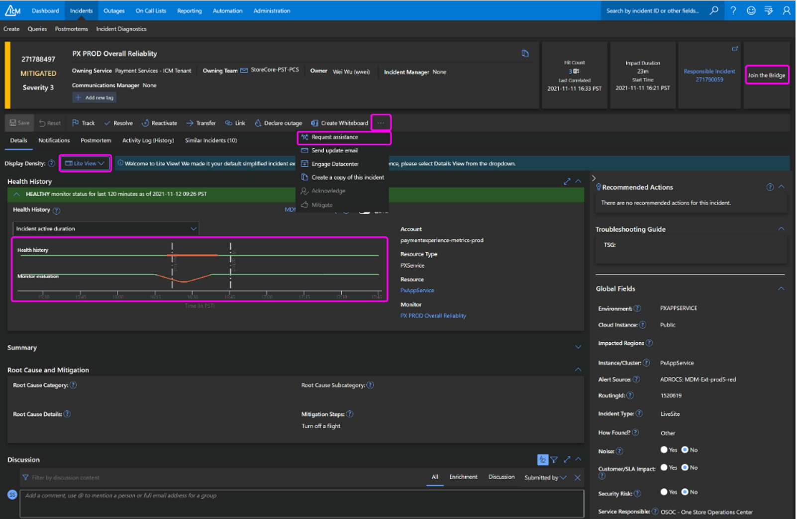
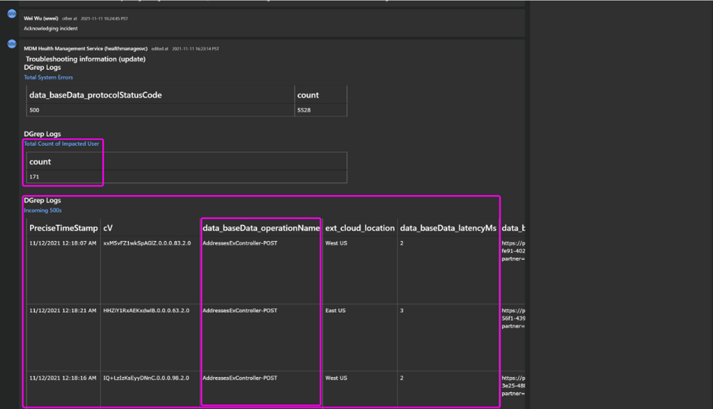
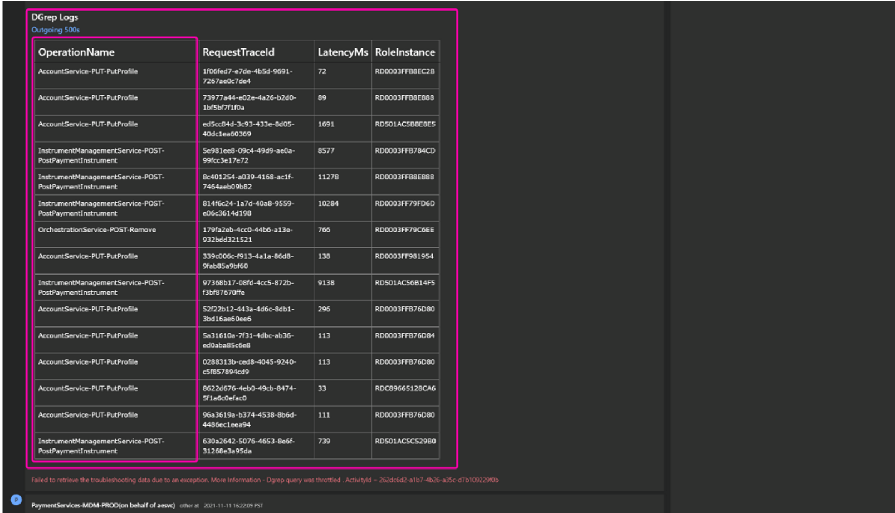
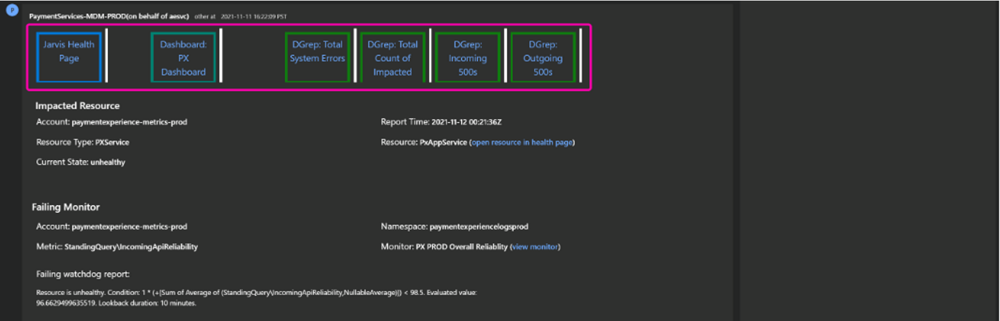

# Parsing the IcM Ticket

**IcM Ticket Guide**

**Target audience**

PX Engineering team

**Overview**

During a livesite incident, the first piece of information you will review is either the incident email or the incident ticket. This guide explains how to interpret or parse out various pieces of useful information there to help reduce Time-To-Mitigation.

**Prerequisites**

1. [IcM Docs - Introduction (Opens in new window or tab)](https://icmdocs.azurewebsites.net/onboarding/introduction.html)

**Parsing the IcM Ticket**

Below is a screenshot of an IcM incident page (the same applies to IcM incident emails). [The specific incident 271788497, is here (Opens in new window or tab)](https://portal.microsofticm.com/imp/v3/incidents/details/271788497/home) in case you want to see it on the IcM portal.

Highlighted in the below picture:

1. **Join the Bridge** - To join an engineering bridge. If one does not exits, create one and join.
2. **Request Assistance** - If you need a different team's assistance, use this button. You can also request OSOC to help you with getting assistance
3. **Lite View** - I took these screenshots in "Lite View" which seems to be the default. If you are in a different view, your view may look different from these screenshots.
4. **Health History** - This shows the history of the specific monitor that triggered this IcM. This is useful in determining if the issue has auto-mitigated or if its currently on-going.

Highlighted in the below picture:

1. **Total count of impacted users** - This number represents the PX Service impacted user call count, but doesn't account for successful retries. To get impacted users discarding sucesful retries, use this query: cluster('pst.kusto.windows.net').database('Prod').GetPidlSdkFailureDetails(inputStartTime:datetime=datetime(null), inputEndTime:datetime=datetime(null), pidlResourceName:string="", partnerName:string="", market:string="", includeConnectivityErrors:bool=false, includeAllErrors:bool=false) Use [severity table in livesite-sop.md](https://microsoft.visualstudio.com/Universal%20Store/_git/SC.CSPayments.PX?path=/private/Payments/Docs/operations/livesite-sop.md&version=GBmaster&anchor=severity) to determine severity. Typically, severity is one of the first things that OSOC will ask you on the bridge.

2. **Incoming 500s** - A glance at this table can tell if errors are affecting a particular operation (AddressesExController-POST in the example below). This can further help assess the type of impact to end-users. Its a link that takes you to the query so that you can dig deeper when needed.

Highlighted in the below picture:

1. **Outgoing 500s** - A glance at this table can tell if errors are because of a specific downstream service. See [List of dependencies in livesite-sop.md](https://microsoft.visualstudio.com/Universal%20Store/_git/SC.CSPayments.PX?path=/private/Payments/Docs/operations/livesite-sop.md&version=GBmaster&anchor=dependencies). Its a link that takes you to the query so that you can dig deeper when needed.

Highlighted in the below picture:
1. All queries that we have seen so far (above), in a "tile" format.

From https://microsoft.visualstudio.com/Universal%20Store/_git/SC.CSPayments.PX?path=/private/Payments/Docs/operations/icm-ticket-guide.md&version=GBmaster&_a=preview