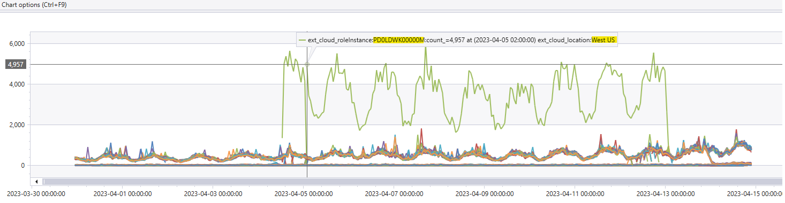

## TSG - Azure Cloud Instance in Bad state 
__TSG - Azure Cloud Instance in Bad state__

* __Background__: This TSG is for investigating the high latency issue between PIFD & PX .The issue involves a significant drop spike of bad cloud instance, impacting the PX & PIFD services. 

* __Issue__: After get an IcM generated by PIFD PX API Reliability Monitor, always start your investigation from IcM itself. Use [Incident-380890329](https://portal.microsofticm.com/imp/v5/incidents/details/380890329/summary), [Task 44192175](https://dev.azure.com/microsoft/OSGS/_workitems/edit/44192175) as an sample.

* __Impact__: We've noticed that a particular operation name: POST_users/{userId}/addressesEx/{addressId}_v6.0_{} having Reliability Drop.

* __SLA Definition__: The IcM should be mitigated in 3 days and resolved in 5 days for Sev3/Sev4.

* __Severity Level Explanation__:
    * __Sev4__ - Not urgent, no SLA impact such as routing maintenance.
    * __Sev3__ - Urgent or high business impact with no SLA impact such as service/Component below SLA, not impacting major or minor customer scenario.
    * __Sev2__ - Partial workflow or use case issue impacting service(s) or customer experience with errors or degraded performance.
    * __Sev1__ - Multi-region, multi-service, or major service degradation issue severely impacting customers.
    * __Sev0__ - Entire platform globally offline, with no workaround, directly impacting customers or an entire channel.

* __Steps to Investigate__:
    1. Open the ICM Trouble shooting Information and check for which operation name having the reliability drop. 
    2. Run the Kusto query below, to see the errors and adjust the Timestamp as needed(around 60 mins).

        Note:
        
        1. To run the below Kusto query, you need to have access to the PX Kusto Cluster. Kindly raise for an access here [PST Kusto Access Link](https://myaccess.microsoft.com/@microsoft.onmicrosoft.com#/access-packages/7fbe9cb6-00f3-4c98-9ed0-c9ff140f0f58)

        2. Connect to Azure VPN and open the Kusto explorer and a click on add connection with the Cluster Details - [Kusto Explorer](https://pst.kusto.windows.net)  to run the Kusto query

    3. __Modify Operation Name & Time__: Adjust the operation name and time based on the impacted operations and time window.

* __Sample Query__
    ```
    let startTime = datetime(2023-04-09 21:50:32Z); 
    let endTime = datetime(2023-04-09 22:50:32Z); 
    let cVRoot = "vpwAQ99/gH7hzFbjAomk+Y"; 
    let clientErrors = GetPidlSdkFailureDetails(startTime, endTime, "", "", "") 
    | project PidlSdkOperationId, IngestTime, CV, PartnerName, Market, PidlResourceName, ErrorType, ErrorCode, EventParameters, UserId, ClientIP, BrowserDomain, SdkVersion 
    |where CV startswith cVRoot; 
    let serverRequests = RequestTelemetry 
    | where TIMESTAMP  between (startTime..endTime) 
    | where cV startswith cVRoot   
    | project TIMESTAMP,cV, data_baseData_latencyMs, ext_cloud_role, data_baseData_protocolStatusCode, data_baseData_operationName, data_RequestDetails, data_ResponseDetails, data_baseData_targetUri, name; serverRequests;clientErrors;  

    Or 

    pifdIncomingQoS  
    | where CV startswith "vpwAQ99/gH7hzFbjAomk+Y"  

    Or
    ```

 * __Run the below query to check the error trend for impacted service and instances__
    ```
    RequestTelemetry 
    | where (name == "Microsoft.Commerce.Tracing.Sll.PXServiceIncomingOperation" or name == "Microsoft.Commerce.Tracing.Sll.PXServiceOutgoingOperation") 
    | where TIMESTAMP > ago(15d) 
    | extend url = parse_url(data_baseData_targetUri) 
    | extend host  = tolower(url["Host"]) 
    | where data_baseData_latencyMs > 4000 
    | summarize count() by ext_cloud_roleInstance,ext_cloud_location,bin(TIMESTAMP, 1h) //tostring(host) 
    | render timechart  
    ```
    __Latency trend for last 15day (Latency > 4000 MS)__

     

* __Mitigation Steps:__

    * __Transient Issue__ : If it’s a transient issue, the IcM will be auto mitigated after 10 mins.
        * If the issue is not auto-mitigated, then we have to check the Monitor and Reliability Dashboard as per the time window [Incoming Service QoS | Jarvis](https://portal.microsoftgeneva.com/dashboard/PIFDMetrics/Common%2520Dashboard/Incoming%2520Service%2520QoS?overrides=[{%22query%22:%22//*[id%3D%27Role%27]%22,%22key%22:%22value%22,%22replacement%22:%22PIFDWebApp%22},{%22query%22:%22//*[id%3D%27OperationName%27]%22,%22key%22:%22value%22,%22replacement%22:%22POST_users/{userId}/addressesEx/{addressId}_v6.0_{}%22},{%22query%22:%22//*[id%3D%27RoleInstance%27]%22,%22key%22:%22value%22,%22replacement%22:%22%22},{%22query%22:%22//*[id%3D%27CallerName%27]%22,%22key%22:%22value%22,%22replacement%22:%22%22},{%22query%22:%22//*[id%3D%27Environment%27]%22,%22key%22:%22value%22,%22replacement%22:%22%22}]%20) and above Query's attached in the Investigation Steps and confirm if the spike is back to normal or  If any specific instance take high latency follow below point and work with App Service Windows Availability and Perf Loop team (AntAvaPerf@microsoft.com) to find out the root cause.   

* __Root Cause Analysis__: 

    -   Based on above query result if you find that any specific instance take high latency follow below point and work with Azure team to find out the root cause.   
    -   [Create Ticket with Azure app service team](https://microsoft.sharepoint.com/teams/PaymentExperience/_layouts/Doc.aspx?sourcedoc={171ACB93-A045-434E-938D-CCEFE55457AD}&wd=target%28LiveSite%2FLive-Site-Management.one%7CB0A7DA97-2CF5-4F22-8C99-6FCCA0E74787%2FCreate%20Ticket%20with%20Azure%20app%20service%20team%7C03894D9C-78B3-4F54-AE19-3C5A363E2194%2F%29&wdpartid={E07721AB-6969-4B90-BCFA-0E770813206B}{106}&wdsectionfileid={B0A7DA97-2CF5-4F22-8C99-6FCCA0E74787})
    - ICM created with azure appaservice:  [Incident 382174874](https://portal.microsofticm.com/imp/v5/incidents/details/382174874/summary) : High latency Issue due to bad Cloud Instance "PD0LDWK00000M" in West US 

* __Verification Steps__: 

    -   If you find that any specific instance take high latency follow below point and work with Azure team to find out the root cause.  
    -  Below Point Suggested by Azure Team 
        -   IN_22 faced slowness from 2023-04-05 02:00 till 2023-04-13 00:00, we see that P99 is around 8-10secs  
        - We found that most of the time was spent in ManagedPipeline Handler which indicates application code  
        -  If there was no data collected such as memory dump or profiler, the root cause cannot be identified. If the application using App Insights, please check the logs if there are any collected from the instance.  
        -   From this point onwards, you need a memory dump to be captured to root cause the issue. You need to setup an Auto-Heal rule for Request duration and configure it to take memory dumps when X number of requests take more than Y number of seconds in Z time interval. To do that, you can go to Diagnose and Solve blade for this app -> Diagnostic Tools – “Auto Heal” -> Request Duration and configure a rule like this  
            - Request Duration can be 10 seconds, 
            - Time interval can be 5 minutes. 
            - Request count can be set to 100. 
            - Make sure it is configured to capture memory dumps only. 
        - Once this rule is configured, and we get some dumps, we can try to figure out why the application is responding slowly. 
        - Follow below point to OOR bad Instance   
           - SC for taking a server out of rotation - [Service Change 40931426](https://nam06.safelinks.protection.outlook.com/?url=https%3A%2F%2Fmicrosoft.visualstudio.com%2FOSGS%2F_workitems%2Fedit%2F40931426&data=05%7C01%7Cv-gaurpa%40microsoft.com%7C940b62e884f942951bd508db535182de%7C72f988bf86f141af91ab2d7cd011db47%7C1%7C0%7C638195381785580477%7CUnknown%7CTWFpbGZsb3d8eyJWIjoiMC4wLjAwMDAiLCJQIjoiV2luMzIiLCJBTiI6Ik1haWwiLCJXVCI6Mn0%3D%7C3000%7C%7C%7C&sdata=Qbvoq8XkjCmSQspc0YRwcfJcWWHsohUvGLY2wk80Do8%3D&reserved=0): Run Reboot Worker Azure Rest API to remove one bad instance in PX East US region 

* __Note__ :-  
    - we will capture the memory dump if we face similar issue and found any instance is in bad state. 

    - __SRE pipeline__ - 
        [Pipelines - Runs for SSD-PSP-Payment-and-Settlement-Prod-SR1-OB (azure.com)](https://dev.azure.com/microsoft/Universal%20Store/_build?definitionId=139720) 

* __Escalation Contact or Point-of-Contact (POC)__: 
Kindly contact to primary escalation point:  App Service Windows Availability and Perf Loop team (AntAvaPerf@microsoft.com) 

* __Acronyms or Glossary:__

    * PX: Payment Experience

    * SLA: Service Level Agreement

    * ICM: Incident Management