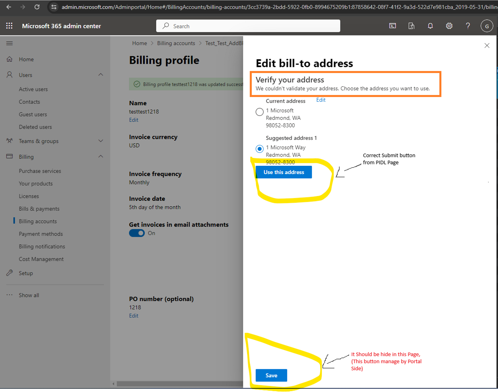

# TSG---Cannot perform submit action as the current PIDL document does not have it.

Reference:[Incident 498556716](https://portal.microsofticm.com/imp/v3/incidents/incident/498556716/summary) : [M365][APAC] Customer is not able to add PI while purchasing subscription through Founders Hub

[Incident 449976593](https://icmcdn.akamaized.net/imp/v3/incidents/details/449976593/home) : [M365] [vNext] CST - Can't update Bill-To Address 

**Ask:** Unable to perform submit action.

**Resolution:** Ask customer to click the "Use this address" button to save the suggested address instead of SAVE button in this page.

Issue from Portal Side Only.