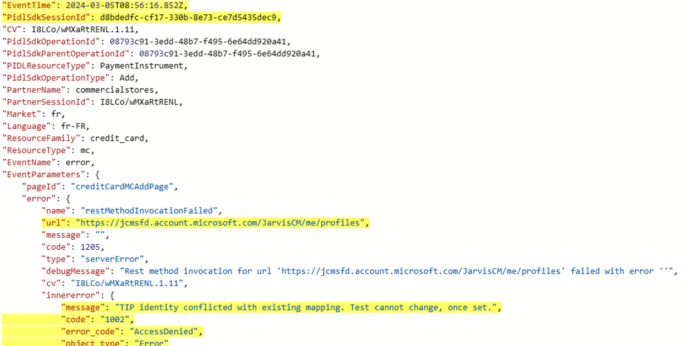
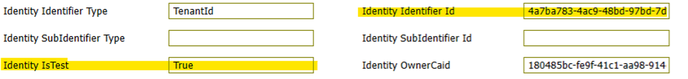
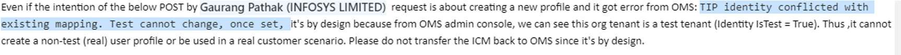

# TSG-Cannot find employee profile(RequiredLegacyPropertiesAreMissing)

[Incident 481977865](https://icmcdn.akamaized.net/imp/v3/incidents/details/481977865/home) : Adhoc PX Incident - [M365][APGC] Customer not able to add payment method

**• Check Create Profile logs in Client Telemetry** 

Execute: [[Web]](https://dataexplorer.azure.com/clusters/https%3a%2f%2fpst.kusto.windows.net/databases/Prod?query=H4sIAAAAAAAEAAvITMkJTskOSc1JzU0tKap0LUvNKynm5apRKM9ILUpVcA5TKC5JLCopLs8syVBQysvx9UoLDis2iajw9Db0da8yC891s9BTAgDHjE9kRwAAAA%3d%3d) [[Desktop]](https://pst.kusto.windows.net/Prod?query=H4sIAAAAAAAEAAvITMkJTskOSc1JzU0tKap0LUvNKynm5apRKM9ILUpVcA5TKC5JLCopLs8syVBQysvx9UoLDis2iajw9Db0da8yC891s9BTAgDHjE9kRwAAAA%3d%3d&web=0) [[Web(Lens)]](https://lens.msftcloudes.com/v2/#/discover/query//results?datasource=(cluster:pst.kusto.windows.net,database:Prod,type:Kusto)&query=H4sIAAAAAAAEAAvITMkJTskOSc1JzU0tKap0LUvNKynm5apRKM9ILUpVcA5TKC5JLCopLs8syVBQysvx9UoLDis2iajw9Db0da8yC891s9BTAgDHjE9kRwAAAA%3d%3d&runquery=1) [[Desktop(SAW)]](https://pst.kusto.windows.net/Prod?query=H4sIAAAAAAAEAAvITMkJTskOSc1JzU0tKap0LUvNKynm5apRKM9ILUpVcA5TKC5JLCopLs8syVBQysvx9UoLDis2iajw9Db0da8yC891s9BTAgDHjE9kRwAAAA%3d%3d&saw=1) https://pst.kusto.windows.net/Prod

PidlSdkTelemetryEvents

| where CV startswith "nlMJfSVs4XxIK1MGz6WmF8."

**Error Description:** "Can't find employee profile of us for user c8c48218-5f13-45ef-aa21-e3981a8b84d4"<--"Accountid"

Error: AADSTS90002: Tenant 'c8c48218-5f13-45ef-aa21-e3981a8b84d4' not found. Check to make sure you have the correct tenant ID and are signing into the correct cloud. Check with your subscription administrator, this may happen if there are no active subscriptions for the tenant, however would just like to clarify that the tenant ID was not c8c48218-5f13-45ef-aa21-e3981a8b84d4 in the first place, it was 4a7ba783-4ac9-48bd-97bd-7dfff637adb2. Checked on Jarvis and found that c8c48218-5f13-45ef-aa21-e3981a8b84d4 is the Account ID for user ngeorge@testtestpartnerapitest6tip.onmicrosoft.com under tenant ID 4a7ba783-4ac9-48bd-97bd-7dfff637adb2.
From customer's point of view, they had login to the tenant using GA account ngeorge@testtestpartnerapitest6tip.onmicrosoft.com and tried to add the payment method, which failed.

**Resolution:**

The reseller 4a7ba783-4ac9-48bd-97bd-7dfff637adb2 who created this org tenant that this is a test tenant and shouldn't be used in real customer use case. It's for testing purpose only as mention by OMS team.

Similar Tenant of this ICM - [Incident 477662045](https://icmcdn.akamaized.net/imp/v3/incidents/details/477662045/home) : [M365][EMEA[Cannot add credit card | 2402211420002645  

