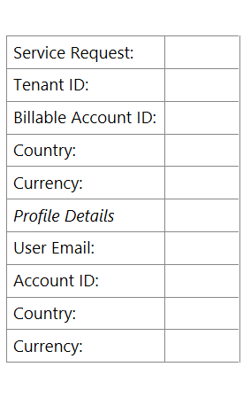

# TSG - Country Mismatch Issue

**Note :- Transfer ICM to  CommerceMgmt for further action on it.**

If the goal is to allow customer to update PI, the user tenant country code needs to be updated. 
Org tenant and User Tenant need to have matched Country codes.
 
.If it is not then ,  
Please create a new ICM for the country code request.  
Please provide the data in this format and answer the following question if you would like to raise a country code request. Refer to an existing ICM for sample Incident 419374747 : [M365] [VNEXT] - Update/change profile country & currency to allow add PI 2307100060000607

Ref.. ICM - [Incident 424853328](https://portal.microsofticm.com/imp/v3/incidents/incident/424853328/summary) : Customer Unable to add new Credit Card in Portal : 2308050050000431

SPOC :- janae.chan@microsoft.com 

Owning Team :- CommerceMgmt

Owning Service :- M365 Commerce Management  
 
1.Are there any active subscriptions under the user account?

2.Have there been any purchase activity found for the user account?

