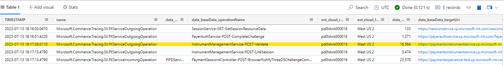

# TSG:Handling TaskCancelledException : A task was canceled in Int Environment(Testing)

Received that the following call had a failed 500 (PIFD):

https://pifd.cp.microsoft-int.com/V6.0/paymentSessions/Z10008CA2W4J034ad737-2fc9-426c-acd8-ca2e562f9a07/NotifyThreeDSChallengeCompleted

Therefore checked below as Request telemetry returned only 200 response

**Query :-**

Execute: [Web] [Desktop] [Web (Lens)] [Desktop (SAW)] https://testpst.westus2.kusto.windows.net/Int  -->Cluster
PIFD_IncomingOutgoingCall

| where Parameters contains https://paymentexperience-test.cp.microsoft-int.com/v7.0/paymentSessions/Z10008CA2W4J034ad737-2fc9-426c-acd8-ca2e562f9a07/NotifyThreeDSChallengeCompleted

**Output:**

    "responseSizeBytes": null,
    "scenarioHeader": "",
    "externalServiceRequestId": "1dd2e2c8-79d7-4c28-ace3-aed2f5b05ba5",
    "faultDetail": "Microsoft.MarketplaceServices.PaymentInstrumentService.Clients.PX.PXClientException: Error calling PXService from PaymentInstrumentFD ---> System.Threading.Tasks.TaskCanceledException: A task was cancelled.\r\n
    at System.Runtime.CompilerServices.TaskAwaiter.ThrowForNonSuccess(Task task)\r\n
    at System.Runtime.CompilerServices.TaskAwaiter.HandleNonSuccessAndDebuggerNotification(Task task)\r\n
    at Microsoft.MarketplaceServices.Core.MarketplaceClientHandler.<SendAsync>d__75.MoveNext() in C:\\__w\\1\\s\\private\\InstrumentManagement\\MarketplaceServices\\Core\\Core\\MarketplaceClientHandler.cs:line 716\r\n
    --- End of inner exception stack trace ---",
    "callingServiceRequestId": "ed0ad20d-b036-4d39-89ce-e1d5d33ab375",
    "certificateThumbprint": "",
    "testHeader": "",
    "partCBase": "Microsoft.MarketplaceServices.Core.Logging.OutgoingServiceRequest",
    "certificateCommonName": "",
    "responsePayload": "",
    "requestPayload": "POST https://paymentexperience-test.cp.microsoft-int.com/v7.0/paymentSessions/Z10008CA2W4J034ad737-2fc9-426c-acd8-ca2e562f9a07/NotifyThreeDSChallengeCompleted HTTP/1.1\r\napi-version: v7.0\r\nx-ms-tracking-id: 1dd2e2c8-79d7-4c28-ace3-aed2f5b05ba5\r\nx-ms-correlation-id: WPzpgaoS5E28SOG3.0\r\nCorrelation-Context: v=1,ms.b.tel.partner=unknownclient\r\nAccept: application/json\r\nMS-CV: WPzpgaoS5E28SOG3.1\r\nUser-Agent: PaymentInstrumentFD\r\n",
    "responseHeader": ""
    }                  

• Since it was not transient issue we checked with new cv And noticed latency for pims operation

**Note:** Check for latency if getting only 200 response

Query

Execute: [Web] [Desktop] [Web (Lens)] [Desktop (SAW)] https://testpst.westus2.kusto.windows.net/Int

PIMSOutgoingCallEven

| where Timestamp > ago(1d) 

| where CV startswith "+d08zoVBYkuXvS61.1"

**Query to latency**

    RequestTelemetry
     | where (name == "Microsoft.Commerce.Tracing.Sll.PXServiceIncomingOperation" or name == "Microsoft.Commerce.Tracing.Sll.PXServiceOutgoingOperation")
     | where TIMESTAMP > ago(30d)
     | where cV startswith "FaX5VfTA/Si42a3wr5Mub0.187" -->Enter the corresponding CV
     | extend url = parse_url(data_baseData_targetUri)
     | extend partnerName = tolower(url["Query Parameters"].partner)
     | extend state = parse_json(data_ResponseDetails).state
     | project TIMESTAMP,cV, name, data_baseData_callerName,  data_baseData_operationName, data_baseData_protocolStatusCode,data_baseData_dependencyName, data_baseData_latencyMs, data_baseData_targetUri, data_RequestDetails,data_ResponseDetails , data_ResponseHeader,data_RequestHeader, data_AccountId, data_Partner, data_Country, partnerName

