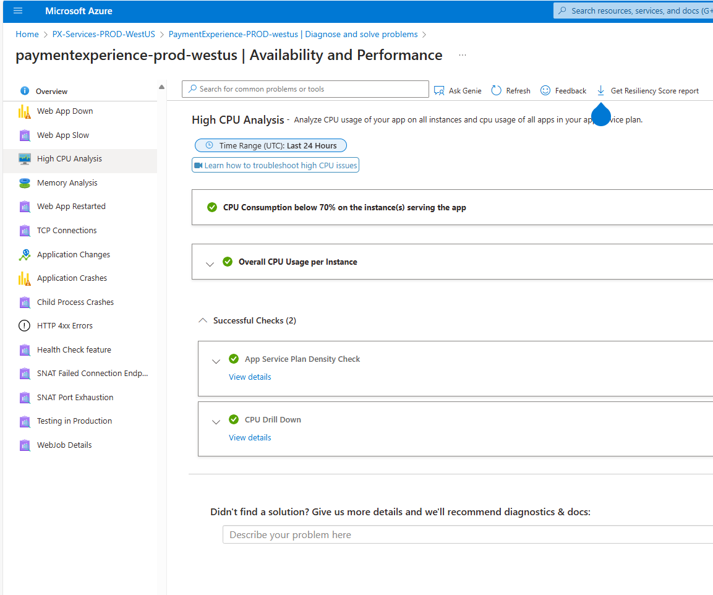
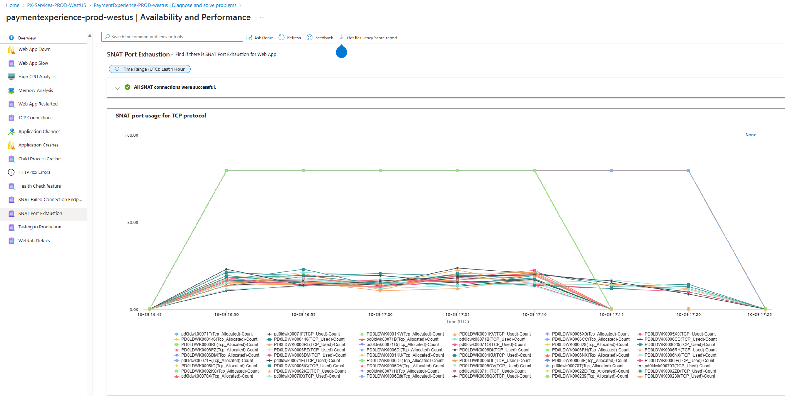

# TSG: Holiday period

1. Monitor PX reliability, CPU and TCP connection for all the region.
    
    a. PX reliability - [Service QoS | Jarvis](https://portal.microsoftgeneva.com/dashboard/paymentexperience-metrics-prod/Service%2520QoS?overrides=%5b%7b%22query%22:%22//*%5bid%3D%27OperationName%27%5d%22,%22key%22:%22value%22,%22replacement%22:%22%22%7d,%7b%22query%22:%22//*%5bid%3D%27CloudLocation%27%5d%22,%22key%22:%22value%22,%22replacement%22:%22%22%7d,%7b%22query%22:%22//*%5bid%3D%27CloudRole%27%5d%22,%22key%22:%22value%22,%22replacement%22:%22%22%7d,%7b%22query%22:%22//*%5bid%3D%27RoleInstance%27%5d%22,%22key%22:%22value%22,%22replacement%22:%22%22%7d,%7b%22query%22:%22//*%5bid%3D%27CloudRoleInstance%27%5d%22,%22key%22:%22value%22,%22replacement%22:%22%22%7d,%7b%22query%22:%22//*%5bid%3D%27CallerName%27%5d%22,%22key%22:%22value%22,%22replacement%22:%22%22%7d%5d%20)

    b. PX CPU and TCP Connection - [paymentexperience-prod-westus | Availability and Performance - Microsoft Azure](https://portal.azure.com/#view/WebsitesExtension/SCIFrameBlade/id/%2Fsubscriptions%2F9b6168fd-7d68-47e1-9c71-e51828aa62c0%2FresourceGroups%2Fpx-services-prod-westus%2Fproviders%2FMicrosoft.Web%2Fsites%2Fpaymentexperience-prod-westus/categoryId/AvailabilityAndPerformanceWindows/optionalParameters~/%5B%7B%22key%22%3A%22categoryId%22%2C%22value%22%3A%22AvailabilityAndPerformanceWindows%22%7D%2C%7B%22key%22%3A%22diagnoseAndSolveWorkflowId%22%2C%22value%22%3A%225b1157aa-9f00-41cc-891d-f9126fe0abb8%22%7D%5D) (Use SWA machine)
2. Monitor PIFD reliability, CPU and TCP connection for all the region.

    c. PIFD reliability - [PIFD Service | Jarvis](https://portal.microsoftgeneva.com/dashboard/PIFDMetrics/PIFD%2520Service?overrides=%5b%7B%22query%22:%22//*%5bid%3D%27Environment%27%5d%22,%22key%22:%22value%22,%22replacement%22:%22%22%7D,%7B%22query%22:%22//*%5bid%3D%27Role%27%5d%22,%22key%22:%22value%22,%22replacement%22:%22%22%7D,%7B%22query%22:%22//*%5bid%3D%27RoleInstance%27%5d%22,%22key%22:%22value%22,%22replacement%22:%22%22%7D,%7B%22query%22:%22//*%5bid%3D%27OperationName%27%5d%22,%22key%22:%22value%22,%22replacement%22:%22%22%7D,%7B%22query%22:%22//*%5bid%3D%27CallerName%27%5d%22,%22key%22:%22value%22,%22replacement%22:%22%22%7D,%7B%22query%22:%22//*%5bid%3D%27DependencyName%27%5d%22,%22key%22:%22value%22,%22replacement%22:%22%22%7D,%7B%22query%22:%22//*%5bid%3D%27DependencyOperationName%27%5d%22,%22key%22:%22value%22,%22replacement%22:%22%22%7D,%7B%22query%22:%22//*%5bid%3D%27DependencyAndOperationName%27%5d%22,%22key%22:%22value%22,%22replacement%22:%22%22%7D%5d%20)

    d. PIFD machine view - [Machine Counters View | Jarvis](https://portal.microsoftgeneva.com/dashboard/PIFDMetrics/Machine%2520Counters%2520View?overrides=%5b%7b%22query%22:%22//*%5bid%3D%27Tenant%27%5d%22,%22key%22:%22value%22,%22replacement%22:%22eastus2%22%7d,%7b%22query%22:%22//*%5bid%3D%27Role%27%5d%22,%22key%22:%22value%22,%22replacement%22:%22%22%7d,%7b%22query%22:%22//*%5bid%3D%27RoleInstance%27%5d%22,%22key%22:%22value%22,%22replacement%22:%22%22%7d%5d)

3. If any bad machine/instance found pls use this TSG to reboot instance - [TSG - Azure Cloud Instance in Bad state](onenote:#TSG%20-%20Azure%20Cloud%20Instance%20in%20Bad%20state&section-id=b6f43cce-b562-4fff-b2c6-930873727180&page-id=ef629526-2a1e-4975-8016-7b4da306960b&end&base-path=https://microsoft.sharepoint.com/teams/PaymentExperience/SiteAssets/Payment%20Experience/LiveSite/TSGs.one)  [(Web view)](https://microsoft.sharepoint.com/teams/PaymentExperience/_layouts/15/Doc.aspx?sourcedoc=%7b171acb93-a045-434e-938d-ccefe55457ad%7d&action=edit&wd=target%28LiveSite%2FTSGs.one%7Cb6f43cce-b562-4fff-b2c6-930873727180%2FTSG%20-%20Azure%20Cloud%20Instance%20in%20Bad%20state%7Cef629526-2a1e-4975-8016-7b4da306960b%2F%29&wdorigin=703&wdpreservelink=1)

Sample CPU screenshot from PX West US region



Sample SNAT port Exhaustion from PX West US region
If you see any warning/error please use below query to find out bad instance and follow the TSG step 3.

```
RequestTelemetry
| where TIMESTAMP > ago(1h)
    //and name == "Microsoft.Commerce.Tracing.Sll.PXServiceIncomingOperation" 
    and name == "Microsoft.Commerce.Tracing.Sll.PXServiceOutgoingOperation" 
    and data_baseData_latencyMs > 5000| order by TIMESTAMP desc 
| project TIMESTAMP,data_baseData_operationName,data_baseData_latencyMs, cV, data_RequestDetails, data_ResponseDetails, ext_cloud_role, ext_cloud_roleInstance,data_baseData_protocolStatusCode,data_RequestHeader, data_ResponseHeader,data_baseData_targetUri, data_baseData_callerName
| summarize RPM = count() by data_baseData_operationName,ext_cloud_roleInstance, bin(TIMESTAMP, 1m)
| render timechart;
```



