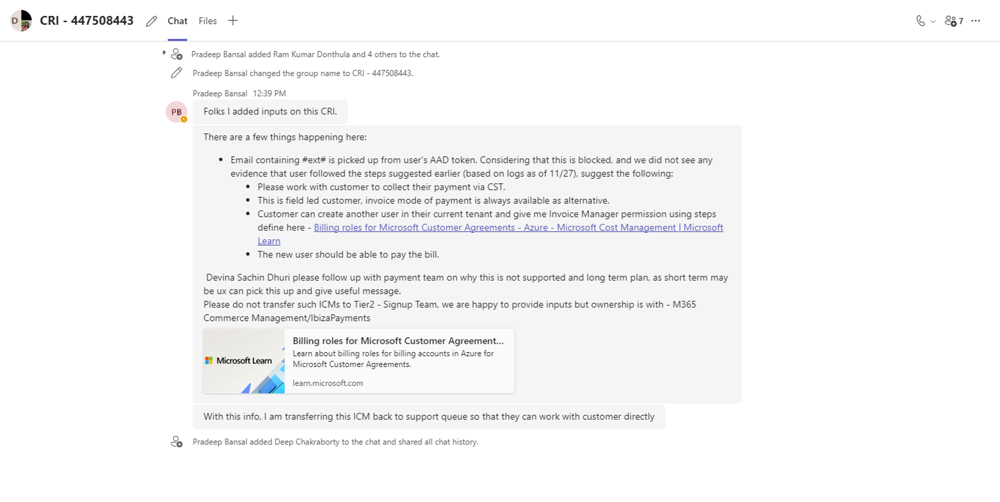

# TSG-Invalid Email Address

**Reference:** [Incident 447508443](https://icmcdn.akamaized.net/imp/v3/incidents/details/447508443/home) : Azure commerce EEE | Still unable to use Pay now option.

[Incident 431858979](https://icmcdn.akamaized.net/imp/v3/incidents/details/431858979/home) : Azure commerce EEE | Unable to add credit card payment method to Azure portal for Pay now option

**Issue:**
Email Id facing the issue - admin_healthiva.com#EXT#@healthivahotmail.onmicrosoft.com-->has # in emailid

**Logs:**

"EventTime": 2023-11-27T03:28:57.379Z,

"CV": LJwbJP0TQMsqKRAhxW1rJx.4,

"data": {

        "baseData": {
            "contentJsonVer": 1,
            "pageName": "Payment Information",
            "uri": 
"https://billing.hosting.portal.azure.net/billing/Content/23.11.0.02.20231108-1934/PIDL/index.html?action=select&piid=undefined&piBrand=undefined&useInvoice=undefined&env=prod&theme=AzureIbizaLight
&isModern=true&challengeScenario=PaymentTransaction&locale=en-US&country=US
&email=admin_healthiva.com%23EXT%23%40healthivahotmail.onmicrosoft.com&language=en&currency=USD&challenge=true&challengeAmount=4183.45&greenId=b6b9b91e-831a-4a8c-8e49-c6a7ee4ebe4d&greenIdUrl=https%3A%2F%2Ffpt.windowsazure.com%2Ftags%3Fsession_id%3Db6b9b91e-831a-4a8c-8e49-c6a7ee4ebe4d&canMakeDefault=undefined&canUseInvoice=false&enableModernAVS=true&sessionId=171483483f584d65bb93cd82753dbb84&loadingString=Loading%20existing%20payment%20methods..&clientOptimizations=undefined&l=en.en-us&trustedAuthority=https%3A%2F%2Fportal.azure.com&shellVersion=undefined#171483483f584d65bb93cd82753dbb84",
            "destUri": "https://billing.hosting.portal.azure.net/billing/Content/23.11.0.02.20231108-1934/PIDL/index.html?action=select&piid=undefined&piBrand=undefined&useInvoice=undefined&env=prod&theme=AzureIbizaLight
&isModern=true&challengeScenario=PaymentTransaction&locale=en-US&country=US
&email=admin_healthiva.com%23EXT%23%40healthivahotmail.onmicrosoft.com&language=en&currency=USD&challenge=true&challengeAmount=4183.45&greenId=b6b9b91e-831a-4a8c-8e49-c6a7ee4ebe4d&greenIdUrl=https%3A%2F%2Ffpt.windowsazure.com%2Ftags%3Fsession_id%3Db6b9b91e-831a-4a8c-8e49-c6a7ee4ebe4d&canMakeDefault=undefined&canUseInvoice=false&enableModernAVS=true&sessionId=171483483f584d65bb93cd82753dbb84&loadingString=Loading%20existing%20payment%20methods..&clientOptimizations=undefined&l=en.en-us&trustedAuthority=https%3A%2F%2Fportal.azure.com&shellVersion=undefined#171483483f584d65bb93cd82753dbb84",
            
            "customSessionGuid": "e853119e-f2f7-b9bf-c81e-b51cd905af9d",
            "impressionGuid": "8e0df3cf-15ef-cf18-ed25-49e3147f905f",
            "content": "{\"eventName\":\"failure\"}",
            "properties": {
                "version": "PostChannel=3.1.2;SystemPropertiesCollector=3.1.2;WebAnalyticsPlugin=3.1.2"
            }
        },

<u>Jarvis team conformation regarding '#' symbol supported or not in Email</u>

**Transfer to**:M365 Commerce Management/IbizaPayments(Refer ss below)

**<u>Update from Praveen Bansal</u>**

There are a few things happening here:

• Email containing #ext# is picked up from user's AAD token. Considering that this is blocked, and we did not see any evidence that user followed the steps suggested earlier (based on logs as of 11/27), suggest the following:

○ Please work with customer to collect their payment via CST.

○ This is field led customer, invoice mode of payment is always available as alternative.

○ Customer can create another user in their current tenant and give me Invoice Manager permission using steps define here - [Billing roles for Microsoft Customer Agreements - Azure - Microsoft Cost Management | Microsoft Learn](https://learn.microsoft.com/en-us/azure/cost-management-billing/manage/understand-mca-roles)

○ The new user should be able to pay the bill.

Devina Sachin Dhuri please follow up with payment team on why this is not supported and long term plan, as short term may be ux can pick this up and give useful message. 
Please do not transfer such ICMs to Tier2 - Signup Team, we are happy to provide inputs but ownership is with - M365 Commerce Management/IbizaPayments

