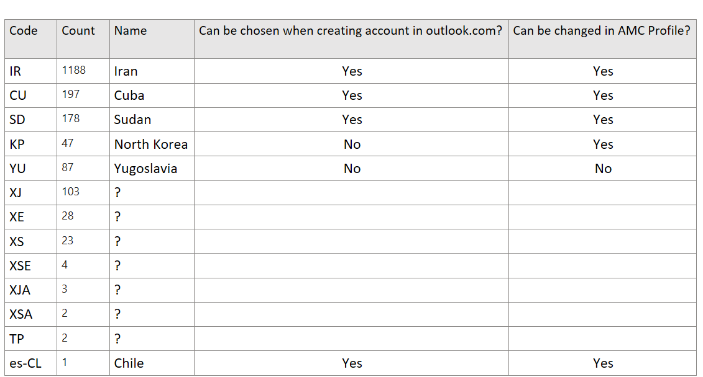

# TSG- Invalid country codes from AMC


**This TSG helps us to understand**

    • When user is trying to do some payments scenario and getting Invalid country code/Country is not Supported error, this situation arises when user is trying to use the countries which are embargoed for the Payments.
    
What needs to be checked:

    • Payments backend is seeing invalid country codes in the incoming requests from AMC and seeing lots of 400s Protocol status code.
    • Check the Country code with these embargoed countries
    • In below table, top 4 countries (IR,CU,SD,KP)are not supported by Payments as they are embargoed(banned) Countries till todays date.

Execute: [Web](https://nam06.safelinks.protection.outlook.com/?url=https%3A%2F%2Fdataexplorer.azure.com%2Fclusters%2Fhttps%253a%252f%252fpst.kusto.windows.net%2Fdatabases%2FProd%3Fquery%3DH4sIAAAAAAAEAHVSwW7bMAy9B8g%252fCL40Bgxfe0qBIiuwHLxmjbfLMASsxKUeZNGjqLYZ9vGTXLlGg%252fYmks%252fvPT5a2%252bAFeVXs9m1R1gYE7sFjrJlMbNzhn4BeWrTYo%252fBpufinnh6QUbXb5mbfXjc7daXgSKtLU6YhPgs6ozQFF%252bFqrYQsPUWFAdjjIbBdJZFDUvmUHgJ8RPnGXfmj%252bBowfrMDhiiG7IufdSYqZ2EXh2q9VhdNp5k8%252fZJ6Q32PrLFuGXTnjvXe2nrrvHDo0UkDDo6YXlunqY%252bA2wEZpCN3MfOOtu7QD%252bSiNRTorI97uPhwXhXtA75u1XnlSJQPw0AsaOpCJZ6B6TdqmaOp9PcqJXLQloI5WNKjaDXuUKm3QdDk6cs7w0gtpMnuBST4DZmIyG6q951XH8Sc4TFkcci52mSqzDTe%252fDOCeQXkXiY%252fk5yQL91rPRrbmtiYd2eymC4CTk%252fL3TATv6wy15PC3GnQ%252b3i%252b80Q88mOn8ZwEnzUOY8hv4Rbif6lPjU%252bH8qHvgbu%252f%252baKrUt2fpjiXi%252bXiP%252bHh%252b0wWAwAA&data=05%7C01%7Cv-ranjithau%40microsoft.com%7C60fedb0b6f9a4b51053008dbd58c9404%7C72f988bf86f141af91ab2d7cd011db47%7C1%7C0%7C638338572018795727%7CUnknown%7CTWFpbGZsb3d8eyJWIjoiMC4wLjAwMDAiLCJQIjoiV2luMzIiLCJBTiI6Ik1haWwiLCJXVCI6Mn0%3D%7C3000%7C%7C%7C&sdata=zeHknRodtI%2BmsNO0GYXKh9wvlG2YRTMI72YCmtiwaEY%3D&reserved=0) [Desktop](https://nam06.safelinks.protection.outlook.com/?url=https%3A%2F%2Fpst.kusto.windows.net%2FProd%3Fquery%3DH4sIAAAAAAAEAHVSwW7bMAy9B8g%252fCL40Bgxfe0qBIiuwHLxmjbfLMASsxKUeZNGjqLYZ9vGTXLlGg%252fYmks%252fvPT5a2%252bAFeVXs9m1R1gYE7sFjrJlMbNzhn4BeWrTYo%252fBpufinnh6QUbXb5mbfXjc7daXgSKtLU6YhPgs6ozQFF%252bFqrYQsPUWFAdjjIbBdJZFDUvmUHgJ8RPnGXfmj%252bBowfrMDhiiG7IufdSYqZ2EXh2q9VhdNp5k8%252fZJ6Q32PrLFuGXTnjvXe2nrrvHDo0UkDDo6YXlunqY%252bA2wEZpCN3MfOOtu7QD%252bSiNRTorI97uPhwXhXtA75u1XnlSJQPw0AsaOpCJZ6B6TdqmaOp9PcqJXLQloI5WNKjaDXuUKm3QdDk6cs7w0gtpMnuBST4DZmIyG6q951XH8Sc4TFkcci52mSqzDTe%252fDOCeQXkXiY%252fk5yQL91rPRrbmtiYd2eymC4CTk%252fL3TATv6wy15PC3GnQ%252b3i%252b80Q88mOn8ZwEnzUOY8hv4Rbif6lPjU%252bH8qHvgbu%252f%252baKrUt2fpjiXi%252bXiP%252bHh%252b0wWAwAA%26web%3D0&data=05%7C01%7Cv-ranjithau%40microsoft.com%7C60fedb0b6f9a4b51053008dbd58c9404%7C72f988bf86f141af91ab2d7cd011db47%7C1%7C0%7C638338572018802377%7CUnknown%7CTWFpbGZsb3d8eyJWIjoiMC4wLjAwMDAiLCJQIjoiV2luMzIiLCJBTiI6Ik1haWwiLCJXVCI6Mn0%3D%7C3000%7C%7C%7C&sdata=jY3kqPn4I%2BoRAU7A7prWoDHcwkeJOsj2vWsAJLHg5os%3D&reserved=0) [Web (Lens)](https://nam06.safelinks.protection.outlook.com/?url=https%3A%2F%2Flens.msftcloudes.com%2Fv2%2F%23%2Fdiscover%2Fquery%2F%2Fresults%3Fdatasource%3D(cluster%3Apst.kusto.windows.net%2Cdatabase%3AProd%2Ctype%3AKusto)%26query%3DH4sIAAAAAAAEAHVSwW7bMAy9B8g%252fCL40Bgxfe0qBIiuwHLxmjbfLMASsxKUeZNGjqLYZ9vGTXLlGg%252fYmks%252fvPT5a2%252bAFeVXs9m1R1gYE7sFjrJlMbNzhn4BeWrTYo%252fBpufinnh6QUbXb5mbfXjc7daXgSKtLU6YhPgs6ozQFF%252bFqrYQsPUWFAdjjIbBdJZFDUvmUHgJ8RPnGXfmj%252bBowfrMDhiiG7IufdSYqZ2EXh2q9VhdNp5k8%252fZJ6Q32PrLFuGXTnjvXe2nrrvHDo0UkDDo6YXlunqY%252bA2wEZpCN3MfOOtu7QD%252bSiNRTorI97uPhwXhXtA75u1XnlSJQPw0AsaOpCJZ6B6TdqmaOp9PcqJXLQloI5WNKjaDXuUKm3QdDk6cs7w0gtpMnuBST4DZmIyG6q951XH8Sc4TFkcci52mSqzDTe%252fDOCeQXkXiY%252fk5yQL91rPRrbmtiYd2eymC4CTk%252fL3TATv6wy15PC3GnQ%252b3i%252b80Q88mOn8ZwEnzUOY8hv4Rbif6lPjU%252bH8qHvgbu%252f%252baKrUt2fpjiXi%252bXiP%252bHh%252b0wWAwAA%26runquery%3D1&data=05%7C01%7Cv-ranjithau%40microsoft.com%7C60fedb0b6f9a4b51053008dbd58c9404%7C72f988bf86f141af91ab2d7cd011db47%7C1%7C0%7C638338572018808828%7CUnknown%7CTWFpbGZsb3d8eyJWIjoiMC4wLjAwMDAiLCJQIjoiV2luMzIiLCJBTiI6Ik1haWwiLCJXVCI6Mn0%3D%7C3000%7C%7C%7C&sdata=%2F01uAGlJNE6hofXL8pHY9JSvmY6oX94oNXcHLZqQjNc%3D&reserved=0) [Desktop (SAW)](https://nam06.safelinks.protection.outlook.com/?url=https%3A%2F%2Fpst.kusto.windows.net%2FProd%3Fquery%3DH4sIAAAAAAAEAHVSwW7bMAy9B8g%252fCL40Bgxfe0qBIiuwHLxmjbfLMASsxKUeZNGjqLYZ9vGTXLlGg%252fYmks%252fvPT5a2%252bAFeVXs9m1R1gYE7sFjrJlMbNzhn4BeWrTYo%252fBpufinnh6QUbXb5mbfXjc7daXgSKtLU6YhPgs6ozQFF%252bFqrYQsPUWFAdjjIbBdJZFDUvmUHgJ8RPnGXfmj%252bBowfrMDhiiG7IufdSYqZ2EXh2q9VhdNp5k8%252fZJ6Q32PrLFuGXTnjvXe2nrrvHDo0UkDDo6YXlunqY%252bA2wEZpCN3MfOOtu7QD%252bSiNRTorI97uPhwXhXtA75u1XnlSJQPw0AsaOpCJZ6B6TdqmaOp9PcqJXLQloI5WNKjaDXuUKm3QdDk6cs7w0gtpMnuBST4DZmIyG6q951XH8Sc4TFkcci52mSqzDTe%252fDOCeQXkXiY%252fk5yQL91rPRrbmtiYd2eymC4CTk%252fL3TATv6wy15PC3GnQ%252b3i%252b80Q88mOn8ZwEnzUOY8hv4Rbif6lPjU%252bH8qHvgbu%252f%252baKrUt2fpjiXi%252bXiP%252bHh%252b0wWAwAA%26saw%3D1&data=05%7C01%7Cv-ranjithau%40microsoft.com%7C60fedb0b6f9a4b51053008dbd58c9404%7C72f988bf86f141af91ab2d7cd011db47%7C1%7C0%7C638338572018815562%7CUnknown%7CTWFpbGZsb3d8eyJWIjoiMC4wLjAwMDAiLCJQIjoiV2luMzIiLCJBTiI6Ik1haWwiLCJXVCI6Mn0%3D%7C3000%7C%7C%7C&sdata=usImD%2FSqnXFKtWkTrwKRXrqfTbvtUk%2Fy0l%2Fru%2Btzn4o%3D&reserved=0) [https://pst.kusto.windows.net/Prod](https://nam06.safelinks.protection.outlook.com/?url=https%3A%2F%2Fpst.kusto.windows.net%2FProd&data=05%7C01%7Cv-ranjithau%40microsoft.com%7C60fedb0b6f9a4b51053008dbd58c9404%7C72f988bf86f141af91ab2d7cd011db47%7C1%7C0%7C638338572018822000%7CUnknown%7CTWFpbGZsb3d8eyJWIjoiMC4wLjAwMDAiLCJQIjoiV2luMzIiLCJBTiI6Ik1haWwiLCJXVCI6Mn0%3D%7C3000%7C%7C%7C&sdata=5vA5iuLNQDNOwoU7cv5QwZ1OCuc6yNOfFLv52vzX4Ck%3D&reserved=0)
```
cluster("PST").database("Prod").RequestTelemetry
| where TIMESTAMP > ago(7d)
| extend country = tolower(parse_url(data_baseData_targetUri)["Query Parameters"].country)
| where name == 'Microsoft.Commerce.Tracing.Sll.InstrumentManagementIncomingOperation'
| where data_ResponseDetails contains "The country is not supported." 
| project TIMESTAMP,cV, ext_cloud_location, name, data_baseData_operationName, data_baseData_protocolStatusCode, country, data_ResponseDetails ,data_baseData_targetUri, data_Partner, data_Country,data_RequestHeader, data_RequestDetails, data_ResponseHeader,  data_AccountId,  ext_cloud_roleInstance, data_ErrorCode, data_ErrorDetails,data_ErrorMessage, data_baseData_serviceErrorCode, data_exception,data_baseData_latencyMs
| summarize count() by country
```

In Below Table, Just comparing what you can choose when creating a new account in outlook.com I found you can create accounts with several of these countries. Also they are supported when changing Profile’s country in AMC.



[Bug 47253688](https://dev.azure.com/microsoft/OSGS/_workitems/edit/47253688): Invalid country codes KP(North Korea) from AMC
