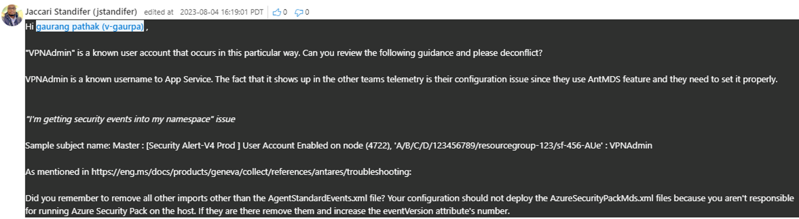

# TSG : Security Alert-V4 Prod User Account Enabled on node (4722) For VPNAdmin

Similar ICM -  [Incident 406984624](https://icmcdn.akamaized.net/imp/v3/incidents/details/406984624/home) : [Security Alert-V4 Prod ] User Account Enabled on node (4722), 'psslogsprod/PartnerSettingsAppServicePlan/AppService/10.21.64.24' : VPNAdmin

[Incident 504817911](https://icmcdn.akamaized.net/imp/v3/incidents/details/504817911/home) : [Security Alert-V4 Prod ] User Account Enabled on node (4722), 'psslogsprod/PartnerSettingsAppServicePlan/AppService/10.20.64.156' : VPNAdmin

If we got Security Alert-V4 for User account Enabled for "VPNAdmin", we are good to Resolved this as By Design as "
User accounts getting enabled "VPNAdmin" known account that is part of VPN client installation."

