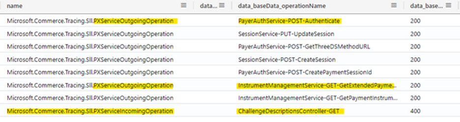
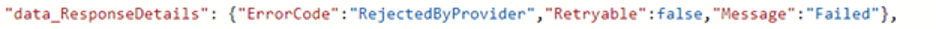
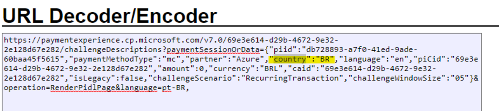
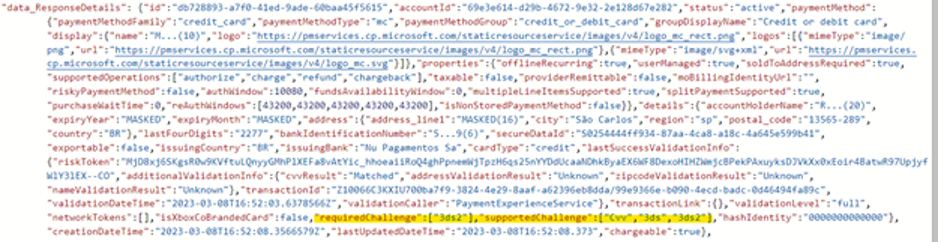
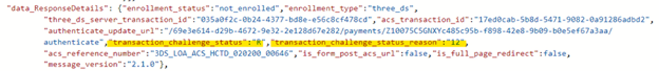
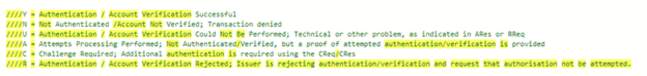

# TSG : "Signup Portal: User facing error code PIDL Challenge Failure rates exceed Sev 3 limits" (Rejected By Provider)

**Ref… ICM** - Incident 381986889 : Signup Portal: User facing error code PIDL Challenge Failure rates exceed Sev 3 limits.
 
**Note: - PSD2 Challenge Enable for Europe countries only and some of the other countries.**

[text](<../../AppData/Local/Temp/OneNote/16.0/Exported/{923A72D2-B0D7-4FD8-ACA5-37A3A8EEE488}/NNT/0/RE PSD2 Challenge for BR Country.msg>)

**· Check the request Telemetry log for Challenges base on given cV & Time Stemp**
``` 
RequestTelemetry
| where TIMESTAMP >ago(10d)

| where (name == "Microsoft.Commerce.Tracing.Sll.PXServiceIncomingOperation" or name == "Microsoft.Commerce.Tracing.Sll.PXServiceOutgoingOperation")

| where cV startswith "xhSs+YCwHgvnb4Z+E5h3vz.3"

| extend url = parse_url(data_baseData_targetUri)

| extend partnerName = tolower(url["Query Parameters"].partner)

| project TIMESTAMP,cV, ext_cloud_location, name,data_CallerName,  data_baseData_operationName, data_baseData_protocolStatusCode, data_baseData_latencyMs, data_baseData_targetUri, data_RequestHeader, data_RequestDetails, data_ResponseHeader, data_ResponseDetails , data_AccountId, data_Partner, data_Country, partnerName
```



To verify the Challenge request country you can Decode the Target URI 

 

**· Verify the GetExtendedPaymentInstrument response for supportedChallenge & requiredChallenge**

    o If requiredchallenge list have the “3ds2” means it’s PSD2 enabled for this transaction and Authenticate required for this.
    o If 3ds2 enabled for other than Europe country, please verify with Bizops or PIMS team for this type of traction. (Mail thread attached for reference)

**· Verify the PayerAuthService-POST-Authenticate response. 
To know the Provide failed response as below**


**Transaction Status details** ( https://microsoft.visualstudio.com/Universal%20Store/_git/SC.CSPayments.PX?path=/private/Payments/PXService/Model/PayerAuthService/TransactionStatus.cs&version=GBmaster&line=10&lineEnd=10&lineStartColumn=17&lineEndColumn=34&lineStyle=plain&_a=contents)


**· If Transaction challenge status “R” means transaction rejected by provider in this case user need to check with his bank regarding the failure.**

    o Mitigate/Resolved the ICM with above details and transferred back to previous team. 