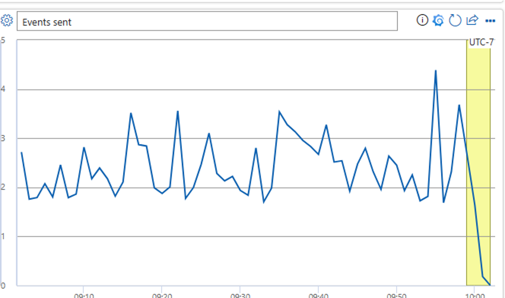

# ActiveUserCount

• If this alert fires, Payment Options App on xbox app is receiving lower than expected user count, this means either
       
        ○ Client side telemetry has stopped working
        ○ App is experiencing high failure rate on launch

1. Confirm if back end traffic is not 0

        a. RequestTelemetry
        | where TIMESTAMP > ago(3d)
        | where data_Partner == "xboxsettings"
        | summarize count() by bin (TIMESTAMP, 1h)
        | render timechart

2. If back end traffic is 0 or much lower than expected, there is an issue with the app
        a. Contact SelvanrFTE alias, we may need to initiate a rollback with xbox OS or push a new package with partner center
3. If back end traffic matches trendline, that means an issue likely occurred with front end telemetry
        a. Verify Asimov Event Forwarder is still processing traffic 
[Dashboard | Jarvis (microsoftgeneva.com)](https://portal.microsoftgeneva.com/dashboard/AEF/AEF/Asimov%20Event%20Forwarder%20Subscribers?overrides=[%7B%22query%22:%22//*[id%3D%27__Cluster%27]%22,%22key%22:%22value%22,%22replacement%22:%22%22%7D,%7B%22query%22:%22//*[id%3D%27__Instance%27]%22,%22key%22:%22value%22,%22replacement%22:%22PaymentsTeamKusto%22%7D,%7B%22query%22:%22//*[id%3D%27__Environment%27]%22,%22key%22:%22value%22,%22replacement%22:%22%22%7D]%20)
        b. If Events sent is 0, may be issue with AEF
            i. 

            