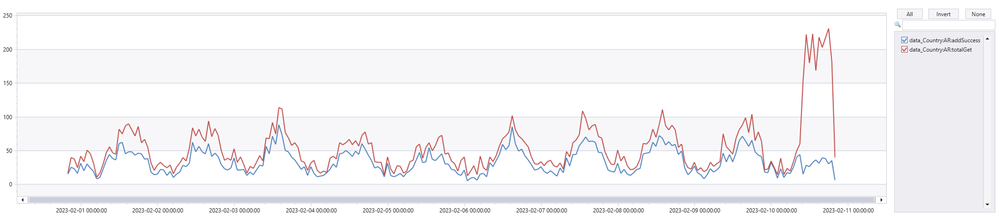

# TSG: AddCC-ConversionRate-Sev3-xboxsettings 

**Query used for alert:**

// Credit conversion rate
 
let endTime =  ago(1m);

let startTime = ago(4d);

RequestTelemetry

| where TIMESTAMP between (startTime .. endTime)
    and data_baseData_targetUri !has"8e342cdc-771b-4b19-84a0-bef4c44911f7"
    and data_baseData_requestMethod != "OPTIONS"

| where data_baseData_operationName == "PaymentMethodDescriptionsController-GET"

| extend partner = tolower(parse_url(data_baseData_targetUri)["Query Parameters"].partner)

| extend operation = tolower(parse_url(data_baseData_targetUri)["Query Parameters"].operation)

| extend family = tolower(parse_url(data_baseData_targetUri)["Query Parameters"].family)

| where partner in ("xboxsettings")

| where operation == "add"

| where data_PaymentMethodFamily == "credit_card"

//| where data_Country in ("AR") // change country here as needed

| project TIMESTAMP, operation, data_PaymentMethodFamily, data_baseData_protocolStatusCode, data_baseData_operationName, data_PidlOperation, data_baseData_targetUri, data_RequestDetails, data_ResponseDetails, partner, data_Country
| summarize totalAddGet = countif(data_baseData_protocolStatusCode == 200) by bin(TIMESTAMP, 1h), data_Country

| union (

RequestTelemetry

| where TIMESTAMP between (startTime .. endTime)
    and data_baseData_targetUri !has"8e342cdc-771b-4b19-84a0-bef4c44911f7"
    and data_baseData_requestMethod != "OPTIONS"

| where data_baseData_operationName == "PaymentInstrumentsExController-POST"

| where data_Partner in ("xboxsettings")

| extend status = tolower(parse_json(data_ResponseDetails).status)

| where status == "active"

| where data_PaymentMethodFamily == "credit_card"

//| where data_Country in ("AR")  // change country here as needed

| project TIMESTAMP, data_PaymentMethodFamily, data_baseData_protocolStatusCode, data_baseData_operationName, data_PidlOperation, data_baseData_targetUri, data_RequestDetails, data_ResponseDetails, data_Partner, data_Country

| summarize totalAddSuccess = dcountif(data_baseData_targetUri, data_baseData_protocolStatusCode == 200) by bin(TIMESTAMP, 1h), data_Country
)

| summarize addSuccess = sum(totalAddSuccess), totalGet = sum(totalAddGet) by bin(TIMESTAMP, 1h), data_Country

| extend conversionRate = round((addSuccess * 1.0 / totalGet) * 100, 2)

| project TIMESTAMP, totalGet, addSuccess, conversionRate, data_Country

//| render timechart with(ycolumns=totalGet,addSuccess) // use this time chart to see total amount requests vs successes

| render timechart with(ycolumns=conversionRate)  // use this time chart to see conversion rate trends

let endTime = ago(1m);

let startTime = ago(20d);

PaymentOptionsTelemetryEvents

| where EventTime  between (startTime .. endTime)  and Name == "Microsoft.Gaming.PaymentOptions.OutgoingServiceRequest"

| extend operation = parse_urlquery(targetUri)["Query Parameters"].operation

| extend country = parse_urlquery(targetUri)["Query Parameters"].country

| where operation == "Add" and country == "AR"

//| distinct data_baseData_targetUri

| summarize count() by bin(EventTime, 1d)

//| summarize count() by bin(TIMESTAMP, 1d), data_baseData_targetUri

| render timechart;

Steps:

    1. Errors can be transient, may self recover within 30 minutes
    2. Comment out render timechart portion and look at results for last day
        a. For higher volume countries, check to see if there is a particular country that is having a large amount of failures and is trending downward (example in query above, was checking specifically for Argentina).  If so engage PX On Call for investigation
    
    
        Example below, ADD CC alert occurred.  After looking at results for step 2, noticed that AR (Argentina) had significantly lower Add CC rate to  previous days.  Rendered time chart for totalGet, addSuccess and noticed higher volumes of GET requests for Add CC forms, but successful adds remained the same.  Further investigation determined it was a likely a card testing attack.

