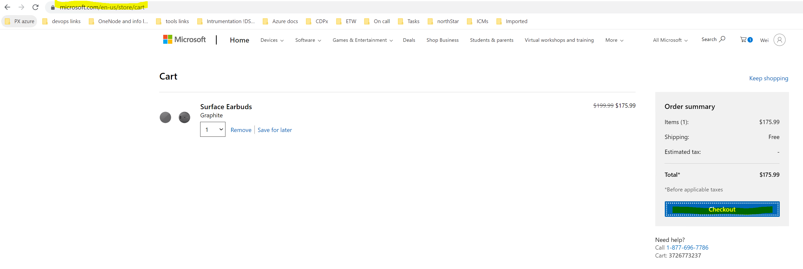
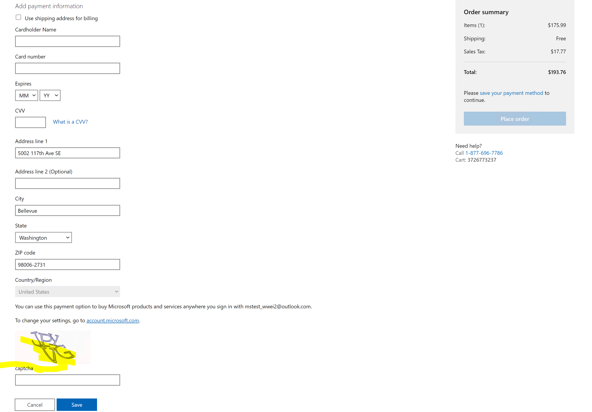
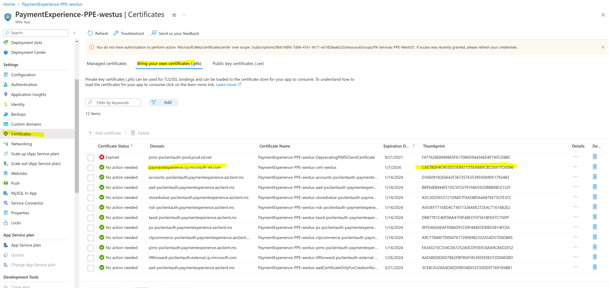

# ECR Drill Instruction

## Target audience
PX Engineering

## Prerequisites
- [secret-management](../engineering/secret-management.md)
- [renew-certificate](../operations/renew-certificate.md)

## Overview
This doc describes how to manually renew PX PROD certificates. This process is also called ECR drill, which needs to be performed every 6 months.

# ECR drill instruction for certificates with auto-rotation enabled
1. Before starting the process, please read [ECR Drill self-serve instruction](https://keyvaultdocs.azurewebsites.net/AutoRotationAndECR/ECRDrillSelfServe.html)
    -  [Incident 291021553] (https://portal.microsofticm.com/imp/v3/incidents/details/291021553/home): ECR Drill: [Payment Experience Service] for reference.
1. Create a SC using the following SC as a template, to renew certificate in AKV: 
    -  [Service Change 33207187](https://microsoft.visualstudio.com/OSGS/_workitems/edit/33207187): ECR for PX-Certs PPE/PROD
    -  Certificate list:
        -  px-pxclientauth-paymentexperience-azclient-ms
        -  ctpcommerce-pxclientauth-paymentexperience-azclient-ms 
        -  sslppecertificate
        -  sslProdCertificate
        -  aad-pxclientauth-paymentexperience-azclient-ms
        -  ma-geneva-keyvault-paymentexperience-azclient-ms (in order to include this cert in ECR drill, we need to figure out a way to retrieve logs from Geneva for thumbprint for this cert, support ticket has been created in Geneva. As for now we could just include five certificates listed above in the ECR drill)

1. Include assigned resource from StoreCore-PST-SRE team to perform the above SC. Use the default setting for each certificate when creating new version of the certificate.
1. After certificates are renewed, App Service will automatically picked up the new certificates.
    -  Use [this DGrep query](https://portal.microsoftgeneva.com/s/F41189E6) to verify that aad certificate with new thumbprint has been used when app service starts up.
    -  Use [this DGrep query](https://portal.microsoftgeneva.com/s/39C8552B) to verify that px-pxclientauth cert and ctpcommerce-pxclientauth cert with new thumbprints have been used when app service starts up. If there is no traffic for px-pxclienauth (HIPService) certificate, please follow the process below to trigger one test request for this cert, or contact wwei@microsoft.com for more details.
       - Work with PX oncall to add your test account id into "PXEnableHIPCaptcha" flight in Azure Exp.
       - Go to "https://www.microsoft.com/en-us/store/cart", add a item into cart, then click checkout.
       
       - Add a new credit card payment method, and you should see a Captcha image shown in the credit card form, which means the test request for px-pxclientauth-paymentexperience-azclient-ms certificate was triggered successfully.
       
    -  Go to Azure portal to verify ssl certificates have been used in App Service. The location of ssl cert thumbprint is shown below:
        
# ECR drill instruction for certificate which can't be auto-rotated
**PX now has one certificate that can't be auto-rotated:**

---
For questions/clarifications, email [author/s of this doc and PX support](mailto:WWei@microsoft.com?cc=PXSupport@microsoft.com&subject=Docs%20-%20operations/ecrdrill.md).

---