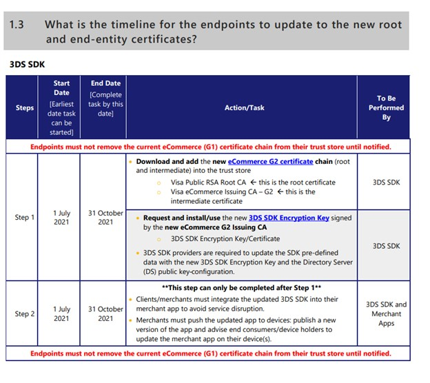
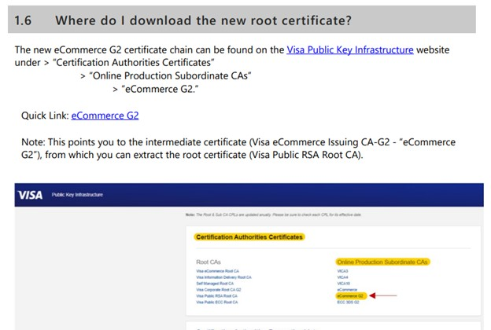
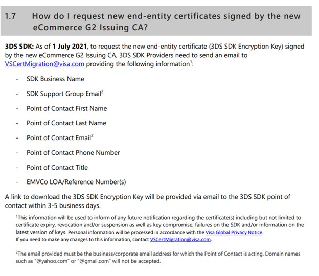
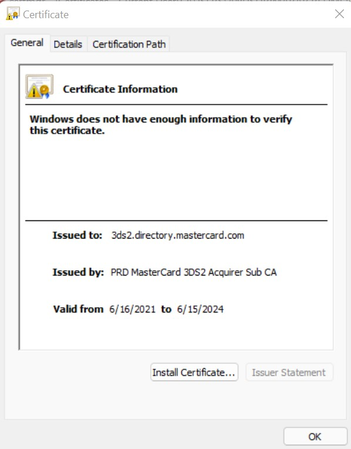

# Certification Change and Version upgrade  

## Target audience
PX Engineering and Payments PM teams

## Overview

#### Updating credit card certificates and upgrading Settings Versions in PX Service

- Certificates for the various payment types recorded in the PaymentClientSettings.json file expire after a few years and it is our responsibility to update them with renewed versions before the expiration date.  

- All new changes should be made in a new versions folder (Pidl > PXService > App_Data > PSD2_Config), using the PaymentClientSettings.json file from the last appropirate version folder and only changing the fields that need to be upgraded.  

## Prerequisites

- [PSD2 Prerequisite](https://support.microsoft.com/en-us/account-billing/payment-services-directive-2-and-strong-customer-authentication-3527fa95-9c6a-5f6f-d8e6-f27f33aba50e)
- [Microsoft Trusted Root Certificates](https://docs.microsoft.com/en-us/security/trusted-root/program-requirements)

## Details for a Version Upgrade

**Changes made in the V19 Upgrade:**   

- Compare changes in versions in the [DevicePaymentExpererience One Note](https://microsoft.sharepoint.com/:o:/t/DevicesPaymentExperience/EkERqgJi-H9Cpnnut9nRSRsBsW0EVhLlair_XT39_I7wuw?e=tCWUwa) 

- The following folders were added in the V19 upgrade: 
    - V19 
    - sdk2-V19 
    - sdk2.2-V19 
    - sdk2.2-default 
    - sdk2.2-V16 
    - sdk2.2-V17 
    - certs-V17 
    - certs-V19 
- Remember to link the files in the CIT.PX folder in order to run the appropriate tests. 

**Summary of folders**
- certs-V# 
    - Contains the [DsCertificates.json](https://microsoft.visualstudio.com/DefaultCollection/Universal%20Store/_git/SC.CSPayments.PX?path=/private/Payments/PXService/App_Data/PSD2Config/certs-V19/DsCertificates.json) file, which includes the directory root server certificates, commonly known as dsCertificates, of the Payment Method Type. 
    - The dsCertificates are listed in array format under the property "caRootCertificates".  
    - These certificates will be used and validated in PaymentSessionHandler.cs and PaymentPSD2CertificateValidator.  
- Sdk2.2-V# 
    - Contains a [PaymentClientSettings.json](https://microsoft.visualstudio.com/DefaultCollection/Universal%20Store/_git/SC.CSPayments.PX?path=/private/Payments/PXService/App_Data/PSD2Config/sdk2.2-V19/PaymentClientSettings.json) file, which will be accessed in the latest SDK update 
    - The SDK update supports React Native 64 (RN 0.64), which was an updgrade from RN 0.64. The sdk2.2-V# folders also support a new rendering html compared to the older sdk2-V# folders.
- Sdk2-V# and V# 
    - Contains a [PaymentClientSettings.json](https://microsoft.visualstudio.com/DefaultCollection/Universal%20Store/_git/SC.CSPayments.PX?path=/private/Payments/PXService/App_Data/PSD2Config/sdk2-V19/PaymentClientSettings.json) file, which is used for backwards compatibility for partners who have not upgraded to sdk2.2 
    - The sdk2-V# supports RN 0.62 sdk and the V# folders support the UWP SDK 

 ### **Payment Method Changes**
  
  The following will show the general steps on how to update certificates for specific card networks. 
  
  The V19 update is used as an example, but for future updates, please keep in mind that the spcific changes might be slightly different. 

#### **Visa**  
- Example: Specific changes made for V19 Update:  
    - Ecommerce G2 Root certificate 
    - Encryption Key 
- How to replicate the changes and get the new certs/keys:  
    - Go to : [Visa Technology Partners Website](https://technologypartner.visa.com/Library/3DSecure2.aspx) 
        - Note: Visa might also reach out to a Payments team memeber with up to date instructions. Follow links given in the email. 
    - Select the Visa Secure Root Certificate Update: 3DS SDK - FAQs link 
    - Find the most up to date instructions to get the new cert(s) 
    - Will be something **similar** to : 
        - 
- Follow the instructions according to the updated Visa documentation in the FAQ file:  
    - Example for the V19 update (specific instructions might change in the future, check with the latest Visa documentation)  
        - 
        - 

#### **Mastercard**  
- Example: Specific changes made for V19 Update:  
    - Encryption Key  
- How to replicate the changes:  
    - Make an account at: [Log in | Mastercard Developers](https://developer.mastercard.com/account/log-in) 
    - Find and open the Mastercard Certificate PDF 
        - Can be provided by : Vipin Shrivastava  
    - Follow the instructions and links provided in the PDF to receive the new encryption key (.zip) and "kid". 
- Most up to date instructions might be sent via email to a Payments team member when it is time for the certificate/key to expire.

#### **Amex** 
- Example: Specific changes made for V19 Update:  
    - Encryption key update 
- Will most likely recieve an email from an Amex representative with the updated encryption key.   

**How to view the downloaded Certificates:**  

*NOTE: Certificates and encryption keys recieved from the above methods need one final change before they can be integrated into the PX PaymentClientSettings.json files. Follow all the steps below:*

- Download the appropriate certificate in .zip format 
- In local file explorer, extract all files 
- Find the correct certificate and double click. 
- If certmgr does not open immediately 
    - 
    - Click install certificate 
    - Install in Current User 
    - Open "Manage User Certificate" 
    - Follow steps below 
 - When certmgr opens
    - Right click the correct certificate file > All Tasks > Export. 
    - Follow steps of the Certificate Wizard  
    - Export file format: Base-64 encoded X.509 (.CER) 
    - Add the file to a local certificates folder and name it accurately 
- To extract the correct (shortened) key:  
    - [Install WSL](https://docs.microsoft.com/en-us/windows/wsl/install)  
    - Run the following command:  `openssl x509 -pubkey -noout -in [originalCertFileName].pem > [newCertFileName].pem` 
    - Open the new cert in Visual Studio Code (or similar IDE) 
    - Use this certificate in the PaymentClientSettings.json  

**Appropriate Flighting method:**  
- Monitor at 5% for 2 days 
- Move to 25% and monitor for one more day 
- Move to 100%, monitor 

**How to monitor flighting on Kusto:**
- Run the following query in the CommerceSharedClusterdb 
        `// Graph for time/errors for the different PX Version Settings`
        `PXPSD2AppAuthenticate(ago(1d), ago(1m), showDetails=true)`
        `| where challengeStatus == "Failed"`
        `| summarize count() by bin(TIMESTAMP, 1h), settingsVersion`
        `| render timechart;`
 - Monitor spikes in errors, shouldn't go up more than 1000 errors at any given hour
 
 **How to resolve spikes in errors:** 
Raise this issue to BizOps team

## Read next 
<!-- 
Optionally, list references to other docs that the reader may want to read next
--> 

---
For questions/clarifications, email [author/s of this doc and PX support](mailto:anushrimarar@microsoft.com?cc=PXSupport@microsoft.com&subject=Docs%20-%20versionUpgrades.md).
---