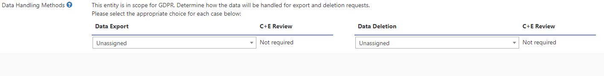
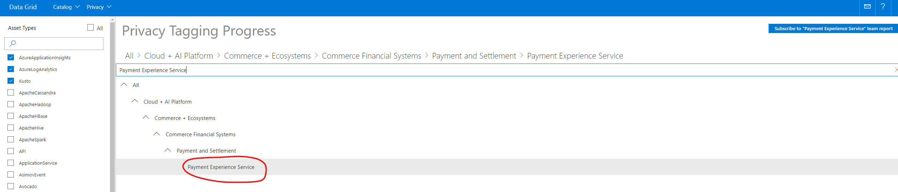
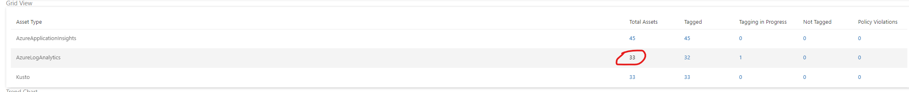
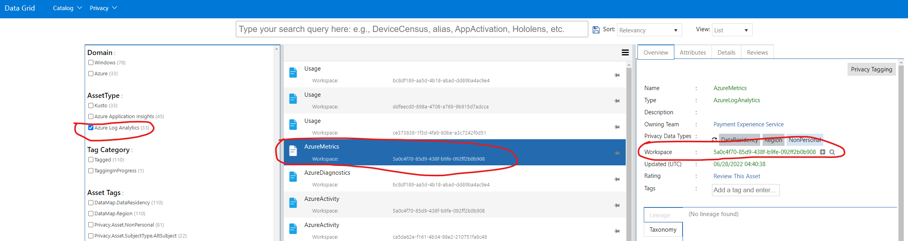
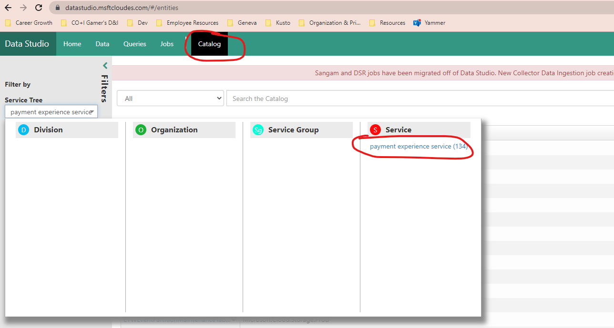
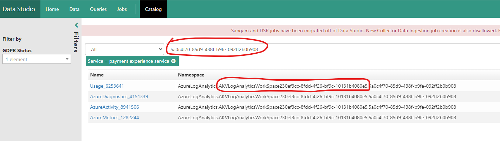
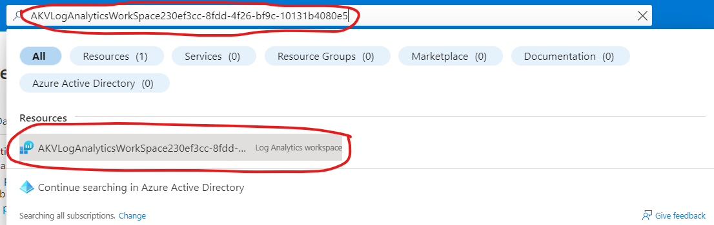
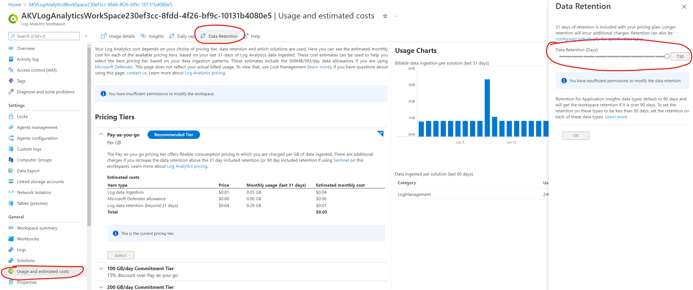
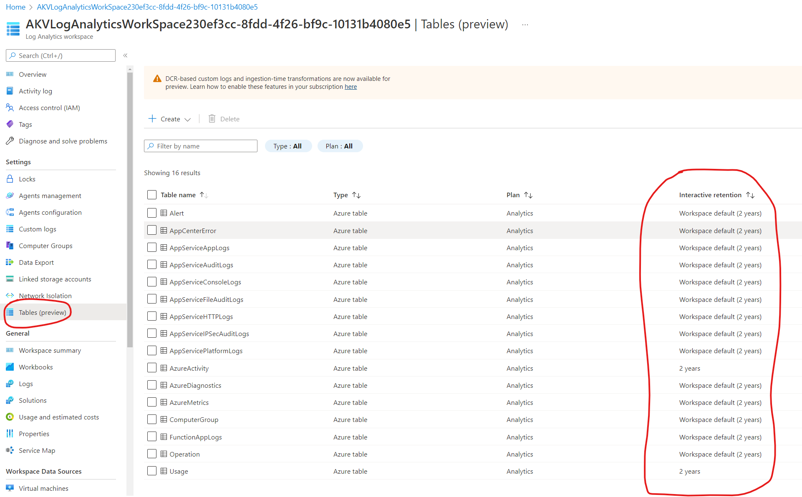

# Finding Data Retention for Azure Log Analytics

## Target audience
PX Engineering team

## Overview
For data tagging in [Data Studio](https://datastudio.msftcloudes.com/), we need to know and select the data retention (data handling) methods for GDPR In-Scope assets.

## Prerequisites
Read access to the subscription id that has your Log Analytics Workspace.  

## Steps
1. Navigate to [Privacy Tagging Progress Portal](https://datagrid.microsoft.com/Tagging/Report/all)  

---

2. Put your team name (Payment Experience Service) in the top search bar and then select the same name from the dropdown:  

  

---

3. Under "**Grid View**" you will see Assets listed by type. Click the blue number under the "**Total Assets**" column in the "**AzureLogAnalytics**" row:  

  

---

4. A new link will open in [Data Grid](https://datagrid.microsoft.com/CatalogManager/DataDiscovery).

---

5. Make sure "**AzureLogAnalytics**" is selected on the left, Click on an asset in the middle, copy the Workspace Id in the panel that loads on the right hand side (we will use this later on).  

  

---

6. Navigate to [Data Studio](https://datastudio.msftcloudes.com/#/entities)  

---

7. Make sure you are in the "**Catalog**" tab. Put in your team name in the search on the top left, then click on the team name that appears in the popup panel:  

  

---

8. Search for the workspace id copied earlier in step 5, and then copy the middle section of the namespace that appears in the results, the section between the two "." (we will use this to search in azure portal):
    1. Example: If the Namespace is "AzureLogAnalytics.**AKVLogAnalyticsWorkSpace230ef3cc-8fdd-4f26-bf9c-10131b4080e5**.5a0c4f70-85d9-438f-b9fe-092ff2b0b908", you will only copy the middle section in bold **AKVLogAnalyticsWorkSpace230ef3cc-8fdd-4f26-bf9c-10131b4080e5**  

  

---

9. Navigate to azure portal and search for this section of the namespace that we copied in the previous step, then click on the Resource that appears in the results. You will need to be signed in to the correct tenant, possibly PME / etc, for the subscription that the Log Analytics Workspace belongs to in order for it to appear in the search results:  

  

---

10. On the page that loads with the Log Analytics Workspace overview, click "**Usage and estimated costs**" in the left navigation menu, then click "**Data Retention**" tab at the top of the page that loads, then on the right you will see a popup that shows "**Data Retention (Days)**.  

  

---

11. "**Data Retention (Days)** is the default number of days that data will be stored before being deleted for every table in this Log Analytics Workspace.  

---

12. To view each tables' individual retention policy, click on "**Tables (preview)**" in the left navigation menu. You can see each tables' retention policy under the "**Interactive retention**" column on the right:  

---
For questions/clarifications, email [author/s of this doc and PX support](mailto:mccordmatt@microsoft.com?cc=PXSupport@microsoft.com&subject=Docs%20-%20operations/data-retention.md).

---