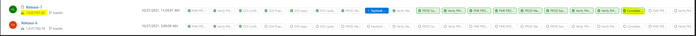
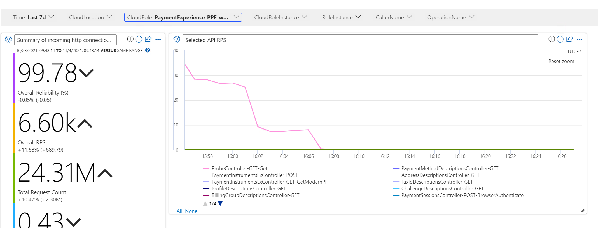

# Engineering Deployment

## Target audience
PX Engineering team

## Overview
This document describes the steps necesssary for an engineering branch deployment.

## Prerequisites
[mainDeployment.md](./mainDeployment.md)

## Deployment Steps  
### 1. Merge Master Branch into Engineering branch
  1. Find out last commit deployed to main region from master branch
     1. Navigate to [csPayments.PX.PME.OneBranch](https://microsoft.visualstudio.com/Universal%20Store/_release?definitionId=15255&view=mine&_a=releases).
     1. Find out the current active release from master branch. If there is no active release from master branch, find out the latest successful release labeled "**Complete SOX succeeded**" when hovering one of the farther right column items.
    
     1. Find out the hash of the last commit from the build of the release pipeline above.
 
  1. Merging Master into Engineering branch
      ```
      $ git checkout master && git pull origin master
      $ git checkout engineering && git pull origin engineering 
      $ git checkout -b users/youralias/engineering--master-merge
      $ git merge <commit-id from previous step> 
      ```  
      - Create a PR for the merge, add **Wei Wu** (*wwei@microsoft.com*), **Homero Barbosa** (*homero.lugo@microsoft.com*), **Kowshik Palivela** (*kowshik.palivela@microsoft.com*) and PX DRI of this week.

### 2. Release Engineering branch to PPE East US
  1. Build Engineering Branch using [SC.CSPayments.PX-OneBranch-master-Official](https://microsoft.visualstudio.com/Universal%20Store/_build?definitionId=72510)
  1. Navigate to [csPayments.PX.PME.OneBranch.Engineering](https://microsoft.visualstudio.com/Universal%20Store/_release?definitionId=14891&view=mine&_a=releases) and start a new release.
  1. Make sure COTs pass for PPE.

### 3. Collecting Test Evidence
  - The process for collecting test evidence is similar to "Collecting Test Evidence" section in [mainDeployment.md](./mainDeployment.md). However there are few differences:
    1. UI automation tests: not needed for engineering branch release.
    1. Diff tests: need to bring traffic to PPE East US before starting diff tests
       1. Navigate to [PPE ATM](https://ms.portal.azure.com/#@microsoft.onmicrosoft.com/resource/subscriptions/b6994420-af3c-4653-bbb1-c6b6ddf8e83b/resourceGroups/PX-INT-PPE-ATM/providers/Microsoft.Network/trafficmanagerprofiles/PX-PPE-APAzure/overview).
       1. Bring PPE traffic 100% to "**AzureEastUSPME**". Before cutting PPE traffic, communicate in [Operations Teams Channel](https://teams.microsoft.com/l/channel/19%3ace1e9fe78d1947d8ab399814cd02376e%40thread.tacv2/Operations?groupId=0ae81c6c-c941-4646-8bda-1c13c68611bb&tenantId=72f988bf-86f1-41af-91ab-2d7cd011db47) to ensure no one is testing with PPE West US.
       1. Navigate to [Jarvis PPE Dashboard](https://portal.microsoftgeneva.com/dashboard) to make sure West US PPE is not taking any traffic by checking "**ProbeController-GET-Get**" endpoint.
         
       1. Run diff test as described in [mainDeployment.md](./mainDeployment.md).
       1. Once diff test is done, bring PPE traffic back to "**AzureWestUSPME**".
       1. Find the instruction below for triaging diff test results.
          1. Get the triaged main regions diff test results for comparison.
             1. Navigate to [Payment Experience Test Evidence](https://microsoft.sharepoint.com/teams/PaymentExperience/Shared%20Documents/Forms/AllItems.aspx?viewid=dab0243d%2Dbefa%2D4c1c%2D939f%2D0e3531ab5ab3&id=%2Fteams%2FPaymentExperience%2FShared%20Documents%2FPX%20Deployment%2FTestEvidence&xsdata=MDN8MDF8fGI2Mzk4YmE4Mzc2MDQzMTM4NDYzMDAxM2FiNzQ3NWIwfDcyZjk4OGJmODZmMTQxYWY5MWFiMmQ3Y2QwMTFkYjQ3fDF8MHwzMTU1Mzc4OTc1OTk5OTk5OTk5fEdvb2R8VkdWaGJYTlRaV04xY21sMGVWTmxjblpwWTJWOGV5SldJam9pTUM0d0xqQXdNREFpTENKUUlqb2lJaXdpUVU0aU9pSWlMQ0pYVkNJNk1USjk%3D&sdata=K0ZybzhlQThndk4xOHhST3JGVVhIY1V4bWJWNGxWZTQ5aUdIOXljYUdMND0%3D&ovuser=72f988bf%2D86f1%2D41af%2D91ab%2D2d7cd011db47%2Cmccordmatt%40microsoft%2Ecom&OR=Teams%2DHL&CT=1624575293453) sharepoint.
             1. Find the folder with the name that matches the artifact name on the left under Releases > Artifacts in the [csPayments.PX.PME.OneBranch](https://microsoft.visualstudio.com/Universal%20Store/_release?definitionId=15255&view=mine&_a=releases) dashboard.
             1. Download the .csv file with the name like 'PPE_vs_PROD-#######-####.csv'.
          1. Compare the engineering region csv created by the diff test with the main region csv you just downloaded.
             1. The entries in engineering region csv should be a subset of the entries in main region csv, plus your recent changes that are on engineering right now.
             1. If you see anything in PPE not in PROD that is a 500 or similar error, it could be intermittent. You can run the diff tests again and make sure the same ones don't show up a second time.
             1. For all entries in engineering region csv that are in main region csv, copy the comment in the triage column of main region csv to the triage column of engineering region csv.
             1. For all entires in engineering region csv that are related to your changes only in engineering right now, put an appropriate comment in the triage column.
          1. If there are entries in engineering region csv that are NOT in main region csv and are NOT part of your recent engineering changes, then there is an issue that you need to go back and fix (your changes have affected another area of the codebase).
          1. Only once you have confirmed that the entries in the engineering region csv only include a subset of the main region csv changes, plus your engineering changes should you continue to the next step.
       1. Upload and share diff test results.
          1. Navigate to the [PX Deployment > Engineering region test evidence Sharepoint](https://microsoft.sharepoint.com/teams/PaymentExperience/Shared%20Documents/Forms/AllItems.aspx?viewid=dab0243d%2Dbefa%2D4c1c%2D939f%2D0e3531ab5ab3&id=%2Fteams%2FPaymentExperience%2FShared%20Documents%2FPX%20Deployment%2FEngineering%20region%20test%20evidence).
          1. Create a new folder with the artifact name under "**Releases > Artifacts**" in the [csPayments.PX.PME.OneBranch.Engineering](https://microsoft.visualstudio.com/Universal%20Store/_release?definitionId=14891&view=mine&_a=releases) dashboard, and put the csv and txt files, that you just triaged (from the diff test) in to this folder.
          1. Make sure the files you are adding are the latest csv you just created (with diff test) and triaged and its associated txt file.

### 4. SOX Approval Process
  - SOX Approval Process is similar to "SOX Approval Process" section in [mainDeployment.md](./mainDeployment.md). The only difference is that engineering branch release use engineering release pipeline [csPayments.PX.PME.OneBranch.Engineering](https://microsoft.visualstudio.com/Universal%20Store/_release?definitionId=14891&view=mine&_a=releases).

### 5. Health Monitoring
  - Same as "Health monitoring" session in [mainDeployment.md](./mainDeployment.md).

<div style="position:fixed; bottom:30px">

>For questions/clarifications, email [author/s of this doc and PXSupport](mailto:wwei@microsoft.com?cc=PXSupport@microsoft.com&subject=Docs%20-%20operations/engineering-region-deployment.md).
</div>


