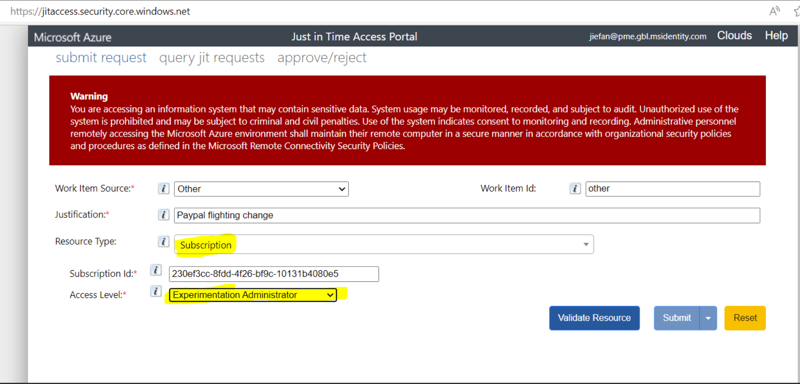
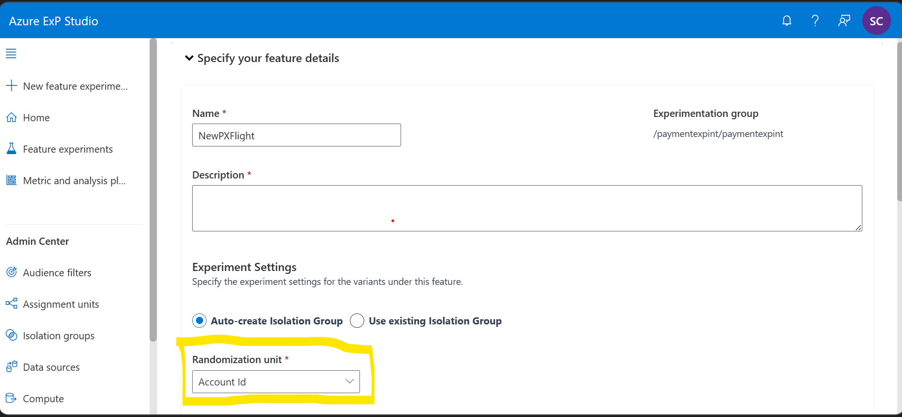
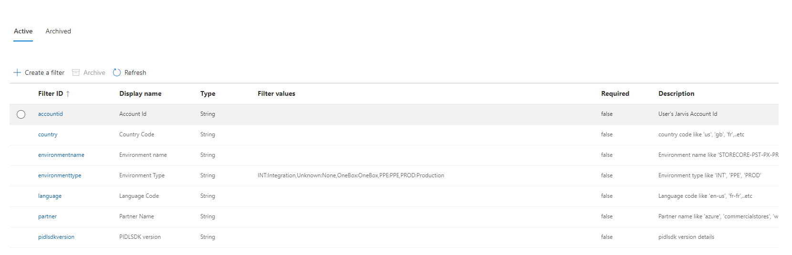

# Feature Flighting

## Target Audience
PX Engineering team

## Process to add/update feature flighting for PX
Below process will be followed by PXOncall. Do not make changes to AzureExp until its neccessary.
Please send email and create task. Follow this - [flightChanges-process.md](https://microsoft.visualstudio.com/Universal%20Store/_git/SC.CSPayments.PX?path=/private/Payments/Docs/operations/flightChanges-Process.md&_a=preview)

We use AzureExP platform to control feature flighting
1. Get "Experimentation Administrator" role access to PX INT or PROD subscription using JIT. JIT access details can be found [here](./livesite-sop.md?anchor=jit-%28just-in-time%29-access)  

   

2. Navigate to [exp.microsoft.com](https://exp.microsoft.com/), login with PME account and select the following from the dropdowns:  

   |Environment   |Azure Subscription                                               |Experiment workspace                                       |Experimentation group  |
   |----|----|----|----|
   |INT           |STORECORE-PST-PX-INT (id: 230ef3cc-8fdd-4f26-bf9c-10131b4080e5)  |paymentexpint (id: 6efb2a85-0548-45d7-9c66-3201f7dfcd7b)   |paymentexpint          |
   |PPE/PROD      |STORECORE-PST-PX-INT (id: 230ef3cc-8fdd-4f26-bf9c-10131b4080e5)  |paymentexpprd (id: 03947902-89f9-4d38-972c-251138ba5b61)   |paymentexpprod         |  

>[!NOTE]
>If you are trying this for the first time, you may need to change the url parameters to have the appropriate Experiment Workspace id and sign in with your PME account using your SAW machine 

3. Authoring a Feature Experiment is detailed [here](https://expdocs.azurewebsites.net/docs/experimentauth/authorfeatureexperiment.html)
   * Choose "Account Id" as assignment unit to return the same feature flights for a given account Id (Jarvis account Id)
   
4. Authoring an Audience Stage is detailed [here](https://expdocs.azurewebsites.net/docs/experimentauth/authoraudiencestage.html)
   * We have the following audience filters
   
5. Steps to run and stop an experiment is detailed [here](https://expdocs.azurewebsites.net/docs/experimentauth/runningfeatureexperiment.html)
   * Note: Once an audience stage/step is stopped, we can't restart it. If we want to start again, we need to create a new audience stage

## AzureExP resources
* [Onboarding to Azure ExP](https://expdocs.azurewebsites.net/docs/onboarding/onboardingsteps.html)
* [Feature Experiments Overview](https://expdocs.azurewebsites.net/docs/experimentauth/featureexperiments.html)
* [VariantAssignmentSDK Documentation](https://experimentation.visualstudio.com/Analysis%20and%20Experimentation/_git/AnE.ExP.VariantAssignment.SDK?path=/README.md&_a=preview). We use On-box Assignment Mode
* [Create Support Ticket](https://aka.ms/exp/help)

---
For questions/clarifications, email [author/s of this doc and PX support](mailto:PXSupport@microsoft.com&subject=Docs%20-%20operations/feature-flighting.md).

---