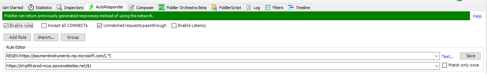
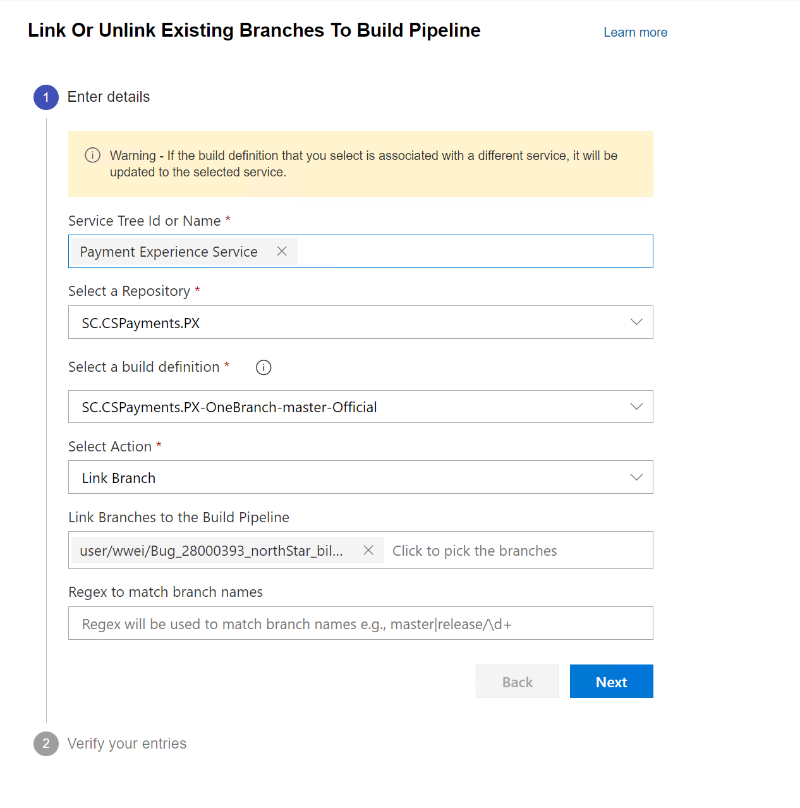
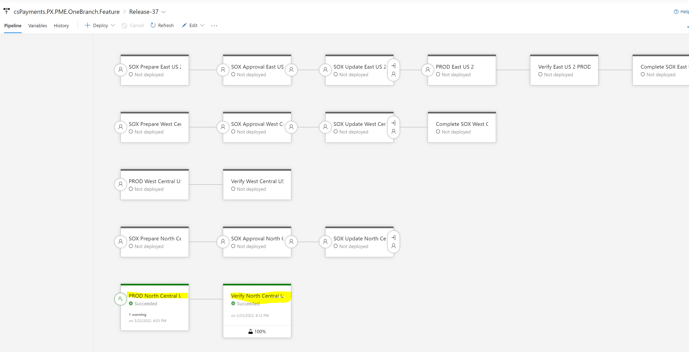

# Feature Region Deployment

## Target audience
PX Engineering team

## Overview
This document describes the steps necessary for feature branch deployment.

## Prerequisites
[mainDeployment.md](./mainDeployment.md)

[engineering-region-deployment.md](./engineering-region-deployment.md)

## What is Feature Region
North Central US is the PX feature region, which is usually not taking any PROD traffic and only used for testing by routing testing traffic to the feature region.

## How to Route Testing Traffic to Feature Region
To route test traffic to PX Feature region, please set the following fiddler auto responder rule in Fiddler to redirect traffic directly to the feature region.

REGEX:https://paymentinstruments.mp.microsoft.com/(.*)

https://st-pifd-prod-wcus.azurewebsites.net/$1

## Deployment Steps  
### 1. Build Feature Branch
1. Go to https://microsoft.visualstudio.com/Universal%20Store/_apps/hub/EZStart.easy-start-ux.onebranch-branch-onboarding.
2. Link the feature branch to PX Build Pipeline, an example is shown below.

3. Build feature branch using the build pipeline: https://microsoft.visualstudio.com/Universal%20Store/_build?definitionId=72510

### 2. Merge Master Branch into Feature branch (Optional. This step is needed if feature region is taking PROD traffic)
- Same as "Merge Master Branch into Feature branch" session in [engineering-region-deployment.md](./engineering-region-deployment.md).

### 3. Release Feature branch to PPE East US (Optional. This step is needed if feature region is taking PROD traffic)
- Same as "Release Feature branch to PPE East US" session in [engineering-region-deployment.md](./engineering-region-deployment.md).

### 4. Collecting Test Evidence (Optional. This step is needed if feature region is taking PROD traffic)
- Same as "Collecting Test Evidence" session in [engineering-region-deployment.md](./engineering-region-deployment.md).

### 5. SOX Approval Process
  - Need to get approval for deployment if during lock-down period, or feature region is taking PROD traffic.

### 6. Release
1. Create a release using the build from feature branch in the following release pipeline: https://microsoft.visualstudio.com/Universal%20Store/_release?definitionId=15256&view=mine&_a=releases
1. Start the North Central US deployment task as shown below.

### 7. Health Monitoring
  - Same as "Health monitoring" session in [mainDeployment.md](./mainDeployment.md).

For questions/clarifications, email [author/s of this doc and PXSupport](mailto:wwei@microsoft.com?cc=PXSupport@microsoft.com&subject=Docs%20-%20operations/feature-region-deployment.md).

