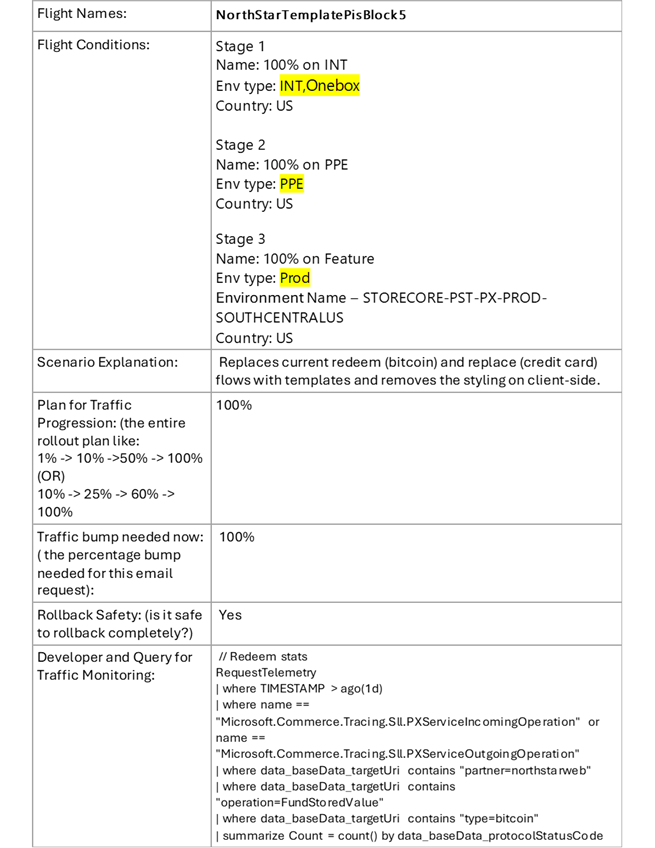

# Feature Flighting

## Target Audience
PX Engineering team

## Follow below format to send email and create task for Oncall to create or update flight

1. Send email to Oncall in below format
    To: pxoncalltask@microsoft.com
    CC: {Dev lead who sign off this change or flight}

    Please create/update the below flights on {environment name}.
    
   |Flight Name       | {Name of flight}                                               |
   |----|----|
   |Flight Conditions | <ul><li>{INT/PPE/Feature/Prod} Configuration: <ul><li>Partners – partnername</li><li>Country – Country name</li><li>AccountId – (In, NotIn) -Account ids(in, Not In)</li><li>Environment type - Onebox/INT/PPE/Feature/Prod</li><li>Environment Name - RegionName (STORECORE-PST-PX-PROD-SOUTHCENTRALUS)</li></ul></li></ul>   |
   |Scenario Explanation      | Explain the scenario, why this flight required and what this flight will do.|
   |<ul><li>Plan for Traffic Progression: (the entire rollout plan like: <ul><li>1% -> 10% ->50% -> 100% (OR)</li><li>10% -> 25% -> 60% -> 100%</li></ul></li></ul>   | Share the plan                                               |
   |Traffic bump needed now: ( the percentage bump needed for this email request):| share the % bump that require|
   |Rollback Safety: (is it safe to rollback completely?)           | Yes/No. State reason if no  |
   |Developer and Query for Traffic Monitoring:      | Kusto query or Geneva portal query link  |
   |PR Commit (for the change being flighted):   | PR/Commit link                                               |
   |Task Link for Cleaning Up the Flight (if the requested rollout is 100%):| Provide clean up task link for this flight for tracking----|
   |Signing off Lead           | **RaviKM or KowshikP**  |

2. **Please check below important note**.
     * Before enabling the flight on Prod, It needs to be enable and tested on Onebox/INT/PPE.
     * If you have more than one flight having different configuration. Please send seperate email for it.
     * All the request needs to be signed-off by either RaviKM or KowshikP.
     * The rollout / ramp-up of the flights need to happen following SDP (Safe Deployment Practices) i.e., wait 24hours between bump-ups. No rollouts / flight changes on Fridays

3. Please see below example

      

4. Task creation
   * Once you send email, you will get automatic reply with task link. Work with PX Oncall to execute the task.

---
For questions/clarifications, email [author/s of this doc and PX support](mailto:PXOnCall@microsoft.com&subject=Docs%20-%20operations/flightChanges-Process.md).

---