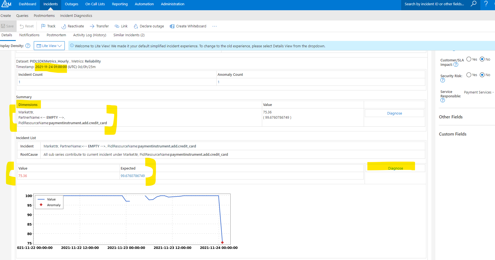

# IcM Ticket Guide - PidlSdk

## Target audience
PX Engineering team

## Overview
During a livesite incident, the first piece of information you will review is either the incident email or
the incident ticket. This guide explains how to interpret or parse out various pieces of useful information
in PidlSdk alert to help reduce Time-To-Mitigation.

## Prerequisites
1. [IcM Docs - Introduction](https://icmdocs.azurewebsites.net/onboarding/introduction.html)

## Parsing the IcM Ticket
Below is a screenshot of an IcM incident page (the same applies to IcM incident emails). The [specific
 incident 274051273, is here](https://portal.microsofticm.com/imp/v3/incidents/details/274051273/home) in case you want
 to see it on the IcM portal.

Highlighted in the below picture:
1. **Timestamp** - Time when this anomaly is detected. We need to look back from this time (based on the feed interval) to see the actual issues.
2. **Dimensions** - These dimention values are useful to compose correct query to look into raw logs.
3. **Value** - Actual value for this metric for the given Dimensions.
4. **Expected Value** - Expected value for this metric for the given Dimensions.
5. **Diagnose** - This link takes to the actual time series in Kensho



## Debug using pidlsdk logs
Use the incident timestamp and dimension values to call the following function in PST kusto cluster

```
cluster('pst.kusto.windows.net').database('Prod').GetPidlSdkFailureDetails(inputStartTime:datetime=datetime(null), inputEndTime:datetime=datetime(null), pidlResourceName:string="", partnerName:string="", market:string="", errorType:string="")

Here is an example

GetPidlSdkFailureDetails(datetime(2021-11-24 10:00:00), datetime(2021-11-24 11:00:00), "addorupdatepi", "", "us")
| project IngestTime, CV, PartnerName, Market, PidlResourceName, ErrorType, ErrorCode, EventParameters, UserId, ClientIP, BrowserDomain, SdkVersion
```
Highlighted in the below picture:
1. **EventParameters** - It contains the failure details.
1. **UserId** - For some partner scenarios, userId will be empty. So, check before counting distinct users affected.
1. **ClientIP** - It contains the client IP. In the absense of userId, this can be used to find out the number of users/clients impacted. 


---
For questions/clarifications, email [author/s of this doc and PX support](mailto:ravikm@microsoft.com?cc=PXSupport@microsoft.com&subject=Docs%20-%20operations/icm-ticket-guide-kensho.md).

---
