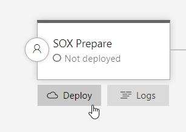
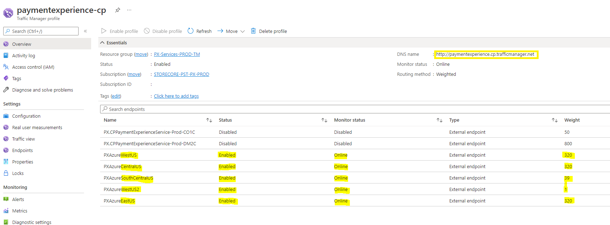

# PX Deployment Process

## Target audience
PX Engineering team

## Overview
This document describes the steps necesssary for deploying to all main regions.

## Cuting the release
Cutting the release really means having a release candidate deployed to our PPE environment. There's 2 ways to cut the realease.
- Every week day, there's an automatic release to PPE at 3am PST. We usually prefer to take this as a release cut.
- When a fix or late change need to make it into the release and we can't wait for the 3am PPE release, we can trigger a manual PPE release as well.

[Release Pipeline](https://microsoft.visualstudio.com/Universal%20Store/_release?definitionId=15255&view=mine&_a=releases)

## Collecting Test Evidence

**COTs**
When PX is deployed to PPE, the following stage executes the COTs. Make sure COTs pass eveen before running DiffTests and UI Automation.

**Run DiffTest**
Run the [difftest]() tool with the following command under PX repo path <PXRepoRoot>\private\Payments\Tests\PidlTest\bin\Debug

```.\PidlTest.exe /test DiffTest /BaseEnv PROD /TestEnv PPE /TriagedDiffFilePath "\DiffTest\ConfigFiles\TriagedDiffs\SELFHOST_vs_SELFHOST.csv"```

Additional configuration for the very 1st time run diff test againest PPE/PROD: 
- Login portal.azure.com using your PME account
- Copy secret from [TestAKV](https://portal.azure.com/#@mspmecloud.onmicrosoft.com/resource/subscriptions/230ef3cc-8fdd-4f26-bf9c-10131b4080e5/resourceGroups/PX-Infra-INT-CentralUS/providers/Microsoft.KeyVault/vaults/PX-TestKV-INT/secrets) 
- Replace all string "DiffTestAccountPassword-PPEPROD" with secret in <PXRepoRoot>\SC.CSPayments.PX.1\private\Payments\Tests\PidlTest\App.config
- Build PX solution and run diff test.

Once the tool is done, do the following:
- Locate the report files under <RepoRoot>\private\Payments\Tests\PidlTest\bin\Debug\Logs
- Convert the cvs into xlsx
- On this [sharepoint location](https://microsoft.sharepoint.com/teams/PaymentExperience/Shared%20Documents/Forms/AllItems.aspx?viewid=dab0243d%2Dbefa%2D4c1c%2D939f%2D0e3531ab5ab3&id=%2Fteams%2FPaymentExperience%2FShared%20Documents%2FPX%20Deployment%2FTestEvidence), create a folder and use the build version as name.
- Copy the report files (txt and xlsx) into the sharepoint folder.
- Send an email so the team can triage diffs

**Run UI Automation**
- Refer to [UI Automation](../engineering/tests/UIAutomation.md) for setup and how to run.
- Send email confirming UI automations tests passed.

## SOX Approval Process
Once test evidence has been collected, the next step is to create a SOX prepare stage and get the necessary approvals.

**Preparing SOX Approval**
Deploy and approve the SOX prepare stage, once it has been completed, it create a service change work item. Open the service change and attach the test evidence. The xlsx file, and the email thread with the confirmation difftest has been run and triagged and UI Automation tests passed.
- **SOX Prepare**


- **SOX Service Change Link**


**Getting SOX Approvals**
SOX approval requires a technical approval and a release approval. Usually **Kowshik Palivela** (*kowshik.palivela@microsoft.com*) does the technical approval, but any PX team member can do it. **Swaroop Shivakumar** (*swaroop.shivakumar@microsoft.com*) must do the release approval though.

- **SOX Approvals**


## Region Bake Times
We follow [Safe Deployment Practices](https://eng.ms/docs/quality/zero-self-inflicted-sev1s/safedeploy#) and therefore, we have bake times between regional deployments.

Make sure we have all regions enabled with right weights before starting the deployment. You can check at [Azure Portal](https://portal.azure.com/#@mspmecloud.onmicrosoft.com/resource/subscriptions/9b6168fd-7d68-47e1-9c71-e51828aa62c0/resourceGroups/PX-Services-PROD-TM/providers/Microsoft.Network/trafficmanagerprofiles/paymentexperience-cp/overview)


- West US 2 (0.1%) region can be deployed right after the SOX release is approved.
- South Central US (3.9%) requires West US2 to be baked for atleast 2 hours.
- Central US (32%) requires South Central US to be baked for 24 hours.
- East US (32%) and West US (32%) requires Central US to be baked for 24 hours.

To complete a deployment from start to finish usually takes at least 3 days.

## Tag Release
After the deployment is release to the first region, tag the commit where the release was cut with the following format "release-yyyy.mm.dd"

## Health monitoring
Before deploying to each region, make sure:
- There's no active Sev 2 or higher ongoing livesites.
- All COT verifications from the previous region succeed.

It's also extremely important to make sure the release is not introducing any issues. We do so by comparing errors between regions. The following queries check for:

- 500 count by region.
- Calls that failed when PX called dependencies.
- Calls that succeeded on calling dependencies but failed on PX.
- Exception details on calls that succeeded on calling dependencies but failed on PX.

```
let startTime = ago(1h);
let endTime = now();
let lookbackMinutes = 10;
let env = "prod";
let sourceNS = case(env =~ "ppe", "paymentexperiencelogsppe", "paymentexperiencelogsprod");

let AllServerErrors = 
RequestTelemetry
| where TIMESTAMP between (startTime .. endTime)
and name == "Microsoft.Commerce.Tracing.Sll.PXServiceIncomingOperation"
and SourceNamespace == sourceNS
//Test accounts
and data_AccountId !in (
"5662f816-97b9-4c2f-9b28-0c09d2c15a1e"
, "097a070b-603c-4ad1-bc63-2d9b7f111c11"
, "8e342cdc-771b-4b19-84a0-bef4c44911f7"
, "876f8839-aae6-45a0-b7f3-679e5385035a")
| extend protocolStatusCode = toint(data_baseData_protocolStatusCode)
| where protocolStatusCode >= 500
| project
    TIMESTAMP,
    cV,
    OperationName = data_baseData_operationName,
    HttpStatus = data_baseData_protocolStatusCode,
    Response=data_ResponseDetails,
    Region = ext_cloud_location,
    RoleInstance = ext_cloud_roleInstance,
    ServerTraceId = data_ServerTraceId,
    RequestTraceId = data_RequestTraceId,
    TargetUri = data_baseData_targetUri,
    PaymentMethodFamily = data_PaymentMethodFamily,
    PaymentMethodType = data_PaymentMethodType,
    AccountId = data_AccountId
;

let CountsByRegion =
AllServerErrors
| summarize Count = count(), UniqueUsers = dcount(AccountId) by Region
| sort by Region asc
;

let OutgoingServiceErrors =
AllServerErrors
| join kind=inner  (
    RequestTelemetry 
    | where TIMESTAMP between (datetime_add('minute', (0-lookbackMinutes), startTime) .. endTime)
        and name == "Microsoft.Commerce.Tracing.Sll.PXServiceOutgoingOperation"
        and SourceNamespace == sourceNS
        and (toint(data_baseData_protocolStatusCode) >= 400 or data_baseData_protocolStatusCode == "InternalServerError")
    | project
        OOperationName = data_baseData_operationName,
        OHttpStatus=data_baseData_protocolStatusCode,
        OResponse = data_ResponseDetails,
        data_ServerTraceId,
        data_RequestTraceId
    )
    on $left.ServerTraceId == $right.data_RequestTraceId
| summarize Count = dcount(AccountId), take_any(OResponse), take_any(Response), take_any(cV)
by
Region,
Operation = OperationName,
HttpStatus,
OOperationName,
OHttpStatus
| sort by Region asc, Operation, HttpStatus, OOperationName, OHttpStatus
;

let InternalPXServiceErrors =
AllServerErrors
| join kind=leftanti (
    RequestTelemetry 
    | where TIMESTAMP between (datetime_add('minute', (0-lookbackMinutes), startTime) .. endTime)
        and name == "Microsoft.Commerce.Tracing.Sll.PXServiceOutgoingOperation"
        and SourceNamespace == sourceNS
        and (toint(data_baseData_protocolStatusCode) >= 400 or data_baseData_protocolStatusCode == "InternalServerError")
    | project
        OOperationName = data_baseData_operationName,
        OHttpStatus=data_baseData_protocolStatusCode,
        data_ServerTraceId,
        data_RequestTraceId
    )
    on $left.ServerTraceId == $right.data_RequestTraceId
| join kind=leftouter (
    CustomEvents
    | where TIMESTAMP between (datetime_add('minute', 0-lookbackMinutes, startTime) .. endTime)
    and SourceNamespace == sourceNS
    | project
        Edata_ServerTraceId=data_ServerTraceId,
        Edata_RequestTraceId=data_RequestTraceId,
        Edata_Exception=data_Exception,
        Edata_cloud_location=ext_cloud_location
    | where Edata_Exception != ""
    )
    on $left.ServerTraceId == $right.Edata_RequestTraceId
;

let AllCountsByRegion =
CountsByRegion
| join kind=leftouter (
    InternalPXServiceErrors
    | summarize PXInternalErrors = count(), PXInternalErrors_UniqueUsers = dcount(AccountId) by Region
    )
    on $left.Region == $right.Region
| project
Region,
Count,
UniqueUsers,
PXInternalErrors,
PXInternalErrors_UniqueUsers
;

AllCountsByRegion;
OutgoingServiceErrors;
InternalPXServiceErrors;

```

## Email Communications
Deployment status is communicated via email, but mainly there's 4 major updates in addition to the test evidance attestment.
- Deployment notification. Notifies a deployment is about to start. Example:
```
PX PROD Deployment - 7/20

1.0.016620003-37c1c265 is the candidate build from SC.CSPayments.PX master branch for PX PROD deployment.
 
The above candidate build has been deployed to PX Azure PPE (below is the release tracking page) : 
csPayments.PX.PME.CDPx - Release-497 - Pipelines (visualstudio.com)
 
@Wei Wu, Please run diff tests and share the results to triage.
 
I'll be running the UI automation tests on PPE.
 
Thanks,
Homero Barbosa
```

- Canary and Engineering Notification. Example:
```
Got the necessary approvals.  Starting the deployment to South Central US (3.9%) and West US 2 (0.1%) regions.

Thanks,
Homero Barbosa
```

- Central US Notification. Example:
```
Traffic to South Central US (3.9%) and West US 2 (0.1%) regions is looking good.  Starting the deployment to Central US (32%).

Thanks,
Homero Barbosa
```

- East US and West US Notification. Example:
```
Traffic to Central US is looking good.  Starting the deployment to remaining regions – East US (32%) and West US (32%)

Thanks,
Homero Barbosa
```

---
For questions/clarifications, email [author/s of this doc and PX support](mailto:holugo@microsoft.com?cc=PXSupport@microsoft.com&subject=Docs%20-%20operations/mainDeployment.md).

---