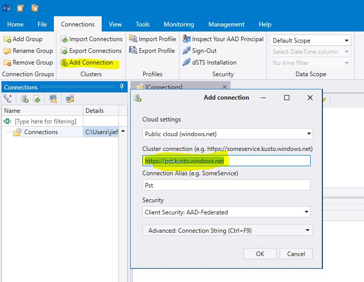
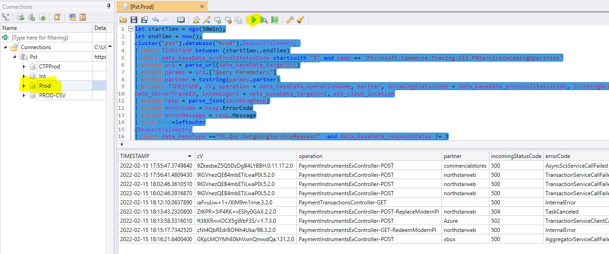
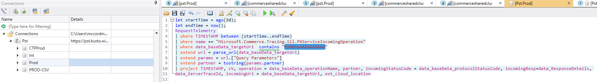
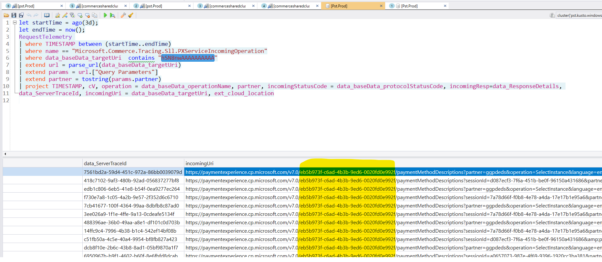

# Observability

## Target Audience
PX Engineering

## Dashboards
- [Jarvis Studio Custom Lookup]() - (You will need to be a member of this [PROD security group](https://account.activedirectory.windowsazure.com/r#/manageMembership?objectType=Group&objectId=2bc1fe0d-d3ab-486c-abd9-8e0d6ccea89d))  
- [Northstar](https://xpert.microsoft.com/osg/Search?display=Grid&searchQuery=%40name%20%3D%3D%20%22Microsoft.Commerce.Payments.ManagePayments.PageEvent%22%0Aselect%20%40eventName%2C%20%40%22eventProperties.healthy%22%2C%20%40country%2C%20%40market%2C%20%40cV%2C%20%40sessionId%0Awhere%20%40eventName%20%3D%3D%20%22HealthOnInitialize%22%20AND%20%40%22eventProperties.healthy%22%20%3D%3D%20false&source=Environment%3DPROD%3B)
- [PIDLSDK](https://xpert.microsoft.com/osg/views/PidlSdkReport/c317477c-a91b-4cce-b9e6-0346c88eddb5)
- [PX Geneva](https://portal.microsoftgeneva.com/dashboard/paymentexperience-metrics-prod/Service%2520QoS?overrides=[{%22query%22:%22//*[id%3D%27OperationName%27]%22,%22key%22:%22value%22,%22replacement%22:%22%22},{%22query%22:%22//*[id%3D%27CloudLocation%27]%22,%22key%22:%22value%22,%22replacement%22:%22%22},{%22query%22:%22//*[id%3D%27CloudRole%27]%22,%22key%22:%22value%22,%22replacement%22:%22%22},{%22query%22:%22//*[id%3D%27RoleInstance%27]%22,%22key%22:%22value%22,%22replacement%22:%22%22},{%22query%22:%22//*[id%3D%27CloudRoleInstance%27]%22,%22key%22:%22value%22,%22replacement%22:%22%22},{%22query%22:%22//*[id%3D%27CallerName%27]%22,%22key%22:%22value%22,%22replacement%22:%22%22}]%20)
- [PX Lens](https://lens.msftcloudes.com/#/dashboard/5dc09589-664c-4f9e-b41e-02bb73b36eab?_g=(ws:e377c266-06a6-4858-9d50-4e24c8d098ed))
- [TradeAVS](https://lens.msftcloudes.com/#/dashboard/5b28c3d9-3437-474b-8503-04aba73da444?tempId=20211019-206d91d6-be87-4e76-bbd9-27ba39ea083e&_g=())
- [Zip+4](https://lens.msftcloudes.com/#/dashboard/c9f738f4-cc32-4723-be68-ec34bbe9f825?_g=(ws:e377c266-06a6-4858-9d50-4e24c8d098ed))

# Access kusto
- kusto desktop UI can be downloaded [here](https://aka.ms/ke). More about [kusto](https://kusto.azurewebsites.net/docs/index.html)
- add PST cluster as below (https://pst.kusto.windows.net).
 
- select PROD db at left panel, select query and execute query 
 

## Sample PX Queries 
Below query finds 500s returned by PX along with corresponding outgoing failures in PX PROD/PPE
```
let startTime = ago(30min);
let endTime = now();
cluster("pst").database("Prod").RequestTelemetry 
| where TIMESTAMP between (startTime..endTime)
| where data_baseData_protocolStatusCode startswith "5" and name == "Microsoft.Commerce.Tracing.Sll.PXServiceIncomingOperation"
| extend url = parse_url(data_baseData_targetUri)
| extend params = url.["Query Parameters"]
| extend partner = tostring(params.partner)
| project TIMESTAMP, cV, operation = data_baseData_operationName, partner, incomingStatusCode = data_baseData_protocolStatusCode, incomingResp=data_ResponseDetails, 
data_ServerTraceId, incomingUri = data_baseData_targetUri, ext_cloud_location
| extend resp = parse_json(incomingResp)
| extend errorCode = resp.ErrorCode
| extend errorMessage = resp.Message
| join kind=leftouter
(RequestTelemetry
| where data_baseType =="Ms.Qos.OutgoingServiceRequest"  and data_baseData_requestStatus != 3
| where TIMESTAMP between (startTime..endTime)
| extend responseDetails = parse_json(data_ResponseDetails)
| project data_RequestTraceId,  outgoingStatusCode = data_baseData_protocolStatusCode, outgoingOperation = data_baseData_operationName, outgoingResp = responseDetails, outgoingUri = data_baseData_targetUri
)on $left.data_ServerTraceId == $right.data_RequestTraceId
|project TIMESTAMP, cV, operation, partner, incomingStatusCode, errorCode, errorMessage, outgoingStatusCode, outgoingOperation, outgoingResp,outgoingResp.Message,incomingUri, outgoingUri, ext_cloud_location
```

Below query finds outgoing accessor exceptions
```
let startTime = ago(30min);
let endTime = now();
cluster("pst").database("Prod").CustomEvents
| where TIMESTAMP between (startTime..endTime)
| where name=="Microsoft.Commerce.Tracing.Sll.PXServiceTraceException" 
| parse kind = regex flags = Ui data_Exception with * "Microsoft.Commerce.Payments.PXService." DependenceName "Accessor.<" * 
| where data_Exception !contains "Product Catalog lookup failed" 
| project PreciseTimeStamp, RoleInstance, cV,DependenceName, data_Exception, data_RequestTraceId, ext_cloud_location 
| sort by DependenceName desc
```

## PIDLSDK Queries
PIDLSDK Query functions

```
GetPidlSdkFailures(ago(4h), now(), 1h)

GetPidlSdkReliabilityForAddOrUpdatePI(ago(4h), now(), 1h)

```

Sample PIDLSDK Query to get reliability cross APIs
```
cluster("pst").database("Prod").PidlSdkTelemetryEvents
| where name == "Microsoft.Commerce.Payments.PidlSdk.PageEvent"
| where EventName in ("success", "failure", "gohome", "apiReturned")
| summarize StartedCount = countif(EventName == "apiReturned")
, SuccessCount = countif(EventName == "success")
, FailureCount = countif(EventName == "failure")
, CancelledCount = countif(EventName == "gohome")
, ServerErrorCount = countif(EventName == "failure" and EventParameters.error.type == "serverError")
by bin(IngestTime, 5m), PartnerName, PIDLResourceType, PidlSdkOperationType, ResourceFamily, ResourceType = iff(ResourceFamily in ("credit_card", "mobile_billing_non_sim"), "All", ResourceType), ResourceScenario
| extend Reliability = round((StartedCount - ServerErrorCount)*100.0/StartedCount, 2)
```


## Sample NorthStar Xpert Query
These failures cause the HealthOnInitialize to be unhealthy in NorthStar Payment Options List PI: [query link](https://xpert.microsoft.com/osg/Search?display=Grid&searchQuery=%40name%20%3D%3D%20%22Microsoft.Commerce.Payments.ManagePayments.PageEvent%22%0Aselect%20%40eventName%2C%20%40country%2C%20%40market%2C%20%40cV%2C%20%40sessionId%2C%20%40eventProperties%0Awhere%20%40eventName.Contains(%22ListPI_fetchFailed%22)&source=Environment%3DPROD%3B)

## Find logs / account id based on unique Url query parameters
**Example URL:** `https://paymentinstruments.mp.microsoft.com/v6.0/users/me/paymentMethodDescriptions?sessionId=d087ecf3-7f6a-451b-be0f-96150a431686&partner=ggpdeds&operation=Add&language=en-US&family=credit_card&country=au&billableaccountid=hSN8nwAAAAAAAAAA`  

1. Open Kusto Explorer
2. Run the following query against Pst > Prod database (adjusting start and end time as necessary), replacing `<YOUR QUERY PARAM HERE>` with a unique query parameter value you want to search for (cV, data_ServerTraceId, billableaccountid, etc):
```
let startTime = ago(1d);
let endTime = now();
RequestTelemetry 
| where TIMESTAMP between (startTime..endTime)
| where name == "Microsoft.Commerce.Tracing.Sll.PXServiceIncomingOperation"
| where data_baseData_targetUri  contains "<YOUR QUERY PARAM HERE>"
| extend url = parse_url(data_baseData_targetUri)
| extend params = url.["Query Parameters"]
| extend partner = tostring(params.partner)
| project TIMESTAMP, cV, operation = data_baseData_operationName, partner, incomingStatusCode = data_baseData_protocolStatusCode, incomingResp=data_ResponseDetails, 
data_ServerTraceId, incomingUri = data_baseData_targetUri, ext_cloud_location
```
For example, if you want to search for the billableaccountid then replace `<YOUR QUERY PARAM HERE>` with `hSN8nwAAAAAAAAAA` as pictured here:
  
  
  3. Find the `incomingUri` in the Kusto search results to locate the account id in the url after the version number. For example: https://paymentexperience.cp.microsoft.com/v7.0/`{ACCOUNT ID IS HERE}`/paymentMethodDescriptions?partner=ggpdeds&operation=SelectInstance&language=en-US&country=AU&billableaccountid=hSN8nwAAAAAAAAAA&allowedPaymentMethods=%5B%22credit_card%22%2C%22direct_debit%22%5D  

  
  
  4. If you need to lookup the customer profile, use the `Jarvis Studio Custom Lookup` link above in the `Dashboards` section.

---
For questions/clarifications, email [author/s of this doc and PX support](mailto:JieFan@microsoft.com?cc=PXSupport@microsoft.com&subject=Docs%20-%20development/observability.md).

---