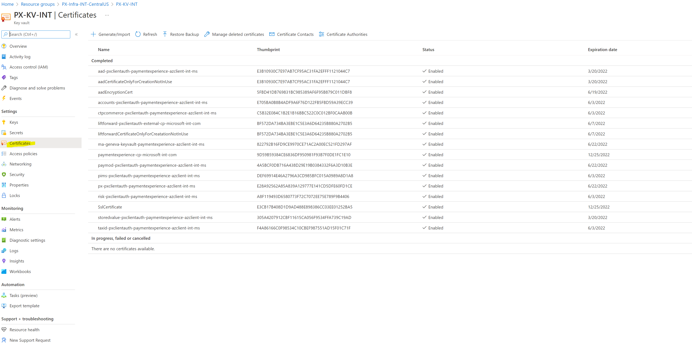
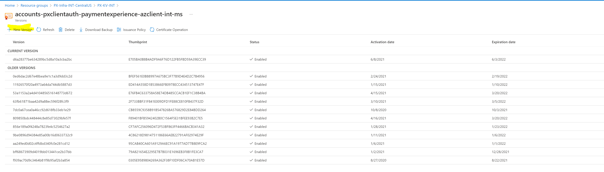
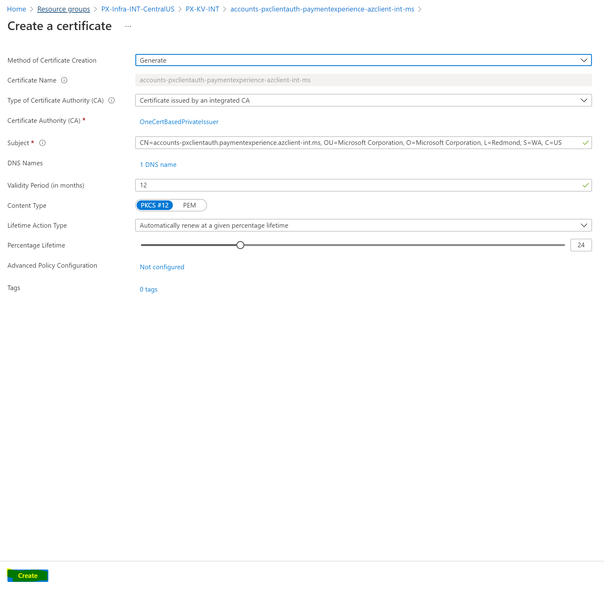

# PX Certificate Renewal Procedure

## Target audience
PX Engineering

## Prerequisites
- [secret-management](../engineering/secret-management.md)

## Overview
This doc describes how to renew certificates of PX Service. Usually, this happens automatically for certificates that are configured for autorenewal in Key Vault. However, we want to do this manually sometimes, such as ECR drill or testing new AME CAs issued certificates.

## INT certificate renewal
1. Apply for yubi key and JIT access, refer to this [livesite-sop.md](./livesite-sop.md) for instruction.
2. Contact PayTaskReq@microsoft.com to add yourself as an approved requester for the following two domains in [OneCert](https://onecert.core.microsoft.com/).
   - *.paymentexperience.azclient-int.ms
3. Go to [PX-KV-INT](https://portal.azure.com/#@mspmecloud.onmicrosoft.com/resource/subscriptions/230ef3cc-8fdd-4f26-bf9c-10131b4080e5/resourceGroups/PX-Infra-INT-CentralUS/providers/Microsoft.KeyVault/vaults/PX-KV-INT/overview).
4. Under "Certificate" section, select the certificate to be renewed.

5. Select "+ New Version" for the selected certificate, use the default setting to create a new version.  
  

6. Start a new INT depolyment in [INT release pipeline](https://microsoft.visualstudio.com/Universal%20Store/_release?definitionId=15253&view=mine&_a=releases) and run COTs, all COTs should pass with new certificates

## PROD certificate renewal
PROD certificate renewal is similar to INT certificate renewal, but we will need SRE team's help to perform the operation.  
Please find the steps in [ECRDrill.md](../operations/ECRDrill.md) about how to create SC and perform PROD certificate renewal.

---
For questions/clarifications, email [author/s of this doc and PX support](mailto:wwei@microsoft.com?cc=PXSupport@microsoft.com&subject=Docs%20-%20operations/renew-certificate.md).

---