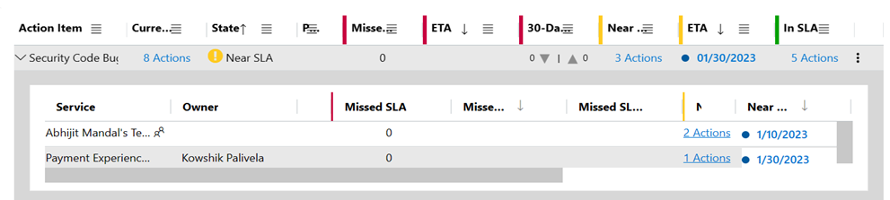
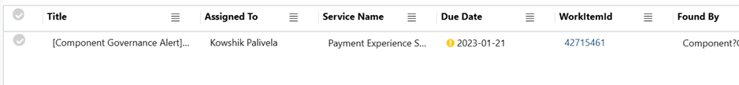
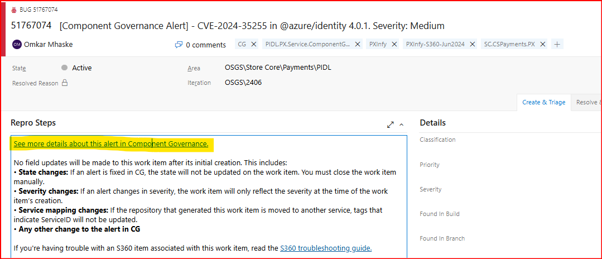
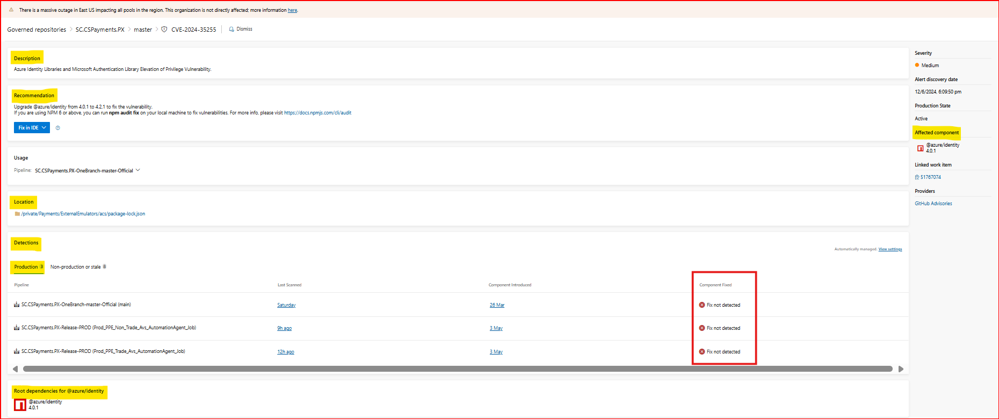

## KPI Name
Security Code Bugs / 1ES Open Source Vulnerabilities

## Target audience
Payment Experience Service 

## Overview
This KPI can appear in S360 dashboard with different names like Security Code Bugs, 1ES Open Source Vulnerabilities.

#### To resolve this KPI, you need to follow below steps,
1. On S360 dashboard, Open Security Code Bugs / 1ES Open Source Vulnerabilities KPI, 

	
2. The actions will open up in New Tab. Once the tab opens, Click on WorkIteId / BugId (column name could be different.)

	
3. Open the Bug, click on 'See more details about this alert in Component Governance.'

	
4. After navigating, you will see the page like below,

	

   - Insights of above page:

	 - **Description:** It will show the information of NuGet / NPM package.
	 - **Recommendation:** It describes what needs to be done with this package.
	 - **Affected component (On right side of page):** It shows the vulnerable package name and version.
	 - **Location:** It shows the path of the package. This is the main place where we need to make the change to upgrade the package.
	 - **Detections:** Here, we are only focusing on Production detections. Resolving these alerts doesn't mean that you fixed the bug and merged changes to master, you also need to trigger all the pipelines shown under the detections tab then only alert will be clear from the dashboard. You will see the 'Alert fixed' message under 'Component fixed' column.
	 - **Root dependencies for (affected package name):** Sometimes, the package that is affected might not appear as installed in your solution. When this happens, you should update the root package that depends on it.

5. Please see below for,
   1. [Type: Upgrading NuGet packages](CGType-Upgrading-NuGet-packages.md)
   2. [Type: Upgrading NPM packages](CGType-Upgrading-NPM-packages.md)
