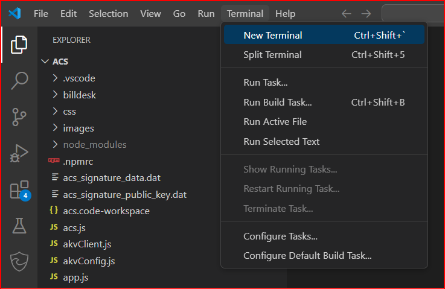

## KPI Name
Security Code Bugs / 1ES Open Source Vulnerabilities

## Target audience
Payment Experience Service 

## Overview
This document will show you how to upgrade NPM packages in PX repo.

**In PX, we have NPM packages at the following location:** `/private/Payments/ExternalEmulators/acs/package-lock.json`

**Please find steps below to upgrade the NPM packages,** (Before going forward, please be familiar with this page - [Insights of above page](https://eng.ms/docs/cloud-ai-platform/commerce-ecosystems/commerce-financial-systems/payment-and-settlement/payment-experience-service/pxpidl-tsgs/operations/s360/cg-security-code-bugs-or-1es-open-source-vulnerabilities#:~:text=Insights%20of%20above%20page)
1. Open the solution in Visual Studio.
2. Checkout to 'master' branch (if not already) -> Create user branch with following format. <u>"users/your_alias/branch_name"</u>. Make sure that the user branch name shouldn't contain any special characters.
3. Open acs folder in visual studio code -> Open 'Terminal' at acs folder location.
	
	
4. Under Terminal, run 'npm audit' to list all vulnerable packages -> run 'npm audit fix' to upgrade all the affected packages.
	1. If you face npm login error, run  'vsts-npm-auth -config .npmrc -force'
	2. Please refer following OneNote for NPM errors - [NPM install error](https://microsoft-my.sharepoint.com/personal/v-saurab_microsoft_com/_layouts/OneNote.aspx?id=%2Fpersonal%2Fv-saurab_microsoft_com%2FDocuments%2FInfy_GloPay&wd=target%28Native%20Experience.one%7CA9C83CD0-AC3E-4B40-BCEF-754F561EBA46%2FNPM%20install%20error%7C1075922B-56DE-4744-A238-5982D7148135%2F%29onenote:https://microsoft-my.sharepoint.com/personal/v-saurab_microsoft_com/Documents/Infy_GloPay/Native%20Experience.one#NPM%20install%20error&section-id={A9C83CD0-AC3E-4B40-BCEF-754F561EBA46}&page-id={1075922B-56DE-4744-A238-5982D7148135}&end)
5. Carefully check the changes and ensure that packages are upgrading.
Commit the changes and follow this TSG from step 8 to step 16. [Type: Upgrading NuGet packages](CGType-Upgrading-NuGet-packages.md)