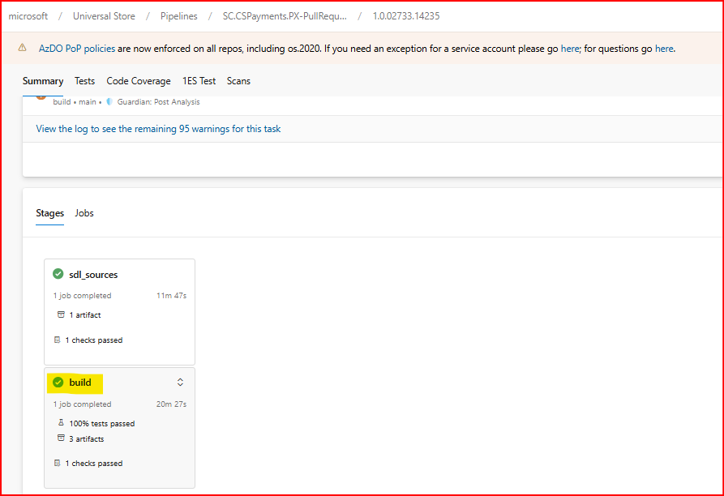

## KPI Name
Security Code Bugs / 1ES Open Source Vulnerabilities

## Target audience
Payment Experience Service 

## Overview
This document will show you how to upgrade NuGet packages in PX repo.

**Please find steps below to upgrade the NuGet packages,** (Before going forward, please be familiar with this page - [Insights of above page](https://eng.ms/docs/cloud-ai-platform/commerce-ecosystems/commerce-financial-systems/payment-and-settlement/payment-experience-service/pxpidl-tsgs/operations/s360/cg-security-code-bugs-or-1es-open-source-vulnerabilities#:~:text=Insights%20of%20above%20page)
	
1. Open the solution in Visual Studio.
2. Checkout to 'master' branch (if not already) -> Create user branch with following format. <u>"users/your_alias/branch_name"</u>. Make sure that the user branch name shouldn't contain any special characters.
3. Right click on the project for which the affected component is flagged -> Click Manage NuGet Packages…
	
	
4. Search with the affected package name -> On the right side of the screen, click on the dropdown and select recommended package version -> 'Update' button will be enable, click 'Update'

	
	
	**Note:** Please use this guidance, [if the version you need isn't available.](https://eng.ms/docs/cloud-ai-platform/commerce-ecosystems/commerce-financial-systems/payment-and-settlement/payment-experience-service/pxpidl-tsgs/operations/s360/cgtype-upgrading-nuget-packages#:~:text=When%20updating%20a%20NuGet%20package%2C%20if%20the%20version%20you%20need%20isn%27t%20in%20the%20feed%2C%20make%20sure%20to%20check%20the%20feed%27s%20upstream%20sources%20section%20for%20the%20required%20version.) 

5. A popup will open to previewing the change. Here, make sure to check whether the installed packages are being upgraded. If packages are downgrading then consider using a different version of the affected package.

		
	- Insights of above image,
	    1. Meaning of the line (OpenTelemetry.1.6.0 -> OpenTelemetry.1.9.0) is that the current installed version of OpenTelemetry package is 1.6.0 and is being upgraded to the version 1.9.0
		2. Sometimes you will see that some packages are getting installed, you may keep those changes as the packages being installed are the required packages for upgrading affected package.
		
6. Click 'Apply' button on Preview Changes page -> License Acceptance popup will open, you need to click on 'I Accept' button.

		
7. Once you upgrade the package, you will see that the number of files got updated. You need to go through each and every change and make sure below things,
    1. Check carefully whether the package downgrade happen in any file. If that is the case, you need to undo all those package downgrades.
		
		
	2. Check carefully and remove the extra added binding redirects apart from the change related to upgraded package. Basically, Yyou need to undo any binding redirects that starts with Microsoft and/or System.
		
		

8. Once you pass the above checklist (point 1 and 2), build the solution, and commit the changes. Once changes are committed, refer below PRs to raise new draft PR.
	1. [Pull Request 10851920: [Bug 51154578,79,80,81] Update Bond packages](https://microsoft.visualstudio.com/Universal%20Store/_git/SC.CSPayments.PX/pullrequest/10851920) 
	2. [Pull Request 10679810: [Bug 50194428,29,50114148,49] Upgrade Azure.Identity package version to version 1.11.0 and Microsoft.Identity.Client package to fix the vulnerability](https://microsoft.visualstudio.com/Universal%20Store/_git/SC.CSPayments.PX/pullrequest/10679810)
	3. [Pull Request 10156381: Updating System.IdentityModel.Tokens.Jwt package in app.config file](https://microsoft.visualstudio.com/Universal%20Store/_git/SC.CSPayments.PX/pullrequest/10156381)
	4. [Pull Request 9774391: [Bug 47161366,67,68,70,71] Update Microsoft.Identity.ServiceEssentials.* packages from version 1.11.0 to 1.19.5](https://microsoft.visualstudio.com/Universal%20Store/_git/SC.CSPayments.PX/pullrequest/9774391)
	5. [Pull Request 10959534: [Bug 51767070,71,72,74] Upgrade @azure/identity package to version 4.2.1, Azure.Identity package to version 1.11.4, and Microsoft.Identity.Client to version 4.61.3 to fix the vulnerability](https://microsoft.visualstudio.com/DefaultCollection/Universal%20Store/_git/SC.CSPayments.PX/pullrequest/10959534)
			
9. After you raise the draft PR, don't forget to put FullBuild and difftests builds on Queue. Below screenshot is for reference only,
	
	
10. When FullBuild and difftests builds successfully, click on 'View Checks' -> Click on 'PullRequest - FullBuild' (Don't click on Re-queue)

	
11. You will be redirected to new page. Scroll down and click on 'build'.
	
	
12. You will be redirected to new page. Scroll down and click on 'Component Governance'. Once, Component Governance task opens, scroll down till the bottom and click on the link under 'Component Governance Alerts'.
	
	
13. You will be redirected to new page. Here, you will see your PR number and the CG alerts for that PR. This page should show as like below,
	
	
14. If above navigated page listing some CG alerts then you need to work again for those listed CG alerts.
15. If all checks are passing then you may review the changes internally and <u>ask FTEs to whitelist the branch for testing it on INT and Feature release pipelines.</u> We will do this extra check because sometimes we get failure on runtime during PRODUCTION release.
	- **INT Release pipeline** - [SC.CSPayments.PX-Release-Int](https://microsoft.visualstudio.com/Universal%20Store/_build?definitionId=128761&_a=summary)
		- INT pipeline will not require any approval.
	- **Feature Release pipeline** - [SC.CSPayments.PX-Release-Prod-Feature](https://microsoft.visualstudio.com/Universal%20Store/_build?definitionId=131714&_a=summary)
		- For Feature release pipeline,  select branch as master, and the build of your branch should be selected from resources section. The steps are mentioned in following OneNote - [Release pipelines](https://microsoft.sharepoint.com/teams/PaymentExperience/_layouts/15/Doc.aspx?sourcedoc=%7b171acb93-a045-434e-938d-ccefe55457ad%7d&action=edit&wd=target%28LiveSite%2FLive-Site-Management.one%7C8b6ab7aa-5f2d-4ea6-a6a6-305995c8710e%2FRelease%20pipelines%7C74ad1a08-eeb8-44f4-89be-afbc58869f12%2F%29&wdorigin=703&wdpreservelink=1)
16. Ensure  that both the pipelines are working as expected and then you can merge your changes to master.
	
	
	
- Things to be consider while upgrading specific NuGet packages
		
	1. Upgrading MISE (Microsoft.Identity.ServiceEssentials.*) packages
		- Please follow below sequence while upgrading MISE packages,
			<ol type="i">
			<li>Microsoft.IdentityModel.Abstractions</li>
			<li>Microsoft.Identity.ServiceEssentials.Core</li>
			<li>Microsoft.Identity.ServiceEssentials.Extensions.AspNetCoreMiddleware</li>
			<li>Microsoft.IdentityModel.LoggingExtensions</li>
			<li>Microsoft.IdentityModel.JsonWebTokens</li>
			<li>Microsoft.IdentityModel.Protocols.OpenIdConnect</li>
			<li>Microsoft.IdentityModel.Validators</li>
			<li>Microsoft.IdentityModel.S2S</li>
			<li>Microsoft.IdentityModel.S2S.Extensions.AspNetCore</li>
			<li>Microsoft.Identity.ServiceEssentials.AspNetCore</li>
			</ol>
		- You may skip the package from sequence if you don't find it in the solution.
	2. Make sure you are <u>not installing</u> Bond.Core.Net package while upgrading ApSecretStore package or any other package unless it's necessary.
	3. When updating a NuGet package, if the version you need isn't in the feed, make sure to check the feed's upstream sources section for the required version.
		- If the required version isn't in the upstream versions either, we'll have to wait for its availability.
			- To search upstream versions, please follow below 2 steps.
		- If the required version is available in the upstream versions, please follow below steps to add it in the feed,
			- Go to the feed -> Click on Search Upstream Sources.

			  
			- Choose Package type as NuGet and search the Package Name.

			  
			- For instance, if version 1.12.1 of the Azure.Identity package isn't in the feed but is available in upstream versions, we'll need to add it to the feed. To do this, click on the three dots menu and select 'Save to feed'.

			  
			- When a new popup appears, simply click on Save to store the package version in the feed.

			  
			- To check if the package has been added to the feed, look for the 'In this feed' label next to version 1.12.1.

			  