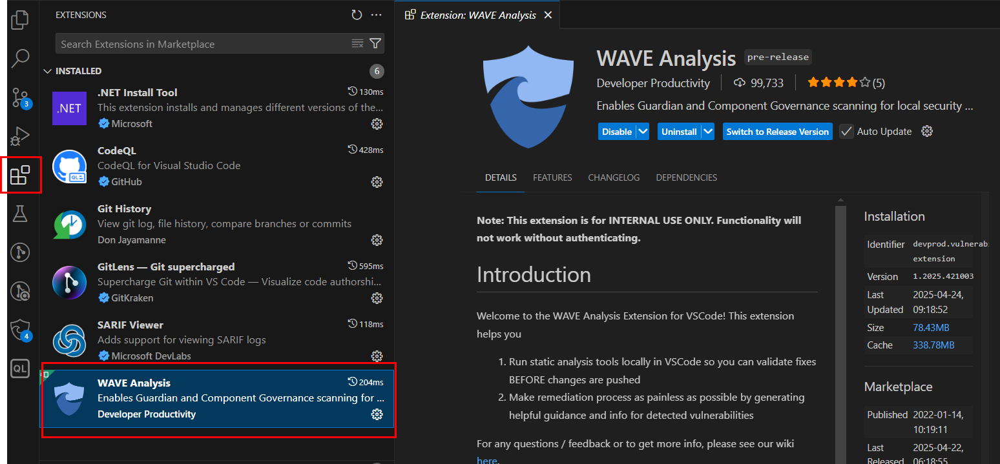
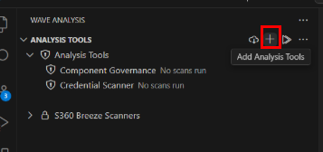
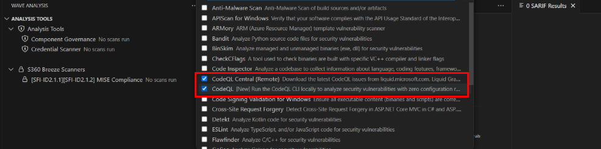
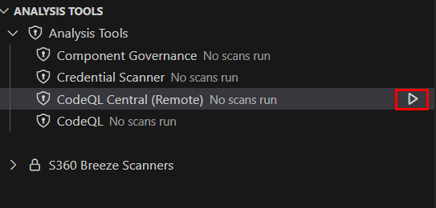

# How to run CodeQL locally on static resources

### 1. Install the Wave Analysis tool extension

- Open Visual Studio Code.
- Navigate to the Extensions tab.
- Search for and install **WAVE Analysis**.

---

### 2. Add CodeQL Tools

- Click on the "+" sign beside **Analysis Tools**.

- Add the following CodeQL tools:
  - **CodeQL Central (Remote)**
  - **CodeQL**

---

### 3. Run CodeQL Tools

- Click the **play** button beside the added CodeQL tools to run them.
- Sign in if prompted.

